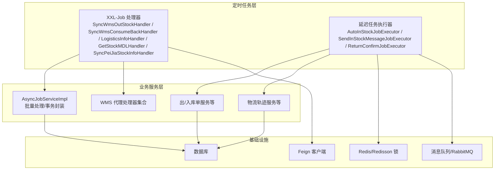
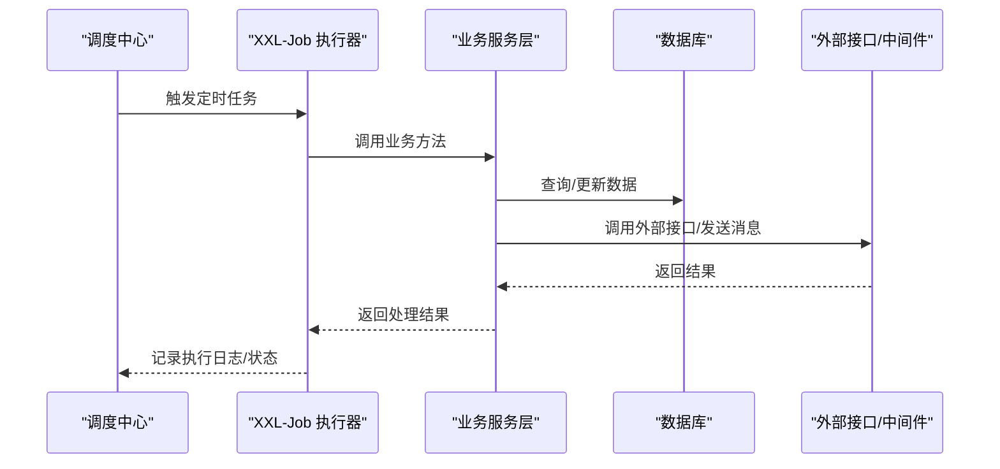
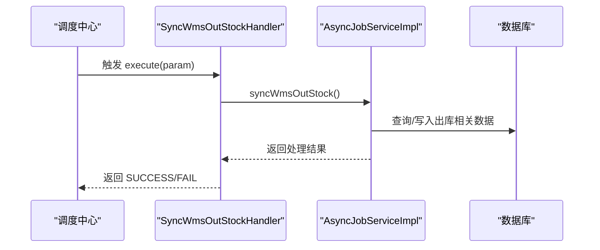
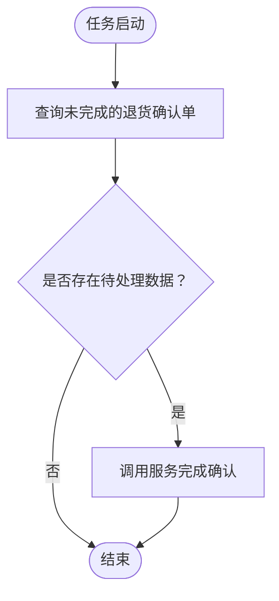
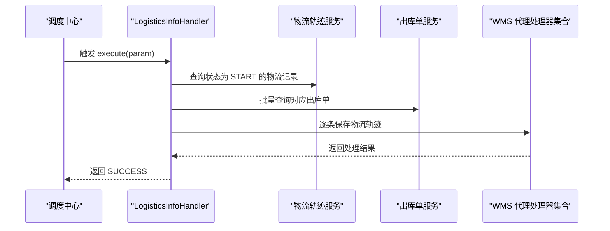
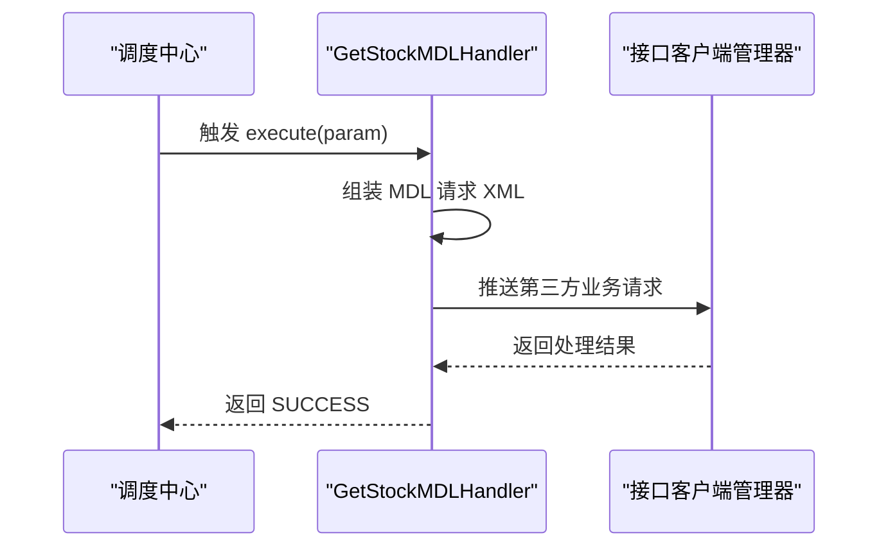
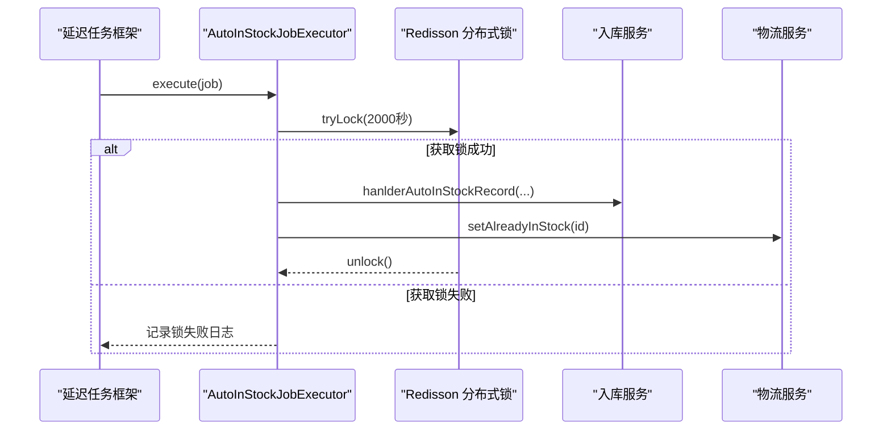
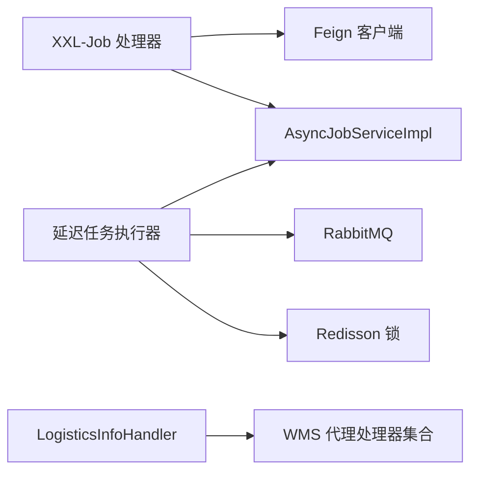

# 定时任务

<cite>
**本文引用的文件**
- [AutoInStockJobExecutor.java](file://guoke-deepexi-storage-center-provider/src/main/java/com/deepexi/storage/job/in/AutoInStockJobExecutor.java)
- [SendInStockMessageJobExecutor.java](file://guoke-deepexi-storage-center-provider/src/main/java/com/deepexi/storage/job/in/SendInStockMessageJobExecutor.java)
- [ReturnConfirmJobExecutor.java](file://guoke-deepexi-storage-center-provider/src/main/java/com/deepexi/storage/job/in/ReturnConfirmJobExecutor.java)
- [AutoInStockParam.java](file://guoke-deepexi-storage-center-provider/src/main/java/com/depthexi/storage/job/in/AutoInStockParam.java)
- [SendInStockMessageParam.java](file://guoke-deepexi-storage-center-provider/src/main/java/com/depthexi/storage/job/in/SendInStockMessageParam.java)
- [ReturnConfirmParam.java](file://guoke-deepexi-storage-center-provider/src/main/java/com/depthexi/storage/job/in/ReturnConfirmParam.java)
- [SyncWmsOutStockHandler.java](file://guoke-deepexi-storage-center-provider/src/main/java/com/depthexi/storage/scheduled/SyncWmsOutStockHandler.java)
- [SyncWmsConsumeBackHandler.java](file://guoke-deepexi-storage-center-provider/src/main/java/com/depthexi/storage/scheduled/SyncWmsConsumeBackHandler.java)
- [LogisticsInfoHandler.java](file://guoke-deepexi-storage-center-provider/src/main/java/com/depthexi/storage/scheduled/LogisticsInfoHandler.java)
- [GetStockMDLHandler.java](file://guoke-deepexi-storage-center-provider/src/main/java/com/depthexi/storage/scheduled/GetStockMDLHandler.java)
- [SyncPeiJiaStockInfoHandler.java](file://guoke-deepexi-storage-center-provider/src/main/java/com/depthexi/storage/scheduled/SyncPeiJiaStockInfoHandler.java)
- [AsyncJobServiceImpl.java](file://guoke-deepexi-storage-center-provider/src/main/java/com/depthexi/storage/service/AsyncJobServiceImpl.java)
- [application.properties](file://guoke-deepexi-storage-center-provider/src/main/resources/application.properties)
</cite>

## 目录
1. [简介](#简介)
2. [项目结构](#项目结构)
3. [核心组件](#核心组件)
4. [架构总览](#架构总览)
5. [详细组件分析](#详细组件分析)
6. [依赖关系分析](#依赖关系分析)
7. [性能与优化](#性能与优化)
8. [故障排查指南](#故障排查指南)
9. [结论](#结论)
10. [附录](#附录)

## 简介
本文件面向国科恒泰仓储管理系统，系统性梳理基于 XXL-Job 的分布式任务调度配置与使用，并结合项目中现有的定时任务实现，给出任务功能、触发条件、执行策略、重试机制、配置参数、执行日志与异常处理、最佳实践与性能优化建议，以及监控与故障排查方法。同时对项目内基于延迟任务框架的入库与消息通知任务进行说明，帮助读者快速理解与维护定时任务体系。

## 项目结构
定时任务相关代码主要分布在以下位置：
- 延迟任务执行器（Guoke Delay Task）：job/in 包下，包含自动入库、消息通知、退货确认等执行器与参数对象
- XXL-Job 任务处理器：scheduled 包下，包含 WMS 同步、物流信息同步、MDL/沛嘉库存同步等处理器
- 异步作业服务：service 包下的 AsyncJobServiceImpl，封装了部分批量处理与事务逻辑
- 应用配置：application.properties，包含 XXL-Job 与相关中间件的基础配置项

图表来源
- [SyncWmsOutStockHandler.java:22-38](file://guoke-deepexi-storage-center-provider/src/main/java/com/depthexi/storage/scheduled/SyncWmsOutStockHandler.java#L22-L38)
- [LogisticsInfoHandler.java:36-73](file://guoke-deepexi-storage-center-provider/src/main/java/com/depthexi/storage/scheduled/LogisticsInfoHandler.java#L36-L73)
- [GetStockMDLHandler.java:33-51](file://guoke-deepexi-storage-center-provider/src/main/java/com/depthexi/storage/scheduled/GetStockMDLHandler.java#L33-L51)
- [AutoInStockJobExecutor.java:30-78](file://guoke-deepexi-storage-center-provider/src/main/java/com/depthexi/storage/job/in/AutoInStockJobExecutor.java#L30-L78)
- [AsyncJobServiceImpl.java:86-167](file://guoke-deepexi-storage-center-provider/src/main/java/com/depthexi/storage/service/AsyncJobServiceImpl.java#L86-L167)

章节来源
- [SyncWmsOutStockHandler.java:22-38](file://guoke-deepexi-storage-center-provider/src/main/java/com/depthexi/storage/scheduled/SyncWmsOutStockHandler.java#L22-L38)
- [LogisticsInfoHandler.java:36-73](file://guoke-deepexi-storage-center-provider/src/main/java/com/depthexi/storage/scheduled/LogisticsInfoHandler.java#L36-L73)
- [GetStockMDLHandler.java:33-51](file://guoke-deepexi-storage-center-provider/src/main/java/com/depthexi/storage/scheduled/GetStockMDLHandler.java#L33-L51)
- [AutoInStockJobExecutor.java:30-78](file://guoke-deepexi-storage-center-provider/src/main/java/com/depthexi/storage/job/in/AutoInStockJobExecutor.java#L30-L78)
- [AsyncJobServiceImpl.java:86-167](file://guoke-deepexi-storage-center-provider/src/main/java/com/depthexi/storage/service/AsyncJobServiceImpl.java#L86-L167)

## 核心组件
- XXL-Job 处理器
  - 同步 WMS 出库信息：SyncWmsOutStockHandler
  - 拉取 WMS 确认消耗回传：SyncWmsConsumeBackHandler
  - 获取物流信息：LogisticsInfoHandler
  - 获取美敦力库存：GetStockMDLHandler
  - 同步沛嘉库存：SyncPeiJiaStockInfoHandler
- 延迟任务执行器
  - 自动入库：AutoInStockJobExecutor
  - 发送入库消息：SendInStockMessageJobExecutor
  - 退货确认：ReturnConfirmJobExecutor
- 参数模型
  - AutoInStockParam、SendInStockMessageParam、ReturnConfirmParam
- 异步作业服务
  - AsyncJobServiceImpl：封装批量处理、事务与部分数据补全逻辑

章节来源
- [SyncWmsOutStockHandler.java:22-38](file://guoke-deepexi-storage-center-provider/src/main/java/com/depthexi/storage/scheduled/SyncWmsOutStockHandler.java#L22-L38)
- [SyncWmsConsumeBackHandler.java:39-62](file://guoke-deepexi-storage-center-provider/src/main/java/com/depthexi/storage/scheduled/SyncWmsConsumeBackHandler.java#L39-L62)
- [LogisticsInfoHandler.java:36-73](file://guoke-deepexi-storage-center-provider/src/main/java/com/depthexi/storage/scheduled/LogisticsInfoHandler.java#L36-L73)
- [GetStockMDLHandler.java:33-51](file://guoke-deepexi-storage-center-provider/src/main/java/com/depthexi/storage/scheduled/GetStockMDLHandler.java#L33-L51)
- [SyncPeiJiaStockInfoHandler.java:22-38](file://guoke-deepexi-storage-center-provider/src/main/java/com/depthexi/storage/scheduled/SyncPeiJiaStockInfoHandler.java#L22-L38)
- [AutoInStockJobExecutor.java:30-78](file://guoke-deepexi-storage-center-provider/src/main/java/com/depthexi/storage/job/in/AutoInStockJobExecutor.java#L30-L78)
- [SendInStockMessageJobExecutor.java:20-53](file://guoke-deepexi/storage/job/in/SendInStockMessageJobExecutor.java#L20-L53)
- [ReturnConfirmJobExecutor.java:29-50](file://guoke-deepexi-storage-center-provider/src/main/java/com/depthexi/storage/job/in/ReturnConfirmJobExecutor.java#L29-L50)
- [AutoInStockParam.java:19-36](file://guoke-deepexi-storage-center-provider/src/main/java/com/depthexi/storage/job/in/AutoInStockParam.java#L19-L36)
- [SendInStockMessageParam.java:20-26](file://guoke-deepexi-storage-center-provider/src/main/java/com/depthexi/storage/job/in/SendInStockMessageParam.java#L20-L26)
- [AsyncJobServiceImpl.java:86-167](file://guoke-deepexi-storage-center-provider/src/main/java/com/depthexi/storage/service/AsyncJobServiceImpl.java#L86-L167)

## 架构总览
XXL-Job 作为分布式任务调度中心，负责注册、分发与执行各类定时任务；处理器通过服务层调用业务能力，必要时访问数据库、消息队列、Redis 与外部接口。

图表来源
- [SyncWmsOutStockHandler.java:28-37](file://guoke-deepexi-storage-center-provider/src/main/java/com/depthexi/storage/scheduled/SyncWmsOutStockHandler.java#L28-L37)
- [LogisticsInfoHandler.java:48-72](file://guoke-deepexi-storage-center-provider/src/main/java/com/depthexi/storage/scheduled/LogisticsInfoHandler.java#L48-L72)
- [GetStockMDLHandler.java:39-50](file://guoke-deepexi-storage-center-provider/src/main/java/com/depthexi/storage/scheduled/GetStockMDLHandler.java#L39-L50)

## 详细组件分析

### XXL-Job 任务处理器

#### 同步 WMS 出库信息（SyncWmsOutStockHandler）
- 功能：从接口中心同步 WMS 出库发货单信息
- 触发方式：由 XXL-Job 调度中心按计划触发
- 执行策略：每次执行调用异步作业服务的同步方法
- 重试机制：捕获异常并记录错误日志，返回失败状态
- 日志与监控：记录开始/结束日志，便于在调度中心查看执行状态
- 配置参数：无额外参数，依赖调度中心的调度周期

图表来源
- [SyncWmsOutStockHandler.java:28-37](file://guoke-deepexi-storage-center-provider/src/main/java/com/depthexi/storage/scheduled/SyncWmsOutStockHandler.java#L28-L37)
- [AsyncJobServiceImpl.java:168-171](file://guoke-deepexi-storage-center-provider/src/main/java/com/depthexi/storage/service/AsyncJobServiceImpl.java#L168-L171)

章节来源
- [SyncWmsOutStockHandler.java:22-38](file://guoke-deepexi-storage-center-provider/src/main/java/com/depthexi/storage/scheduled/SyncWmsOutStockHandler.java#L22-L38)

#### 拉取 WMS 确认消耗回传（SyncWmsConsumeBackHandler）
- 功能：查询尚未完成的退货确认单，调用服务完成确认流程
- 触发方式：定时轮询未完成状态的任务
- 执行策略：查询状态为“待确认且已推送WMS”的记录，批量处理
- 重试机制：异常被捕获并记录，不影响整体执行
- 日志与监控：记录开始/结束日志，便于跟踪处理进度

图表来源
- [SyncWmsConsumeBackHandler.java:48-61](file://guoke-deepexi-storage-center-provider/src/main/java/com/depthexi/storage/scheduled/SyncWmsConsumeBackHandler.java#L48-L61)

章节来源
- [SyncWmsConsumeBackHandler.java:39-62](file://guoke-deepexi-storage-center-provider/src/main/java/com/depthexi/storage/scheduled/SyncWmsConsumeBackHandler.java#L39-L62)

#### 获取物流信息（LogisticsInfoHandler）
- 功能：从物流轨迹表中筛选“开始”状态的记录，调用 WMS 代理处理器抓取物流轨迹并保存
- 触发方式：定时任务
- 执行策略：按批次处理，使用 MDC 注入 traceId，增强链路追踪
- 重试机制：单条记录异常会记录错误日志，不影响其他记录处理
- 日志与监控：记录开始/结束日志与异常日志

图表来源
- [LogisticsInfoHandler.java:48-72](file://guoke-deepexi-storage-center-provider/src/main/java/com/depthexi/storage/scheduled/LogisticsInfoHandler.java#L48-L72)

章节来源
- [LogisticsInfoHandler.java:36-73](file://guoke-deepexi-storage-center-provider/src/main/java/com/depthexi/storage/scheduled/LogisticsInfoHandler.java#L36-L73)

#### 获取美敦力库存（GetStockMDLHandler）
- 功能：构造 MDL 接口请求，通过接口中心推送至外部系统并回调库存同步
- 触发方式：定时任务
- 执行策略：组装 SOAP 请求 XML，封装推送 DTO，调用接口客户端推送
- 重试机制：异常被捕获并记录，不影响整体执行
- 日志与监控：记录请求 XML 与返回结果，便于问题定位

图表来源
- [GetStockMDLHandler.java:39-50](file://guoke-deepexi-storage-center-provider/src/main/java/com/depthexi/storage/scheduled/GetStockMDLHandler.java#L39-L50)
- [GetStockMDLHandler.java:53-82](file://guoke-deepexi-storage-center-provider/src/main/java/com/depthexi/storage/scheduled/GetStockMDLHandler.java#L53-L82)

章节来源
- [GetStockMDLHandler.java:33-51](file://guoke-deepexi-storage-center-provider/src/main/java/com/depthexi/storage/scheduled/GetStockMDLHandler.java#L33-L51)
- [GetStockMDLHandler.java:53-82](file://guoke-deepexi-storage-center-provider/src/main/java/com/depthexi/storage/scheduled/GetStockMDLHandler.java#L53-L82)

#### 同步沛嘉库存（SyncPeiJiaStockInfoHandler）
- 功能：调用接口中心拉取沛嘉库存数据
- 触发方式：定时任务
- 执行策略：调用接口中心客户端的库存拉取方法
- 重试机制：异常被捕获并记录，返回失败状态
- 日志与监控：记录调用与返回结果

章节来源
- [SyncPeiJiaStockInfoHandler.java:22-38](file://guoke-deepexi-storage-center-provider/src/main/java/com/depthexi/storage/scheduled/SyncPeiJiaStockInfoHandler.java#L22-L38)

### 延迟任务执行器

#### 自动入库（AutoInStockJobExecutor）
- 功能：根据出库单自动创建入库记录，完成后更新妥投记录状态
- 触发方式：延迟任务框架触发
- 执行策略：加 Redisson 分布式锁，避免并发冲突；调用入库服务与物流服务
- 重试机制：异常抛出业务异常，交由延迟任务框架处理
- 日志与监控：记录任务参数与执行结果，异常时记录错误日志
- 并发控制：使用分布式锁保证同一公司维度的串行化

图表来源
- [AutoInStockJobExecutor.java:42-68](file://guoke-deepexi-storage-center-provider/src/main/java/com/depthexi/storage/job/in/AutoInStockJobExecutor.java#L42-L68)

章节来源
- [AutoInStockJobExecutor.java:30-78](file://guoke-deepexi-storage-center-provider/src/main/java/com/depthexi/storage/job/in/AutoInStockJobExecutor.java#L30-L78)
- [AutoInStockParam.java:19-36](file://guoke-deepexi-storage-center-provider/src/main/java/com/depthexi/storage/job/in/AutoInStockParam.java#L19-L36)

#### 发送入库消息（SendInStockMessageJobExecutor）
- 功能：向工作台发送入库提醒消息
- 触发方式：延迟任务框架触发
- 执行策略：构造消息 DTO，通过 RabbitMQ 发送
- 重试机制：异常被捕获并记录
- 日志与监控：记录消息内容与发送结果

章节来源
- [SendInStockMessageJobExecutor.java:20-53](file://guoke-deepexi-storage-center-provider/src/main/java/com/depthexi/storage/job/in/SendInStockMessageJobExecutor.java#L20-L53)
- [SendInStockMessageParam.java:20-26](file://guoke-deepexi-storage-center-provider/src/main/java/com/depthexi/storage/job/in/SendInStockMessageParam.java#L20-L26)

#### 退货确认（ReturnConfirmJobExecutor）
- 功能：将部分待确认的退货明细改为未归还并推送
- 触发方式：延迟任务框架触发
- 执行策略：查询待确认明细，调用服务完成确认
- 重试机制：异常抛出运行时异常
- 日志与监控：记录处理前后的明细集合

章节来源
- [ReturnConfirmJobExecutor.java:29-50](file://guoke-deepexi-storage-center-provider/src/main/java/com/depthexi/storage/job/in/ReturnConfirmJobExecutor.java#L29-L50)
- [ReturnConfirmParam.java:1-50](file://guoke-deepexi-storage-center-provider/src/main/java/com/depthexi/storage/job/in/ReturnConfirmParam.java#L1-L50)

### 异步作业服务（AsyncJobServiceImpl）
- 功能：封装批量处理与事务逻辑，如出/入库通知单数据补全、WMS 出库同步等
- 关键点：使用 @Async 与 @Transactional，确保异步与事务边界清晰
- 使用场景：被 XXL-Job 处理器调用，或在业务流程中触发

章节来源
- [AsyncJobServiceImpl.java:86-167](file://guoke-deepexi-storage-center-provider/src/main/java/com/depthexi/storage/service/AsyncJobServiceImpl.java#L86-L167)

## 依赖关系分析
- XXL-Job 处理器依赖业务服务层（AsyncJobServiceImpl、各 Mapper/Service），并通过 Feign 客户端访问外部接口
- 延迟任务执行器依赖 Redisson 分布式锁、消息队列（RabbitMQ）、业务服务层
- 物流信息处理器依赖 WMS 代理处理器映射（Map），按不同供应商选择对应处理器

图表来源
- [LogisticsInfoHandler.java:39-59](file://guoke-deepexi-storage-center-provider/src/main/java/com/depthexi/storage/scheduled/LogisticsInfoHandler.java#L39-L59)
- [AutoInStockJobExecutor.java:35-39](file://guoke-deepexi-storage-center-provider/src/main/java/com/depthexi/storage/job/in/AutoInStockJobExecutor.java#L35-L39)
- [SendInStockMessageJobExecutor.java:22-25](file://guoke-deepexi-storage-center-provider/src/main/java/com/depthexi/storage/job/in/SendInStockMessageJobExecutor.java#L22-L25)

## 性能与优化
- 并发控制
  - 延迟任务执行器使用 Redisson 分布式锁，避免同一公司维度的并发入库导致数据不一致
  - 物流信息处理器按批次处理，减少一次性查询/处理压力
- 事务与异步
  - AsyncJobServiceImpl 中的批量处理使用 @Async 与 @Transactional，提升吞吐并保证一致性
- 日志与追踪
  - 物流信息处理器使用 MDC 注入 traceId，便于跨系统追踪
- 外部接口
  - MDL 接口请求采用 SOAP/XML 组装，建议在高并发场景下增加连接池与超时控制
- 监控指标
  - 建议在调度中心配置任务耗时、失败率、重试次数等指标，结合日志进行分析

[本节为通用性能建议，无需列出章节来源]

## 故障排查指南
- XXL-Job 任务失败
  - 查看调度中心执行日志与返回状态（SUCCESS/FAIL）
  - 检查处理器是否捕获异常并记录错误日志
  - 对于外部接口调用失败，检查网络、鉴权与超时设置
- 延迟任务执行异常
  - 检查 Redisson 锁是否释放（锁持有计数与解锁逻辑）
  - 核对业务服务层的异常处理与回滚策略
- 物流信息抓取失败
  - 检查物流轨迹状态是否正确流转
  - 核对 WMS 代理处理器的可用性与配置
- 消息通知未送达
  - 检查 RabbitMQ 队列与交换机配置
  - 核对消息 DTO 字段与路由键

章节来源
- [LogisticsInfoHandler.java:62-69](file://guoke-deepexi-storage-center-provider/src/main/java/com/depthexi/storage/scheduled/LogisticsInfoHandler.java#L62-L69)
- [AutoInStockJobExecutor.java:58-68](file://guoke-deepexi-storage-center-provider/src/main/java/com/depthexi/storage/job/in/AutoInStockJobExecutor.java#L58-L68)
- [SendInStockMessageJobExecutor.java:48-52](file://guoke-deepexi-storage-center-provider/src/main/java/com/depthexi/storage/job/in/SendInStockMessageJobExecutor.java#L48-L52)

## 结论
本系统通过 XXL-Job 实现对外部系统数据的定时同步（WMS、MDL、沛嘉），并通过延迟任务框架处理入库与消息通知等强一致需求。建议在生产环境中完善任务监控、异常告警与限流降级策略，持续优化批处理与外部接口调用性能，以保障仓储数据的准确性与时效性。

[本节为总结性内容，无需列出章节来源]

## 附录

### XXL-Job 配置要点（基于应用配置文件）
- 调度中心地址与执行器参数
- 应用名称、IP/端口、线程池大小
- 日志路径与级别
- 任务超时与失败重试策略

章节来源
- [application.properties](file://guoke-deepexi-storage-center-provider/src/main/resources/application.properties)

### 任务配置参数清单
- 同步 WMS 出库信息：无额外参数，按调度周期执行
- 拉取 WMS 确认消耗回传：按未完成状态筛选
- 获取物流信息：按物流轨迹状态筛选
- 获取美敦力库存：按公司维度触发
- 同步沛嘉库存：按调度周期触发
- 自动入库：延迟任务参数包含出库单、明细与妥投记录 ID
- 发送入库消息：包含入库单号、公司信息
- 退货确认：包含待确认明细 ID 列表

章节来源
- [SyncWmsOutStockHandler.java:22-38](file://guoke-deepexi-storage-center-provider/src/main/java/com/depthexi/storage/scheduled/SyncWmsOutStockHandler.java#L22-L38)
- [SyncWmsConsumeBackHandler.java:48-61](file://guoke-deepexi-storage-center-provider/src/main/java/com/depthexi/storage/scheduled/SyncWmsConsumeBackHandler.java#L48-L61)
- [LogisticsInfoHandler.java:50-66](file://guoke-deepexi-storage-center-provider/src/main/java/com/depthexi/storage/scheduled/LogisticsInfoHandler.java#L50-L66)
- [GetStockMDLHandler.java:70-81](file://guoke-deepexi-storage-center-provider/src/main/java/com/depthexi/storage/scheduled/GetStockMDLHandler.java#L70-L81)
- [SyncPeiJiaStockInfoHandler.java:26-37](file://guoke-deepexi-storage-center-provider/src/main/java/com/depthexi/storage/scheduled/SyncPeiJiaStockInfoHandler.java#L26-L37)
- [AutoInStockParam.java:19-36](file://guoke-deepexi-storage-center-provider/src/main/java/com/depthexi/storage/job/in/AutoInStockParam.java#L19-L36)
- [SendInStockMessageParam.java:20-26](file://guoke-deepexi-storage-center-provider/src/main/java/com/depthexi/storage/job/in/SendInStockMessageParam.java#L20-L26)
- [ReturnConfirmParam.java:1-50](file://guoke-deepexi-storage-center-provider/src/main/java/com/depthexi/storage/job/in/ReturnConfirmParam.java#L1-L50)