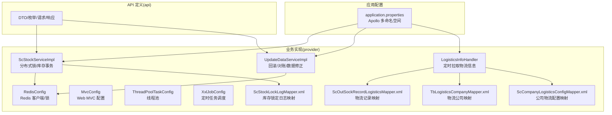
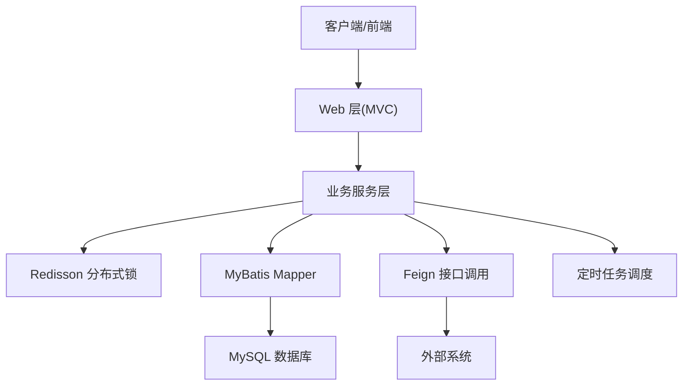
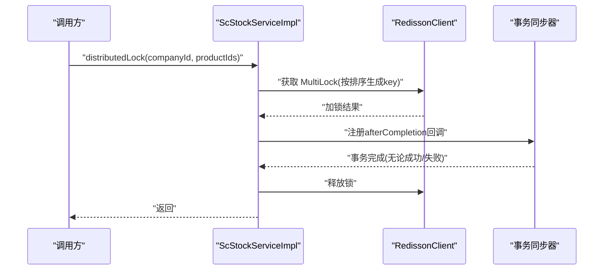
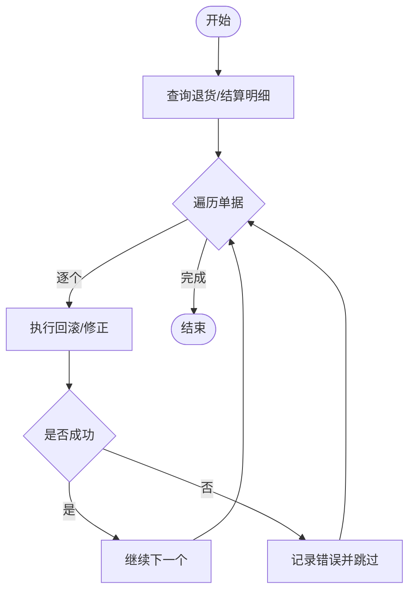
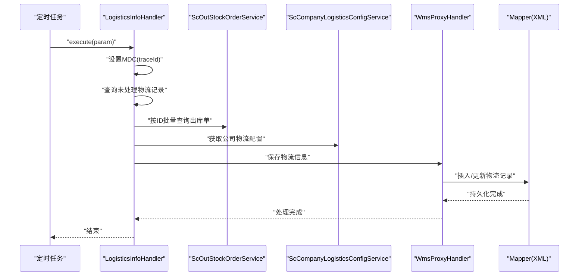
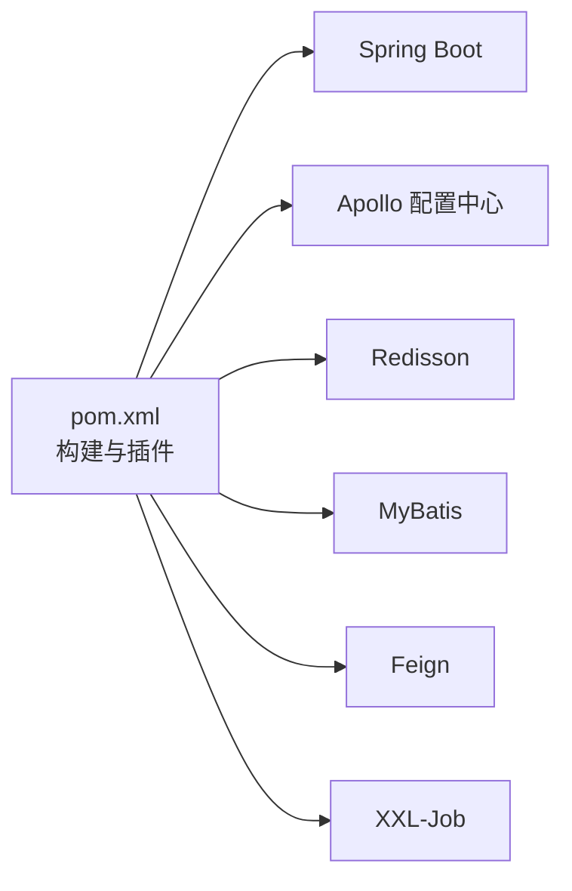

# 故障排查与维护

<cite>
**本文引用的文件**   
- [README.md](file://README.md)
- [application.properties](file://guoke-deepexi-storage-center-provider/src/main/resources/application.properties)
- [ScStockServiceImpl.java](file://guoke-deepexi-storage-center-provider/src/main/java/com/zhengyang/storage/service/impl/ScStockServiceImpl.java)
- [UpdateDataServiceImpl.java](file://guoke-deepexi-storage-center-provider/src/main/java/com/zhengyang/storage/service/UpdateDataServiceImpl.java)
- [LogisticsInfoHandler.java](file://guoke-deepexi-storage-center-provider/src/main/java/com/zhengyang/storage/scheduled/LogisticsInfoHandler.java)
- [ScCompanyLogisticsConfigService.java](file://guoke-deepexi-storage-center-provider/src/main/java/com/zhengyang/storage/service/ScCompanyLogisticsConfigService.java)
- [ScCompanyLogisticsConfigServiceImpl.java](file://guoke-deepexi-storage-center-provider/src/main/java/com/zhengyang/storage/service/impl/ScCompanyLogisticsConfigServiceImpl.java)
- [ScOutSockRecordLogisticsMapper.xml](file://guoke-deepexi-storage-center-provider/src/main/resources/mapper/logistics/ScOutSockRecordLogisticsMapper.xml)
- [TbLogisticsCompanyMapper.xml](file://guoke-deepexi-storage-center-provider/src/main/resources/mapper/logistics/TbLogisticsCompanyMapper.xml)
- [ScCompanyLogisticsConfigMapper.xml](file://guoke-deepexi-storage-center-provider/src/main/resources/mapper/logistics/ScCompanyLogisticsConfigMapper.xml)
- [ScStockLockLogMapper.xml](file://guoke-deepexi-storage-center-provider/src/main/resources/mapper/stock/ScStockLockLogMapper.xml)
- [ScDeliveryInfoMainServiceImpl.java](file://guoke-deepexi-storage-center-provider/src/main/java/com/zhengyang/storage/service/impl/ScDeliveryInfoMainServiceImpl.java)
- [RedisConfig.java](file://guoke-deepexi-storage-center-provider/src/main/java/com/zhengyang/storage/common/config/RedisConfig.java)
- [MvcConfig.java](file://guoke-deepexi-storage-center-provider/src/main/java/com/zhengyang/storage/common/config/MvcConfig.java)
- [ThreadPoolTaskConfig.java](file://guoke-deepexi-storage-center-provider/src/main/java/com/zhengyang/storage/common/config/ThreadPoolTaskConfig.java)
- [XxlJobConfig.java](file://guoke-deepexi-storage-center-provider/src/main/java/com/zhengyang/storage/common/config/XxlJobConfig.java)
- [ScStockChangeCollectQuery.java](file://guoke-deepexi-storage-center-provider/src/main/java/com/zhengyang/storage/pojo/query/stock/ScStockChangeCollectQuery.java)
- [ScStockCheckDetailVO.java](file://guoke-deepexi-storage-center-provider/src/main/java/com/zhengyang/storage/pojo/vo/stockcheck/ScStockCheckDetailVO.java)
- [ScStockWarningSettingServiceImpl.java](file://guoke-deepexi-storage-center-provider/src/main/java/com/zhengyang/storage/service/impl/ScStockWarningSettingServiceImpl.java)
- [StockOutErrorTip.java](file://guoke-deepexi-storage-center-provider/src/main/java/com/zhengyang/storage/pojo/vo/stockout/StockOutErrorTip.java)
- [MybatisObjectHandler.java](file://guoke-deepexi-storage-center-provider/src/main/java/com/zhengyang/storage/common/config/MybatisObjectHandler.java)
- [pom.xml](file://pom.xml)
</cite>

## 目录
1. [简介](#简介)
2. [项目结构](#项目结构)
3. [核心组件](#核心组件)
4. [架构总览](#架构总览)
5. [详细组件分析](#详细组件分析)
6. [依赖关系分析](#依赖关系分析)
7. [性能考量](#性能考量)
8. [故障排查指南](#故障排查指南)
9. [结论](#结论)
10. [附录](#附录)

## 简介
本文件面向国科恒泰仓储管理系统，提供系统级故障排查与维护指南。内容覆盖数据库连接问题、接口调用异常、数据导入导出错误的诊断与修复；系统维护操作如数据备份、性能优化、缓存清理与索引重建；以及故障排查工具与调试技巧（日志分析、性能分析、网络诊断）、应急响应流程与灾难恢复预案、系统健康检查清单与预防性维护建议。

## 项目结构
系统采用多模块 Maven 结构，核心运行时位于 provider 模块，API 定义位于 api 模块。应用通过 Apollo 配置中心加载多命名空间配置，启用 Redis 分布式锁、线程池与定时任务调度，集成 MyBatis 数据访问层，并通过 Feign 调用外部接口。

图表来源
- [application.properties:1-6](file://guoke-deepexi-storage-center-provider/src/main/resources/application.properties#L1-L6)
- [ScStockServiceImpl.java:3363-3415](file://guoke-deepexi-storage-center-provider/src/main/java/com/zhengyang/storage/service/impl/ScStockServiceImpl.java#L3363-L3415)
- [UpdateDataServiceImpl.java:610-676](file://guoke-deepexi-storage-center-provider/src/main/java/com/zhengyang/storage/service/UpdateDataServiceImpl.java#L610-L676)
- [LogisticsInfoHandler.java:39-61](file://guoke-deepexi-storage-center-provider/src/main/java/com/zhengyang/storage/scheduled/LogisticsInfoHandler.java#L39-L61)
- [RedisConfig.java](file://guoke-deepexi-storage-center-provider/src/main/java/com/zhengyang/storage/common/config/RedisConfig.java)
- [MvcConfig.java](file://guoke-deepexi-storage-center-provider/src/main/java/com/zhengyang/storage/common/config/MvcConfig.java)
- [ThreadPoolTaskConfig.java](file://guoke-deepexi-storage-center-provider/src/main/java/com/zhengyang/storage/common/config/ThreadPoolTaskConfig.java)
- [XxlJobConfig.java](file://guoke-deepexi-storage-center-provider/src/main/java/com/zhengyang/storage/common/config/XxlJobConfig.java)
- [ScOutSockRecordLogisticsMapper.xml:1-40](file://guoke-deepexi-storage-center-provider/src/main/resources/mapper/logistics/ScOutSockRecordLogisticsMapper.xml#L1-L40)
- [TbLogisticsCompanyMapper.xml:1-15](file://guoke-deepexi-storage-center-provider/src/main/resources/mapper/logistics/TbLogisticsCompanyMapper.xml#L1-L15)
- [ScCompanyLogisticsConfigMapper.xml:1-39](file://guoke-deepexi-storage-center-provider/src/main/resources/mapper/logistics/ScCompanyLogisticsConfigMapper.xml#L1-L39)
- [ScStockLockLogMapper.xml:848-887](file://guoke-deepexi-storage-center-provider/src/main/resources/mapper/stock/ScStockLockLogMapper.xml#L848-L887)

章节来源
- [application.properties:1-6](file://guoke-deepexi-storage-center-provider/src/main/resources/application.properties#L1-L6)
- [pom.xml:34-68](file://pom.xml#L34-L68)

## 核心组件
- 分布式库存服务：提供分布式锁、库存变更事务与并发控制，保障高并发场景下的数据一致性。
- 数据修正与回滚服务：支持基于退货/结算单据的逆向回滚与对账，处理异常状态。
- 物流信息定时同步：从外部系统拉取物流信息并写入内部表，保证出库跟踪一致。
- 配置与映射：通过 MyBatis Mapper 实现数据持久化，结合 RedisConfig 提供缓存与锁能力。
- Web/线程池/调度：MvcConfig、ThreadPoolTaskConfig、XxlJobConfig 统一管理 Web 层、异步任务与定时作业。

章节来源
- [ScStockServiceImpl.java:3363-3415](file://guoke-deepexi-storage-center-provider/src/main/java/com/zhengyang/storage/service/impl/ScStockServiceImpl.java#L3363-L3415)
- [UpdateDataServiceImpl.java:610-676](file://guoke-deepexi-storage-center-provider/src/main/java/com/zhengyang/storage/service/UpdateDataServiceImpl.java#L610-L676)
- [LogisticsInfoHandler.java:39-61](file://guoke-deepexi-storage-center-provider/src/main/java/com/zhengyang/storage/scheduled/LogisticsInfoHandler.java#L39-L61)
- [RedisConfig.java](file://guoke-deepexi-storage-center-provider/src/main/java/com/zhengyang/storage/common/config/RedisConfig.java)
- [MvcConfig.java](file://guoke-deepexi-storage-center-provider/src/main/java/com/zhengyang/storage/common/config/MvcConfig.java)
- [ThreadPoolTaskConfig.java](file://guoke-deepexi-storage-center-provider/src/main/java/com/zhengyang/storage/common/config/ThreadPoolTaskConfig.java)
- [XxlJobConfig.java](file://guoke-deepexi-storage-center-provider/src/main/java/com/zhengyang/storage/common/config/XxlJobConfig.java)

## 架构总览
系统以 Spring Boot 为基础，通过 Apollo 加载配置，使用 Redisson 进行分布式锁，MyBatis 访问数据库，Feign 调用外部接口，定时任务与线程池支撑异步处理。

图表来源
- [MvcConfig.java](file://guoke-deepexi-storage-center-provider/src/main/java/com/zhengyang/storage/common/config/MvcConfig.java)
- [RedisConfig.java](file://guoke-deepexi-storage-center-provider/src/main/java/com/zhengyang/storage/common/config/RedisConfig.java)
- [ScOutSockRecordLogisticsMapper.xml:1-40](file://guoke-deepexi-storage-center-provider/src/main/resources/mapper/logistics/ScOutSockRecordLogisticsMapper.xml#L1-L40)
- [LogisticsInfoHandler.java:39-61](file://guoke-deepexi-storage-center-provider/src/main/java/com/zhengyang/storage/scheduled/LogisticsInfoHandler.java#L39-L61)

## 详细组件分析

### 分布式库存服务（ScStockServiceImpl）
- 功能要点
  - 基于产品 ID 生成锁键，按排序避免死锁。
  - 使用 Redisson MultiLock 获取跨产品锁，注册事务完成后回调统一释放锁。
  - 提供库存查询示例，展示 JDBC 连接与资源自动关闭模式。
- 关键路径
  - 分布式锁获取与释放：[ScStockServiceImpl.java:3363-3415](file://guoke-deepexi-storage-center-provider/src/main/java/com/zhengyang/storage/service/impl/ScStockServiceImpl.java#L3363-L3415)
  - 事务完成后释放锁回调：[ScStockServiceImpl.java:3391-3406](file://guoke-deepexi-storage-center-provider/src/main/java/com/zhengyang/storage/service/impl/ScStockServiceImpl.java#L3391-L3406)
  - JDBC 查询库存示例：[ScStockServiceImpl.java:3417-3443](file://guoke-deepexi-storage-center-provider/src/main/java/com/zhengyang/storage/service/impl/ScStockServiceImpl.java#L3417-L3443)

图表来源
- [ScStockServiceImpl.java:3363-3415](file://guoke-deepexi-storage-center-provider/src/main/java/com/zhengyang/storage/service/impl/ScStockServiceImpl.java#L3363-L3415)
- [ScStockServiceImpl.java:3391-3406](file://guoke-deepexi-storage-center-provider/src/main/java/com/zhengyang/storage/service/impl/ScStockServiceImpl.java#L3391-L3406)

章节来源
- [ScStockServiceImpl.java:3363-3415](file://guoke-deepexi-storage-center-provider/src/main/java/com/zhengyang/storage/service/impl/ScStockServiceImpl.java#L3363-L3415)
- [ScStockServiceImpl.java:3391-3406](file://guoke-deepexi-storage-center-provider/src/main/java/com/zhengyang/storage/service/impl/ScStockServiceImpl.java#L3391-L3406)
- [ScStockServiceImpl.java:3417-3443](file://guoke-deepexi-storage-center-provider/src/main/java/com/zhengyang/storage/service/impl/ScStockServiceImpl.java#L3417-L3443)

### 数据修正与回滚服务（UpdateDataServiceImpl）
- 功能要点
  - 通过外部订单接口查询退货/结算明细，按单据进行回滚或修正。
  - 对异常单据记录错误信息并返回。
  - 支持强制解锁相关单据。
- 关键路径
  - 退货/结算回滚主流程：[UpdateDataServiceImpl.java:610-676](file://guoke-deepexi-storage-center-provider/src/main/java/com/zhengyang/storage/service/UpdateDataServiceImpl.java#L610-L676)
  - 异常单据处理与错误收集：[UpdateDataServiceImpl.java:629-659](file://guoke-deepexi-storage-center-provider/src/main/java/com/zhengyang/storage/service/UpdateDataServiceImpl.java#L629-L659)
  - 强制解锁逻辑：[UpdateDataServiceImpl.java:661-676](file://guoke-deepexi-storage-center-provider/src/main/java/com/zhengyang/storage/service/UpdateDataServiceImpl.java#L661-L676)
  - 批量数据修正（SQL 更新）：[UpdateDataServiceImpl.java:819-842](file://guoke-deepexi-storage-center-provider/src/main/java/com/zhengyang/storage/service/UpdateDataServiceImpl.java#L819-L842)

图表来源
- [UpdateDataServiceImpl.java:610-676](file://guoke-deepexi-storage-center-provider/src/main/java/com/zhengyang/storage/service/UpdateDataServiceImpl.java#L610-L676)
- [UpdateDataServiceImpl.java:629-659](file://guoke-deepexi-storage-center-provider/src/main/java/com/zhengyang/storage/service/UpdateDataServiceImpl.java#L629-L659)

章节来源
- [UpdateDataServiceImpl.java:610-676](file://guoke-deepexi-storage-center-provider/src/main/java/com/zhengyang/storage/service/UpdateDataServiceImpl.java#L610-L676)
- [UpdateDataServiceImpl.java:629-659](file://guoke-deepexi-storage-center-provider/src/main/java/com/zhengyang/storage/service/UpdateDataServiceImpl.java#L629-L659)
- [UpdateDataServiceImpl.java:661-676](file://guoke-deepexi-storage-center-provider/src/main/java/com/zhengyang/storage/service/UpdateDataServiceImpl.java#L661-L676)
- [UpdateDataServiceImpl.java:819-842](file://guoke-deepexi-storage-center-provider/src/main/java/com/zhengyang/storage/service/UpdateDataServiceImpl.java#L819-L842)

### 物流信息定时同步（LogisticsInfoHandler）
- 功能要点
  - 定时查询未处理物流记录，按公司配置选择代理处理器，保存物流信息。
  - 使用 MDC 注入 traceId，便于链路追踪。
- 关键路径
  - 定时任务入口与处理流程：[LogisticsInfoHandler.java:39-61](file://guoke-deepexi-storage-center-provider/src/main/java/com/zhengyang/storage/scheduled/LogisticsInfoHandler.java#L39-L61)
  - 公司物流配置查询接口与实现：[ScCompanyLogisticsConfigService.java:1-18](file://guoke-deepexi-storage-center-provider/src/main/java/com/zhengyang/storage/service/ScCompanyLogisticsConfigService.java#L1-L18), [ScCompanyLogisticsConfigServiceImpl.java:1-30](file://guoke-deepexi-storage-center-provider/src/main/java/com/zhengyang/storage/service/impl/ScCompanyLogisticsConfigServiceImpl.java#L1-L30)
  - 物流记录与物流公司映射：[ScOutSockRecordLogisticsMapper.xml:1-40](file://guoke-deepexi-storage-center-provider/src/main/resources/mapper/logistics/ScOutSockRecordLogisticsMapper.xml#L1-L40), [TbLogisticsCompanyMapper.xml:1-15](file://guoke-deepexi-storage-center-provider/src/main/resources/mapper/logistics/TbLogisticsCompanyMapper.xml#L1-L15), [ScCompanyLogisticsConfigMapper.xml:1-39](file://guoke-deepexi-storage-center-provider/src/main/resources/mapper/logistics/ScCompanyLogisticsConfigMapper.xml#L1-L39)

图表来源
- [LogisticsInfoHandler.java:39-61](file://guoke-deepexi-storage-center-provider/src/main/java/com/zhengyang/storage/scheduled/LogisticsInfoHandler.java#L39-L61)
- [ScCompanyLogisticsConfigService.java:1-18](file://guoke-deepexi-storage-center-provider/src/main/java/com/zhengyang/storage/service/ScCompanyLogisticsConfigService.java#L1-L18)
- [ScCompanyLogisticsConfigServiceImpl.java:1-30](file://guoke-deepexi-storage-center-provider/src/main/java/com/zhengyang/storage/service/impl/ScCompanyLogisticsConfigServiceImpl.java#L1-L30)
- [ScOutSockRecordLogisticsMapper.xml:1-40](file://guoke-deepexi-storage-center-provider/src/main/resources/mapper/logistics/ScOutSockRecordLogisticsMapper.xml#L1-L40)
- [TbLogisticsCompanyMapper.xml:1-15](file://guoke-deepexi-storage-center-provider/src/main/resources/mapper/logistics/TbLogisticsCompanyMapper.xml#L1-L15)
- [ScCompanyLogisticsConfigMapper.xml:1-39](file://guoke-deepexi-storage-center-provider/src/main/resources/mapper/logistics/ScCompanyLogisticsConfigMapper.xml#L1-L39)

章节来源
- [LogisticsInfoHandler.java:39-61](file://guoke-deepexi-storage-center-provider/src/main/java/com/zhengyang/storage/scheduled/LogisticsInfoHandler.java#L39-L61)
- [ScCompanyLogisticsConfigService.java:1-18](file://guoke-deepexi-storage-center-provider/src/main/java/com/zhengyang/storage/service/ScCompanyLogisticsConfigService.java#L1-L18)
- [ScCompanyLogisticsConfigServiceImpl.java:1-30](file://guoke-deepexi-storage-center-provider/src/main/java/com/zhengyang/storage/service/impl/ScCompanyLogisticsConfigServiceImpl.java#L1-L30)
- [ScOutSockRecordLogisticsMapper.xml:1-40](file://guoke-deepexi-storage-center-provider/src/main/resources/mapper/logistics/ScOutSockRecordLogisticsMapper.xml#L1-L40)
- [TbLogisticsCompanyMapper.xml:1-15](file://guoke-deepexi-storage-center-provider/src/main/resources/mapper/logistics/TbLogisticsCompanyMapper.xml#L1-L15)
- [ScCompanyLogisticsConfigMapper.xml:1-39](file://guoke-deepexi-storage-center-provider/src/main/resources/mapper/logistics/ScCompanyLogisticsConfigMapper.xml#L1-L39)

### 数据模型与查询（Stock/Warning/Check）
- 库存锁定日志映射：用于记录锁定/消耗/取消等统计字段，便于审计与对账。
- 库存预警设置服务：对预警天数/下限等参数进行校验与转换。
- 出库错误提示 VO：封装出库异常时的定位信息（公司、仓库、货架、货位、批号、序列号、有效期等）。
- 统计查询对象：提供时间范围、统计日期等查询条件。

章节来源
- [ScStockLockLogMapper.xml:848-887](file://guoke-deepexi-storage-center-provider/src/main/resources/mapper/stock/ScStockLockLogMapper.xml#L848-L887)
- [ScStockWarningSettingServiceImpl.java:274-300](file://guoke-deepexi-storage-center-provider/src/main/java/com/zhengyang/storage/service/impl/ScStockWarningSettingServiceImpl.java#L274-L300)
- [StockOutErrorTip.java:1-43](file://guoke-deepexi-storage-center-provider/src/main/java/com/zhengyang/storage/pojo/vo/stockout/StockOutErrorTip.java#L1-L43)
- [ScStockChangeCollectQuery.java:47-105](file://guoke-deepexi-storage-center-provider/src/main/java/com/zhengyang/storage/pojo/query/stock/ScStockChangeCollectQuery.java#L47-L105)
- [ScStockCheckDetailVO.java:91-135](file://guoke-deepexi-storage-center-provider/src/main/java/com/zhengyang/storage/pojo/vo/stockcheck/ScStockCheckDetailVO.java#L91-L135)

## 依赖关系分析
- 配置依赖：Apollo 多命名空间（application、m-datasource、m-mybatis、m-common、m-nacos、m-redis、m-prometheus、xxl-job、m-rabbitmq、m-elasticsearch）。
- 运行时依赖：Spring Boot、Redisson、MyBatis、Feign、定时任务（XXL-Job）、线程池与 Web MVC。
- 数据访问：Mapper XML 文件定义 SQL 语句与参数映射，配合 PO/VO 进行数据传输。

图表来源
- [pom.xml:34-68](file://pom.xml#L34-L68)
- [application.properties:1-6](file://guoke-deepexi-storage-center-provider/src/main/resources/application.properties#L1-L6)

章节来源
- [pom.xml:34-68](file://pom.xml#L34-L68)
- [application.properties:1-6](file://guoke-deepexi-storage-center-provider/src/main/resources/application.properties#L1-L6)

## 性能考量
- 分布式锁与死锁规避：按产品 ID 排序生成锁键，降低死锁概率；事务完成后统一释放锁，避免资源泄漏。
- 线程池与异步：ThreadPoolTaskConfig 提供线程池配置，减少阻塞；定时任务与 Feign 调用应避免长时间阻塞。
- 数据库访问：MyBatis Mapper 合理使用参数绑定与条件拼接；批量插入/更新时注意分批与事务大小。
- 缓存策略：RedisConfig 提供缓存与锁能力，需关注热点键与过期策略，避免缓存雪崩与击穿。

章节来源
- [ScStockServiceImpl.java:3410-3415](file://guoke-deepexi-storage-center-provider/src/main/java/com/zhengyang/storage/service/impl/ScStockServiceImpl.java#L3410-L3415)
- [ThreadPoolTaskConfig.java](file://guoke-deepexi-storage-center-provider/src/main/java/com/zhengyang/storage/common/config/ThreadPoolTaskConfig.java)
- [RedisConfig.java](file://guoke-deepexi-storage-center-provider/src/main/java/com/zhengyang/storage/common/config/RedisConfig.java)
- [MybatisObjectHandler.java](file://guoke-deepexi-storage-center-provider/src/main/java/com/zhengyang/storage/common/config/MybatisObjectHandler.java)

## 故障排查指南

### 通用排查步骤
- 确认应用配置：检查 Apollo 命名空间是否正确加载，环境变量是否生效。
- 查看日志：定位 traceId，结合业务日志与异常栈快速定位问题。
- 核查依赖：确认 Redis、数据库、外部接口连通性与可用性。
- 快速回退：对变更较大的功能先回滚，再逐步排查。

章节来源
- [application.properties:1-6](file://guoke-deepexi-storage-center-provider/src/main/resources/application.properties#L1-L6)

### 数据库连接问题
- 现象
  - 连接超时、拒绝连接、SQL 执行异常。
- 诊断
  - 检查数据源命名空间配置与连接参数。
  - 使用 JDBC 连接测试工具验证连通性。
  - 查看数据库慢查询与锁等待情况。
- 修复
  - 调整连接池参数与超时阈值。
  - 优化慢 SQL，补充必要索引。
  - 检查防火墙与网络策略。

章节来源
- [ScStockServiceImpl.java:3417-3443](file://guoke-deepexi-storage-center-provider/src/main/java/com/zhengyang/storage/service/impl/ScStockServiceImpl.java#L3417-L3443)
- [application.properties:1-6](file://guoke-deepexi-storage-center-provider/src/main/resources/application.properties#L1-L6)

### 接口调用异常（Feign/外部系统）
- 现象
  - 调用超时、返回空 payload、业务异常。
- 诊断
  - 检查 Feign 客户端配置与超时设置。
  - 核查外部系统可用性与鉴权头。
  - 查看调用链日志与 traceId。
- 修复
  - 增加重试与熔断策略。
  - 补充幂等与补偿机制。
  - 优化请求参数与分页策略。

章节来源
- [UpdateDataServiceImpl.java:610-676](file://guoke-deepexi-storage-center-provider/src/main/java/com/zhengyang/storage/service/UpdateDataServiceImpl.java#L610-L676)
- [LogisticsInfoHandler.java:39-61](file://guoke-deepexi-storage-center-provider/src/main/java/com/zhengyang/storage/scheduled/LogisticsInfoHandler.java#L39-L61)

### 数据导入导出错误
- 现象
  - 导入失败、重复数据、字段缺失。
- 诊断
  - 校验 Excel 模板与字段映射。
  - 检查导入批次与幂等标识。
  - 查看导入日志与错误明细。
- 修复
  - 修复模板与校验规则。
  - 对历史数据进行清洗与修正。
  - 优化批量写入与事务边界。

章节来源
- [ScOutSockRecordLogisticsMapper.xml:1-40](file://guoke-deepexi-storage-center-provider/src/main/resources/mapper/logistics/ScOutSockRecordLogisticsMapper.xml#L1-L40)
- [ScCompanyLogisticsConfigMapper.xml:1-39](file://guoke-deepexi-storage-center-provider/src/main/resources/mapper/logistics/ScCompanyLogisticsConfigMapper.xml#L1-L39)

### 分布式锁与并发冲突
- 现象
  - 锁获取失败、长时间等待、死锁告警。
- 诊断
  - 检查锁键生成逻辑与排序策略。
  - 查看事务回调与锁释放时机。
  - 分析热点产品与并发峰值。
- 修复
  - 保持锁键排序一致性。
  - 缩短事务时间，避免长事务。
  - 限流与降级策略。

章节来源
- [ScStockServiceImpl.java:3363-3415](file://guoke-deepexi-storage-center-provider/src/main/java/com/zhengyang/storage/service/impl/ScStockServiceImpl.java#L3363-L3415)
- [ScStockServiceImpl.java:3391-3406](file://guoke-deepexi-storage-center-provider/src/main/java/com/zhengyang/storage/service/impl/ScStockServiceImpl.java#L3391-L3406)

### 物流信息同步异常
- 现象
  - 物流信息缺失、重复、延迟。
- 诊断
  - 检查定时任务状态与执行日志。
  - 核查公司物流配置与代理处理器。
  - 查看 Mapper 插入/更新结果。
- 修复
  - 修复配置与处理器逻辑。
  - 补充失败重试与人工干预通道。

章节来源
- [LogisticsInfoHandler.java:39-61](file://guoke-deepexi-storage-center-provider/src/main/java/com/zhengyang/storage/scheduled/LogisticsInfoHandler.java#L39-L61)
- [ScCompanyLogisticsConfigService.java:1-18](file://guoke-deepexi-storage-center-provider/src/main/java/com/zhengyang/storage/service/ScCompanyLogisticsConfigService.java#L1-L18)
- [ScCompanyLogisticsConfigServiceImpl.java:1-30](file://guoke-deepexi-storage-center-provider/src/main/java/com/zhengyang/storage/service/impl/ScCompanyLogisticsConfigServiceImpl.java#L1-L30)
- [ScOutSockRecordLogisticsMapper.xml:1-40](file://guoke-deepexi-storage-center-provider/src/main/resources/mapper/logistics/ScOutSockRecordLogisticsMapper.xml#L1-L40)

### 预防性维护与健康检查清单
- 配置与版本
  - 核对 Apollo 命名空间与环境变量。
  - 检查 Maven 插件与编译配置。
- 数据库
  - 检查慢查询、锁等待、连接数。
  - 备份策略与归档清理。
- 缓存
  - 清理过期键、监控命中率。
  - 分布式锁健康检查。
- 日志与监控
  - 日志级别与落盘策略。
  - Prometheus/告警规则。
- 定时任务
  - 任务执行状态与耗时。
  - 重试与失败告警。

章节来源
- [application.properties:1-6](file://guoke-deepexi-storage-center-provider/src/main/resources/application.properties#L1-L6)
- [pom.xml:34-68](file://pom.xml#L34-L68)
- [RedisConfig.java](file://guoke-deepexi-storage-center-provider/src/main/java/com/zhengyang/storage/common/config/RedisConfig.java)
- [XxlJobConfig.java](file://guoke-deepexi-storage-center-provider/src/main/java/com/zhengyang/storage/common/config/XxlJobConfig.java)

### 应急响应与灾难恢复
- 应急响应流程
  - 发现问题 → 快速隔离 → 回滚变更 → 修复问题 → 验证恢复 → 总结复盘。
- 灾难恢复
  - 数据库备份与恢复演练。
  - 配置中心与缓存双活。
  - 外部接口降级与本地缓存兜底。

章节来源
- [UpdateDataServiceImpl.java:610-676](file://guoke-deepexi-storage-center-provider/src/main/java/com/zhengyang/storage/service/UpdateDataServiceImpl.java#L610-L676)
- [ScStockServiceImpl.java:3363-3415](file://guoke-deepexi-storage-center-provider/src/main/java/com/zhengyang/storage/service/impl/ScStockServiceImpl.java#L3363-L3415)

## 结论
本指南围绕仓储系统的配置、数据访问、分布式锁、定时任务与外部接口调用，提供了系统化的故障排查与维护方法。通过规范的日志与监控、合理的缓存与锁策略、完善的备份与回滚机制，可显著提升系统的稳定性与可维护性。

## 附录
- 参考示例文件路径（用于定位实现细节）
  - [README.md](file://README.md)
  - [application.properties:1-6](file://guoke-deepexi-storage-center-provider/src/main/resources/application.properties#L1-L6)
  - [ScStockServiceImpl.java:3363-3415](file://guoke-deepexi-storage-center-provider/src/main/java/com/zhengyang/storage/service/impl/ScStockServiceImpl.java#L3363-L3415)
  - [UpdateDataServiceImpl.java:610-676](file://guoke-deepexi-storage-center-provider/src/main/java/com/zhengyang/storage/service/UpdateDataServiceImpl.java#L610-L676)
  - [LogisticsInfoHandler.java:39-61](file://guoke-deepexi-storage-center-provider/src/main/java/com/zhengyang/storage/scheduled/LogisticsInfoHandler.java#L39-L61)
  - [ScCompanyLogisticsConfigService.java:1-18](file://guoke-deepexi-storage-center-provider/src/main/java/com/zhengyang/storage/service/ScCompanyLogisticsConfigService.java#L1-L18)
  - [ScCompanyLogisticsConfigServiceImpl.java:1-30](file://guoke-deepexi-storage-center-provider/src/main/java/com/zhengyang/storage/service/impl/ScCompanyLogisticsConfigServiceImpl.java#L1-L30)
  - [ScOutSockRecordLogisticsMapper.xml:1-40](file://guoke-deepexi-storage-center-provider/src/main/resources/mapper/logistics/ScOutSockRecordLogisticsMapper.xml#L1-L40)
  - [TbLogisticsCompanyMapper.xml:1-15](file://guoke-deepexi-storage-center-provider/src/main/resources/mapper/logistics/TbLogisticsCompanyMapper.xml#L1-L15)
  - [ScCompanyLogisticsConfigMapper.xml:1-39](file://guoke-deepexi-storage-center-provider/src/main/resources/mapper/logistics/ScCompanyLogisticsConfigMapper.xml#L1-L39)
  - [ScStockLockLogMapper.xml:848-887](file://guoke-deepexi-storage-center-provider/src/main/resources/mapper/stock/ScStockLockLogMapper.xml#L848-L887)
  - [ScDeliveryInfoMainServiceImpl.java:139-153](file://guoke-deepexi-storage-center-provider/src/main/java/com/zhengyang/storage/service/impl/ScDeliveryInfoMainServiceImpl.java#L139-L153)
  - [RedisConfig.java](file://guoke-deepexi-storage-center-provider/src/main/java/com/zhengyang/storage/common/config/RedisConfig.java)
  - [MvcConfig.java](file://guoke-deepexi-storage-center-provider/src/main/java/com/zhengyang/storage/common/config/MvcConfig.java)
  - [ThreadPoolTaskConfig.java](file://guoke-deepexi-storage-center-provider/src/main/java/com/zhengyang/storage/common/config/ThreadPoolTaskConfig.java)
  - [XxlJobConfig.java](file://guoke-deepexi-storage-center-provider/src/main/java/com/zhengyang/storage/common/config/XxlJobConfig.java)
  - [ScStockChangeCollectQuery.java:47-105](file://guoke-deepexi-storage-center-provider/src/main/java/com/zhengyang/storage/pojo/query/stock/ScStockChangeCollectQuery.java#L47-L105)
  - [ScStockCheckDetailVO.java:91-135](file://guoke-deepexi-storage-center-provider/src/main/java/com/zhengyang/storage/pojo/vo/stockcheck/ScStockCheckDetailVO.java#L91-L135)
  - [ScStockWarningSettingServiceImpl.java:274-300](file://guoke-deepexi-storage-center-provider/src/main/java/com/zhengyang/storage/service/impl/ScStockWarningSettingServiceImpl.java#L274-L300)
  - [StockOutErrorTip.java:1-43](file://guoke-deepexi-storage-center-provider/src/main/java/com/zhengyang/storage/pojo/vo/stockout/StockOutErrorTip.java#L1-L43)
  - [MybatisObjectHandler.java](file://guoke-deepexi-storage-center-provider/src/main/java/com/zhengyang/storage/common/config/MybatisObjectHandler.java)
  - [pom.xml:34-68](file://pom.xml#L34-L68)