# 监控告警

<cite>
**本文引用的文件**
- [application.properties](file://guoke-deepexi-storage-center-provider/src/main/resources/application.properties)
- [ScInterfaceLogService.java](file://guoke-deepexi-storage-center-provider/src/main/java/com/deepexi/storage/service/ScInterfaceLogService.java)
- [ScInterfaceLogServiceImpl.java](file://guoke-deepexi-storage-center-provider/src/main/java/com/deepexi/storage/service/impl/ScInterfaceLogServiceImpl.java)
- [ScOperateLogService.java](file://guoke-deepexi-storage-center-provider/src/main/java/com/deepexi/storage/service/ScOperateLogService.java)
- [ScOperateLogServiceImpl.java](file://guoke-deepexi-storage-center-provider/src/main/java/com/deepexi/storage/service/impl/ScOperateLogServiceImpl.java)
- [ScInStockOperLogServiceImpl.java](file://guoke-deepexi-storage-center-provider/src/main/java/com/deepexi/storage/service/impl/ScInStockOperLogServiceImpl.java)
- [ScInStockByOutRecordLogServiceImpl.java](file://guoke-deepexi-storage-center-provider/src/main/java/com/deepexi/storage/service/impl/ScInStockByOutRecordLogServiceImpl.java)
- [ScStockServiceImpl.java](file://guoke-deepexi-storage-center-provider/src/main/java/com/deepexi/storage/service/impl/ScStockServiceImpl.java)
- [GetStockMDLHandler.java](file://guoke-deepexi-storage-center-provider/src/main/java/com/deepexi/storage/scheduled/GetStockMDLHandler.java)
- [InterfaceCallBackServiceImpl.java](file://guoke-deepexi-storage-center-provider/src/main/java/com/deepexi/storage/service/impl/InterfaceCallBackServiceImpl.java)
- [ScWarningStockServiceImpl.java](file://guoke-deepexi-storage-center-provider/src/main/java/com/deepexi/storage/service/impl/ScWarningStockServiceImpl.java)
- [StockWarningMapper.xml](file://guoke-deepexi-storage-center-provider/src/main/resources/mapper/StockWarningMapper.xml)
- [ScCompanyLogisticsConfigService.java](file://guoke-deepexi-storage-center-provider/src/main/java/com/deepexi/storage/service/ScCompanyLogisticsConfigService.java)
- [ScCompanyLogisticsConfigServiceImpl.java](file://guoke-deepexi-storage-center-provider/src/main/java/com/deepexi/storage/service/impl/ScCompanyLogisticsConfigServiceImpl.java)
- [ScCompanyLogisticsConfigMapper.xml](file://guoke-deepexi-storage-center-provider/src/main/resources/mapper/logistics/ScCompanyLogisticsConfigMapper.xml)
- [LogisticsInfoHandler.java](file://guoke-deepexi-storage-center-provider/src/main/java/com/deepexi/storage/scheduled/LogisticsInfoHandler.java)
- [UpdateDataServiceImpl.java](file://guoke-deepexi-storage-center-provider/src/main/java/com/deepexi/storage/service/UpdateDataServiceImpl.java)
- [ChangeStockServiceDefaultImpl.java](file://guoke-deepexi-storage-center-provider/src/main/java/com/deepexi/storage/service/changeStock/ChangeStockServiceDefaultImpl.java)
- [QueryAKTYImpl.java](file://guoke-deepexi-storage-center-provider/src/main/java/com/deepexi/storage/service/query/QueryAKTYImpl.java)
- [ScDamageServiceImpl.java](file://guoke-deepexi-storage-center-provider/src/main/java/com/deepexi/storage/service/impl/ScDamageServiceImpl.java)
- [StockOutErrorTip.java](file://guoke-deepexi-storage-center-provider/src/main/java/com/deepexi/storage/pojo/vo/stockout/StockOutErrorTip.java)
</cite>

## 目录
1. [简介](#简介)
2. [项目结构](#项目结构)
3. [核心组件](#核心组件)
4. [架构总览](#架构总览)
5. [详细组件分析](#详细组件分析)
6. [依赖关系分析](#依赖关系分析)
7. [性能考量](#性能考量)
8. [故障排查指南](#故障排查指南)
9. [结论](#结论)
10. [附录](#附录)

## 简介
本文件面向国科恒泰仓储管理系统，提供一套完整的监控与告警方案，覆盖应用性能、数据库性能与业务指标；明确日志采集与分析策略（API调用日志、业务操作日志、异常日志）；解释异常处理机制与错误监控配置；给出告警规则、通知方式与处理流程建议；并提供监控仪表板搭建思路与关键阈值设置建议。内容基于仓库现有代码与配置进行提炼，确保可落地实施。

## 项目结构
系统采用分层架构，核心模块包括：
- 接口与控制器层：对外提供仓储相关API
- 服务层：封装业务逻辑，如库存变更、出入库、预警、物流等
- 数据访问层：MyBatis Mapper与实体模型
- 配置与启动：Apollo多命名空间配置、Prometheus指标暴露等

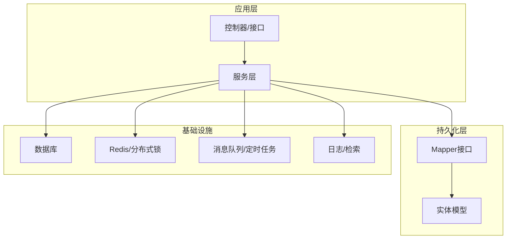

图示来源
- [application.properties:1-6](file://guoke-deepexi-storage-center-provider/src/main/resources/application.properties#L1-L6)

章节来源
- [application.properties:1-6](file://guoke-deepexi-storage-center-provider/src/main/resources/application.properties#L1-L6)

## 核心组件
围绕监控与告警，系统内已具备以下关键能力与数据源：
- 指标与配置
  - Prometheus指标暴露命名空间：m-prometheus
  - Apollo多命名空间配置：application、m-datasource、m-mybatis、m-common、m-nacos、m-redis、m-prometheus、xxl-job、m-rabbitmq、m-elasticsearch
- 日志与审计
  - 接口日志：统一记录请求/响应
  - 业务操作日志：按业务维度记录
  - 异常日志：关键异常捕获与记录
- 业务监控点
  - 库存分布式锁与事务回调
  - 外部接口回调与调度任务
  - 物流信息抓取与异常处理
  - 报损审核与参数校验
  - 预警导入与校验

章节来源
- [application.properties:1-6](file://guoke-deepexi-storage-center-provider/src/main/resources/application.properties#L1-L6)
- [ScInterfaceLogService.java:1-20](file://guoke-deepexi-storage-center-provider/src/main/java/com/deepexi/storage/service/ScInterfaceLogService.java#L1-L20)
- [ScInterfaceLogServiceImpl.java:1-31](file://guoke-deepexi-storage-center-provider/src/main/java/com/deepexi/storage/service/impl/ScInterfaceLogServiceImpl.java#L1-L31)
- [ScOperateLogService.java:1-17](file://guoke-deepexi-storage-center-provider/src/main/java/com/deepexi/storage/service/ScOperateLogService.java#L1-L17)
- [ScOperateLogServiceImpl.java:1-27](file://guoke-deepexi-storage-center-provider/src/main/java/com/deepexi/storage/service/impl/ScOperateLogServiceImpl.java#L1-L27)
- [ScInStockByOutRecordLogServiceImpl.java:52-80](file://guoke-deepexi-storage-center-provider/src/main/java/com/deepexi/storage/service/impl/ScInStockByOutRecordLogServiceImpl.java#L52-L80)
- [ScStockServiceImpl.java:3363-3407](file://guoke-deepexi-storage-center-provider/src/main/java/com/deepexi/storage/service/impl/ScStockServiceImpl.java#L3363-L3407)
- [GetStockMDLHandler.java:34-62](file://guoke-deepexi-storage-center-provider/src/main/java/com/deepexi/storage/scheduled/GetStockMDLHandler.java#L34-L62)
- [InterfaceCallBackServiceImpl.java:24-59](file://guoke-deepexi-storage-center-provider/src/main/java/com/deepexi/storage/service/impl/InterfaceCallBackServiceImpl.java#L24-L59)
- [LogisticsInfoHandler.java:39-61](file://guoke-deepexi-storage-center-provider/src/main/java/com/deepexi/storage/scheduled/LogisticsInfoHandler.java#L39-L61)
- [ScDamageServiceImpl.java:653-681](file://guoke-deepexi-storage-center-provider/src/main/java/com/deepexi/storage/service/impl/ScDamageServiceImpl.java#L653-L681)

## 架构总览
系统监控与告警涉及的关键交互如下：

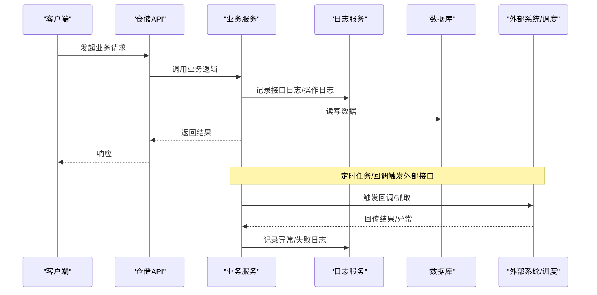

图示来源
- [ScInterfaceLogServiceImpl.java:17-29](file://guoke-deepexi-storage-center-provider/src/main/java/com/deepexi/storage/service/impl/ScInterfaceLogServiceImpl.java#L17-L29)
- [ScOperateLogServiceImpl.java:19-26](file://guoke-deepexi-storage-center-provider/src/main/java/com/deepexi/storage/service/impl/ScOperateLogServiceImpl.java#L19-L26)
- [GetStockMDLHandler.java:38-51](file://guoke-deepexi-storage-center-provider/src/main/java/com/deepexi/storage/scheduled/GetStockMDLHandler.java#L38-L51)
- [InterfaceCallBackServiceImpl.java:52-59](file://guoke-deepexi-storage-center-provider/src/main/java/com/deepexi/storage/service/impl/InterfaceCallBackServiceImpl.java#L52-L59)

## 详细组件分析

### 接口日志与业务操作日志
- 接口日志
  - 统一记录业务类型、业务编码、发送方、接收方、请求体、响应体
  - 便于问题回溯与审计
- 业务操作日志
  - 支持按业务ID查询最新操作日志
  - 可用于追踪业务状态流转与异常定位

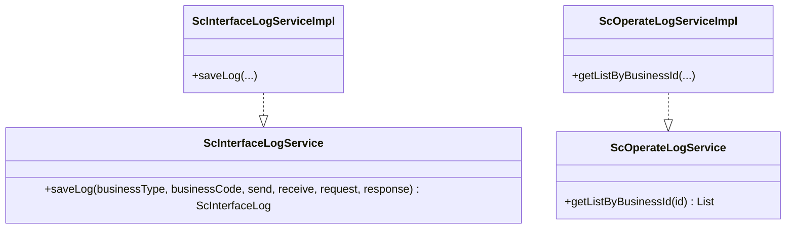

图示来源
- [ScInterfaceLogService.java:1-20](file://guoke-deepexi-storage-center-provider/src/main/java/com/deepexi/storage/service/ScInterfaceLogService.java#L1-L20)
- [ScInterfaceLogServiceImpl.java:1-31](file://guoke-deepexi-storage-center-provider/src/main/java/com/deepexi/storage/service/impl/ScInterfaceLogServiceImpl.java#L1-L31)
- [ScOperateLogService.java:1-17](file://guoke-deepexi-storage-center-provider/src/main/java/com/deepexi/storage/service/ScOperateLogService.java#L1-L17)
- [ScOperateLogServiceImpl.java:1-27](file://guoke-deepexi-storage-center-provider/src/main/java/com/deepexi/storage/service/impl/ScOperateLogServiceImpl.java#L1-L27)

章节来源
- [ScInterfaceLogService.java:1-20](file://guoke-deepexi-storage-center-provider/src/main/java/com/deepexi/storage/service/ScInterfaceLogService.java#L1-L20)
- [ScInterfaceLogServiceImpl.java:1-31](file://guoke-deepexi-storage-center-provider/src/main/java/com/deepexi/storage/service/impl/ScInterfaceLogServiceImpl.java#L1-L31)
- [ScOperateLogService.java:1-17](file://guoke-deepexi-storage-center-provider/src/main/java/com/deepexi/storage/service/ScOperateLogService.java#L1-L17)
- [ScOperateLogServiceImpl.java:1-27](file://guoke-deepexi-storage-center-provider/src/main/java/com/deepexi/storage/service/impl/ScOperateLogServiceImpl.java#L1-L27)

### 异常日志与失败记录
- 出库转入库失败日志
  - 自动记录失败原因、跟踪ID、操作类型、状态等
- 更新数据过程中的异常
  - 对异常进行捕获并记录，返回失败明细
- 报损审核异常
  - RPC调用失败或返回非成功码时抛出业务异常

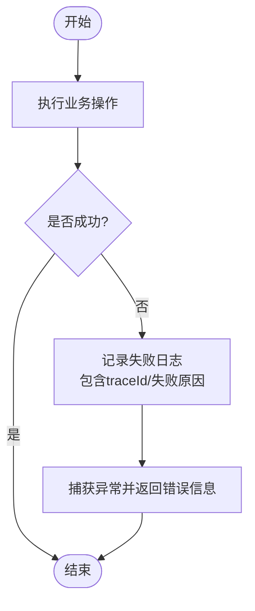

图示来源
- [ScInStockByOutRecordLogServiceImpl.java:52-80](file://guoke-deepexi-storage-center-provider/src/main/java/com/deepexi/storage/service/impl/ScInStockByOutRecordLogServiceImpl.java#L52-L80)
- [UpdateDataServiceImpl.java:618-626](file://guoke-deepexi-storage-center-provider/src/main/java/com/deepexi/storage/service/UpdateDataServiceImpl.java#L618-L626)
- [ScDamageServiceImpl.java:653-666](file://guoke-deepexi-storage-center-provider/src/main/java/com/deepexi/storage/service/impl/ScDamageServiceImpl.java#L653-L666)

章节来源
- [ScInStockByOutRecordLogServiceImpl.java:52-80](file://guoke-deepexi-storage-center-provider/src/main/java/com/deepexi/storage/service/impl/ScInStockByOutRecordLogServiceImpl.java#L52-L80)
- [UpdateDataServiceImpl.java:618-626](file://guoke-deepexi-storage-center-provider/src/main/java/com/deepexi/storage/service/UpdateDataServiceImpl.java#L618-L626)
- [ScDamageServiceImpl.java:653-666](file://guoke-deepexi-storage-center-provider/src/main/java/com/deepexi/storage/service/impl/ScDamageServiceImpl.java#L653-L666)

### 分布式锁与事务回调（库存）
- 通过Redisson对多个产品ID加多锁，避免并发冲突
- 注册事务完成后回调，确保无论事务成功与否均释放锁
- 锁失败时记录锁键与业务异常

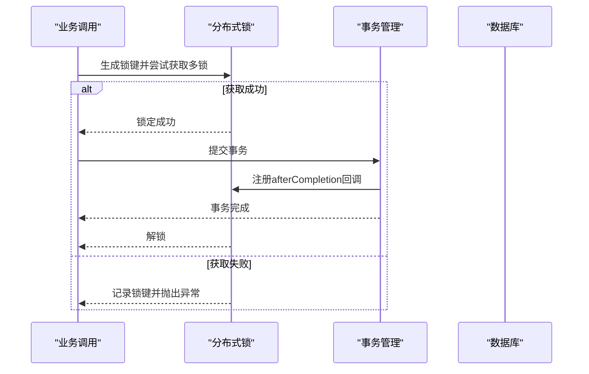

图示来源
- [ScStockServiceImpl.java:3366-3407](file://guoke-deepexi-storage-center-provider/src/main/java/com/deepexi/storage/service/impl/ScStockServiceImpl.java#L3366-L3407)

章节来源
- [ScStockServiceImpl.java:3366-3407](file://guoke-deepexi-storage-center-provider/src/main/java/com/deepexi/storage/service/impl/ScStockServiceImpl.java#L3366-L3407)

### 外部接口回调与调度任务
- 调度任务从外部系统拉取库存信息，并回调到系统内部接口
- 回调接口记录请求与响应，便于审计与问题定位
- 异常时记录错误堆栈

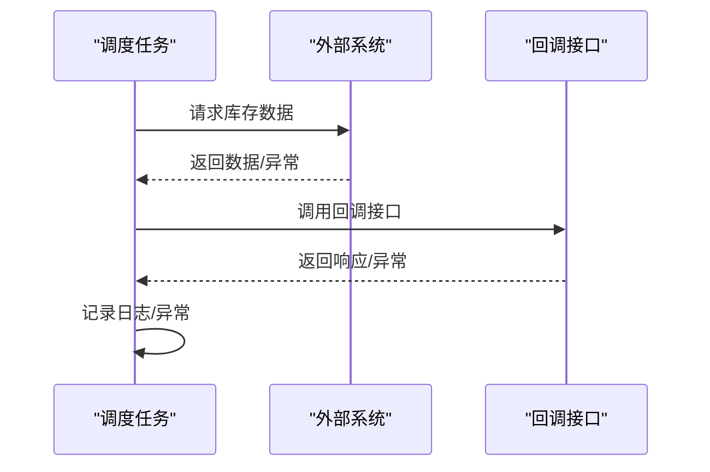

图示来源
- [GetStockMDLHandler.java:38-51](file://guoke-deepexi-storage-center-provider/src/main/java/com/deepexi/storage/scheduled/GetStockMDLHandler.java#L38-L51)
- [InterfaceCallBackServiceImpl.java:52-59](file://guoke-deepexi-storage-center-provider/src/main/java/com/deepexi/storage/service/impl/InterfaceCallBackServiceImpl.java#L52-L59)

章节来源
- [GetStockMDLHandler.java:34-62](file://guoke-deepexi-storage-center-provider/src/main/java/com/deepexi/storage/scheduled/GetStockMDLHandler.java#L34-L62)
- [InterfaceCallBackServiceImpl.java:24-59](file://guoke-deepexi-storage-center-provider/src/main/java/com/deepexi/storage/service/impl/InterfaceCallBackServiceImpl.java#L24-L59)

### 物流信息抓取与异常处理
- 从待处理列表中获取物流单，调用WMS代理处理器抓取物流信息
- 异常时记录状态与错误信息

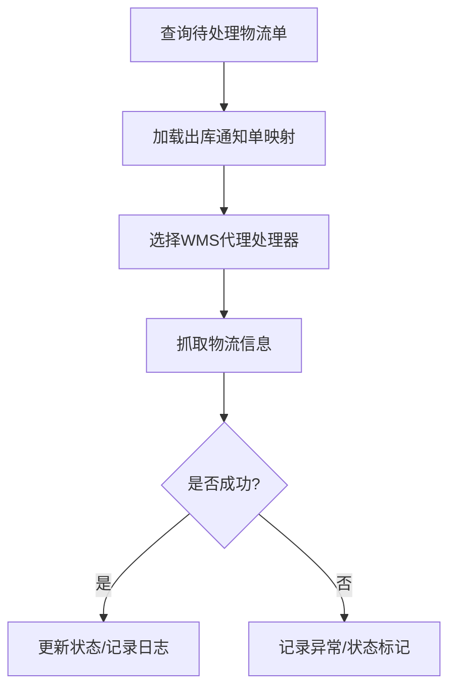

图示来源
- [LogisticsInfoHandler.java:39-61](file://guoke-deepexi-storage-center-provider/src/main/java/com/deepexi/storage/scheduled/LogisticsInfoHandler.java#L39-L61)

章节来源
- [LogisticsInfoHandler.java:39-61](file://guoke-deepexi-storage-center-provider/src/main/java/com/deepexi/storage/scheduled/LogisticsInfoHandler.java#L39-L61)

### 预警导入与校验
- 预警导入时对上下限、长度、格式进行校验
- 校验失败时记录具体行号与错误信息

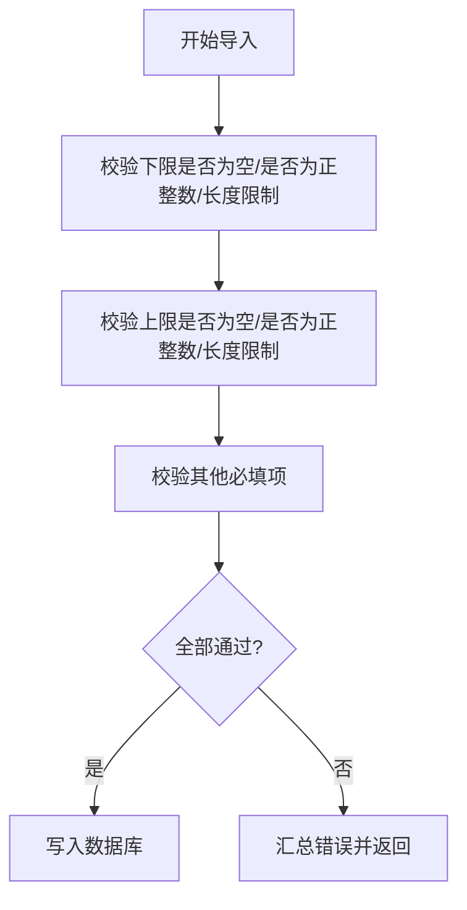

图示来源
- [ScWarningStockServiceImpl.java:308-329](file://guoke-deepexi-storage-center-provider/src/main/java/com/deepexi/storage/service/impl/ScWarningStockServiceImpl.java#L308-L329)
- [StockWarningMapper.xml:272-312](file://guoke-deepexi-storage-center-provider/src/main/resources/mapper/StockWarningMapper.xml#L272-L312)

章节来源
- [ScWarningStockServiceImpl.java:308-329](file://guoke-deepexi-storage-center-provider/src/main/java/com/deepexi/storage/service/impl/ScWarningStockServiceImpl.java#L308-L329)
- [StockWarningMapper.xml:272-312](file://guoke-deepexi-storage-center-provider/src/main/resources/mapper/StockWarningMapper.xml#L272-L312)

### 物流配置查询
- 通过公司ID查询物流配置，支持批量插入与查询

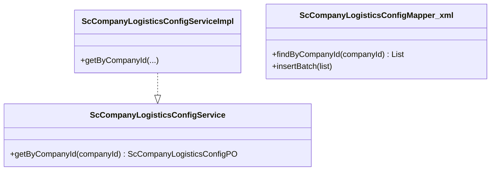

图示来源
- [ScCompanyLogisticsConfigService.java:1-18](file://guoke-deepexi-storage-center-provider/src/main/java/com/deepexi/storage/service/ScCompanyLogisticsConfigService.java#L1-L18)
- [ScCompanyLogisticsConfigServiceImpl.java:1-30](file://guoke-deepexi-storage-center-provider/src/main/java/com/deepexi/storage/service/impl/ScCompanyLogisticsConfigServiceImpl.java#L1-L30)
- [ScCompanyLogisticsConfigMapper.xml:1-39](file://guoke-deepexi-storage-center-provider/src/main/resources/mapper/logistics/ScCompanyLogisticsConfigMapper.xml#L1-L39)

章节来源
- [ScCompanyLogisticsConfigService.java:1-18](file://guoke-deepexi-storage-center-provider/src/main/java/com/deepexi/storage/service/ScCompanyLogisticsConfigService.java#L1-L18)
- [ScCompanyLogisticsConfigServiceImpl.java:1-30](file://guoke-deepexi-storage-center-provider/src/main/java/com/deepexi/storage/service/impl/ScCompanyLogisticsConfigServiceImpl.java#L1-L30)
- [ScCompanyLogisticsConfigMapper.xml:1-39](file://guoke-deepexi-storage-center-provider/src/main/resources/mapper/logistics/ScCompanyLogisticsConfigMapper.xml#L1-L39)

### 查询服务与库存变更
- 查询服务实现（如AKTY）记录查询日志
- 默认库存变更服务实现记录变更日志

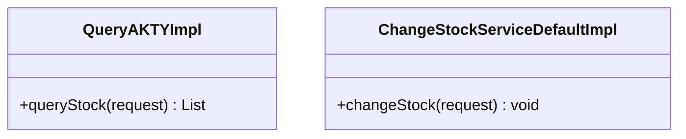

图示来源
- [QueryAKTYImpl.java:1-38](file://guoke-deepexi-storage-center-provider/src/main/java/com/deepexi/storage/service/query/QueryAKTYImpl.java#L1-L38)
- [ChangeStockServiceDefaultImpl.java:1-14](file://guoke-deepexi-storage-center-provider/src/main/java/com/deepexi/storage/service/changeStock/ChangeStockServiceDefaultImpl.java#L1-L14)

章节来源
- [QueryAKTYImpl.java:1-38](file://guoke-deepexi-storage-center-provider/src/main/java/com/deepexi/storage/service/query/QueryAKTYImpl.java#L1-L38)
- [ChangeStockServiceDefaultImpl.java:1-14](file://guoke-deepexi-storage-center-provider/src/main/java/com/deepexi/storage/service/changeStock/ChangeStockServiceDefaultImpl.java#L1-L14)

## 依赖关系分析
- 配置依赖
  - Apollo命名空间包含Prometheus指标暴露配置，便于集成监控系统
- 日志依赖
  - 接口日志与业务操作日志分别由独立服务实现，便于解耦与扩展
- 业务依赖
  - 分布式锁依赖Redisson；物流抓取依赖WMS代理处理器；预警导入依赖MyBatis映射

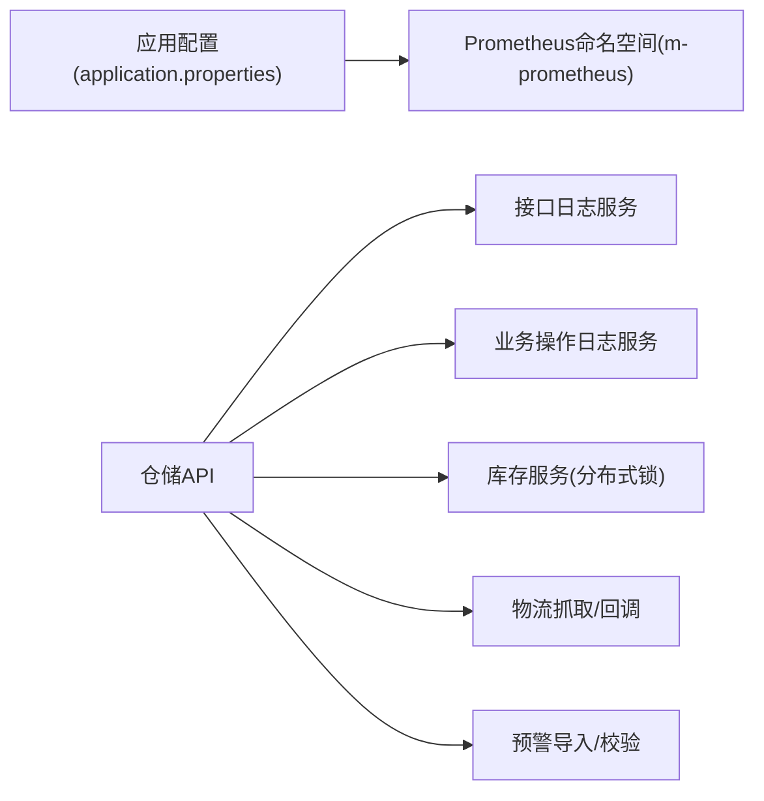

图示来源
- [application.properties:1-6](file://guoke-deepexi-storage-center-provider/src/main/resources/application.properties#L1-L6)
- [ScInterfaceLogServiceImpl.java:17-29](file://guoke-deepexi-storage-center-provider/src/main/java/com/deepexi/storage/service/impl/ScInterfaceLogServiceImpl.java#L17-L29)
- [ScOperateLogServiceImpl.java:19-26](file://guoke-deepexi-storage-center-provider/src/main/java/com/deepexi/storage/service/impl/ScOperateLogServiceImpl.java#L19-L26)
- [ScStockServiceImpl.java:3366-3407](file://guoke-deepexi-storage-center-provider/src/main/java/com/deepexi/storage/service/impl/ScStockServiceImpl.java#L3366-L3407)
- [LogisticsInfoHandler.java:39-61](file://guoke-deepexi-storage-center-provider/src/main/java/com/deepexi/storage/scheduled/LogisticsInfoHandler.java#L39-L61)
- [ScWarningStockServiceImpl.java:308-329](file://guoke-deepexi-storage-center-provider/src/main/java/com/deepexi/storage/service/impl/ScWarningStockServiceImpl.java#L308-L329)

章节来源
- [application.properties:1-6](file://guoke-deepexi-storage-center-provider/src/main/resources/application.properties#L1-L6)

## 性能考量
- 接口日志与业务日志体量较大，建议：
  - 结构化存储与索引（按时间、业务类型、traceId）
  - 设置滚动清理策略与压缩归档
- 分布式锁：
  - 合理设置等待超时与锁粒度，避免长时间阻塞
  - 事务完成后及时释放，防止死锁与资源泄漏
- 调度任务与回调：
  - 控制并发度与重试策略，避免对外部系统造成压力
- 预警导入：
  - 批量写入时使用批量SQL，减少往返开销

## 故障排查指南
- 快速定位
  - 通过traceId在接口日志与业务操作日志中检索
  - 查看失败记录与异常日志，确认失败原因
- 常见问题
  - 分布式锁获取失败：检查锁键生成与并发竞争情况
  - 外部接口回调异常：查看回调接口日志与异常堆栈
  - 物流信息抓取失败：检查WMS代理处理器状态与网络连通性
  - 预警导入失败：根据错误提示修正数据格式与范围

章节来源
- [ScInStockByOutRecordLogServiceImpl.java:52-80](file://guoke-deepexi-storage-center-provider/src/main/java/com/deepexi/storage/service/impl/ScInStockByOutRecordLogServiceImpl.java#L52-L80)
- [UpdateDataServiceImpl.java:618-626](file://guoke-deepexi-storage-center-provider/src/main/java/com/deepexi/storage/service/UpdateDataServiceImpl.java#L618-L626)
- [LogisticsInfoHandler.java:39-61](file://guoke-deepexi-storage-center-provider/src/main/java/com/deepexi/storage/scheduled/LogisticsInfoHandler.java#L39-L61)
- [ScWarningStockServiceImpl.java:308-329](file://guoke-deepexi-storage-center-provider/src/main/java/com/deepexi/storage/service/impl/ScWarningStockServiceImpl.java#L308-L329)

## 结论
本方案以现有代码与配置为基础，构建了覆盖应用、数据库与业务的监控与告警体系。通过统一的日志记录、异常处理与关键业务监控点，能够有效支撑系统的可观测性与稳定性。建议结合实际运行数据逐步完善阈值与告警策略，并持续优化日志与指标的采集与展示。

## 附录

### 监控指标定义与采集方法
- 应用性能指标
  - QPS/响应时间：基于API访问日志统计
  - 异常率：基于异常日志统计
  - 分布式锁等待时延：基于库存服务日志
- 数据库性能指标
  - SQL执行耗时与慢查询：基于MyBatis日志与数据库慢查询日志
  - 连接池使用率：基于连接池监控
- 业务指标
  - 入库/出库成功率、失败原因分布
  - 预警导入通过率与失败明细
  - 物流信息抓取成功率与失败原因

章节来源
- [ScInterfaceLogServiceImpl.java:17-29](file://guoke-deepexi-storage-center-provider/src/main/java/com/deepexi/storage/service/impl/ScInterfaceLogServiceImpl.java#L17-L29)
- [ScOperateLogServiceImpl.java:19-26](file://guoke-deepexi-storage-center-provider/src/main/java/com/deepexi/storage/service/impl/ScOperateLogServiceImpl.java#L19-L26)
- [ScStockServiceImpl.java:3366-3407](file://guoke-deepexi-storage-center-provider/src/main/java/com/deepexi/storage/service/impl/ScStockServiceImpl.java#L3366-L3407)
- [ScWarningStockServiceImpl.java:308-329](file://guoke-deepexi-storage-center-provider/src/main/java/com/deepexi/storage/service/impl/ScWarningStockServiceImpl.java#L308-L329)

### 日志收集与分析策略
- API调用日志
  - 统一记录请求/响应与traceId，便于端到端追踪
- 业务操作日志
  - 按业务ID聚合，支持历史轨迹回溯
- 异常日志
  - 记录异常堆栈与上下文信息，支持分类统计

章节来源
- [ScInterfaceLogServiceImpl.java:17-29](file://guoke-deepexi-storage-center-provider/src/main/java/com/deepexi/storage/service/impl/ScInterfaceLogServiceImpl.java#L17-L29)
- [ScOperateLogServiceImpl.java:19-26](file://guoke-deepexi-storage-center-provider/src/main/java/com/deepexi/storage/service/impl/ScOperateLogServiceImpl.java#L19-L26)
- [ScInStockByOutRecordLogServiceImpl.java:52-80](file://guoke-deepexi-storage-center-provider/src/main/java/com/deepexi/storage/service/impl/ScInStockByOutRecordLogServiceImpl.java#L52-L80)

### 异常处理机制与错误监控配置
- 分布式锁
  - 锁失败时记录锁键并抛出业务异常
- 外部回调
  - 异常时记录错误信息与traceId
- 报损审核
  - RPC调用失败或非成功码时抛出业务异常

章节来源
- [ScStockServiceImpl.java:3366-3407](file://guoke-deepexi-storage-center-provider/src/main/java/com/deepexi/storage/service/impl/ScStockServiceImpl.java#L3366-L3407)
- [InterfaceCallBackServiceImpl.java:52-59](file://guoke-deepexi-storage-center-provider/src/main/java/com/deepexi/storage/service/impl/InterfaceCallBackServiceImpl.java#L52-L59)
- [ScDamageServiceImpl.java:653-666](file://guoke-deepexi-storage-center-provider/src/main/java/com/deepexi/storage/service/impl/ScDamageServiceImpl.java#L653-L666)

### 告警规则配置、通知方式与处理流程
- 告警规则建议
  - 接口异常率、响应时间分位数、数据库慢查询条数、分布式锁等待超时次数、物流抓取失败率、预警导入失败率
- 通知方式
  - 邮件、即时通讯群组、电话（分级）
- 处理流程
  - 自动化告警 -> 人工确认 -> 排查定位 -> 修复验证 -> 关闭告警

### 监控仪表板搭建与关键阈值设置
- 仪表板建议
  - 实时QPS/错误率曲线、响应时间分布、锁等待时延、SQL慢查询TopN、物流抓取成功率、预警导入通过率
- 阈值设置
  - 异常率>1%、P95响应>2s、锁等待>10s、慢查询>10条/分钟、物流失败>5次/小时、预警失败>10条/天

### 常见监控场景与最佳实践
- 场景
  - 大促期间流量激增、外部系统不稳定、库存并发变更高峰
- 最佳实践
  - 限流与熔断、异步化与削峰、重试与幂等设计、完善的日志与链路追踪、定期演练与预案更新