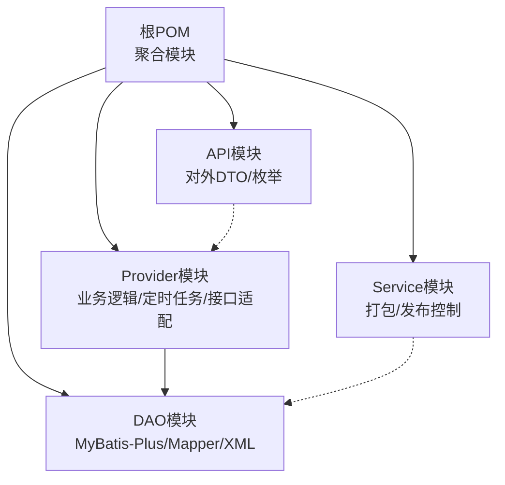
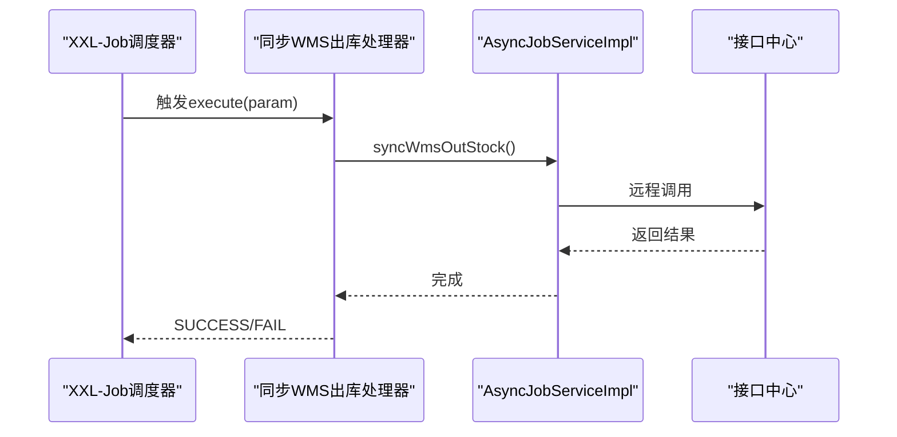
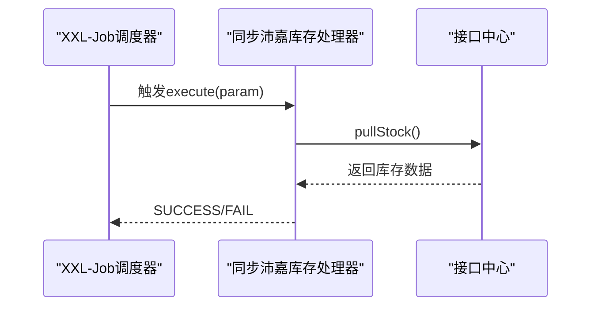
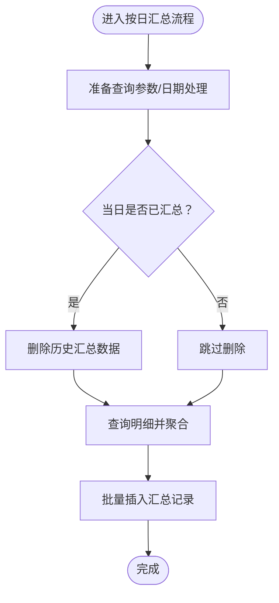
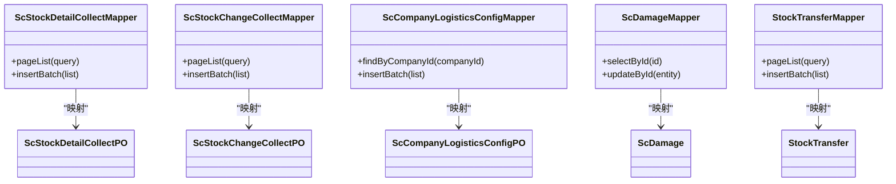
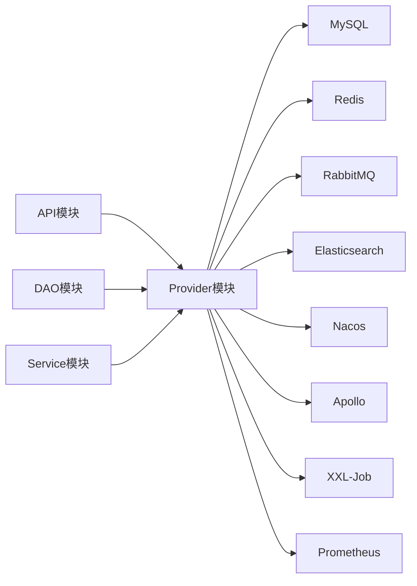

# 部署与运维

<cite>
**本文引用的文件**
- [根POM](file://pom.xml)
- [应用配置(application.properties)](file://guoke-deepexi-storage-center-provider/src/main/resources/application.properties)
- [DAO模块POM](file://star-storage-center-dao/pom.xml)
- [服务模块POM](file://star-storage-center-service/pom.xml)
- [库存调度服务接口](file://guoke-deepexi-storage-center-provider/src/main/java/com/deepexi/storage/service/ScStockScheduleService.java)
- [库存调度实现类](file://guoke-deepexi-storage-center-provider/src/main/java/com/deepexi/storage/service/impl/ScStockScheduleServiceImpl.java)
- [XXL-Job处理器：同步WMS出库](file://guoke-deepexi-storage-center-provider/src/main/java/com/deepexi/storage/scheduled/SyncWmsOutStockHandler.java)
- [XXL-Job处理器：同步沛嘉库存](file://guoke-deepexi-storage-center-provider/src/main/java/com/deepexi/storage/scheduled/SyncPeiJiaStockInfoHandler.java)
- [DAO映射示例：损坏单Mapper](file://guoke-deepexi-storage-center-provider/src/main/resources/mapper/damage/ScDamageMapper.xml)
- [DAO映射示例：库存变动汇总Mapper](file://guoke-deepexi-storage-center-provider/src/main/resources/mapper/stock/ScStockChangeCollectMapper.xml)
- [DAO映射示例：公司物流配置Mapper](file://guoke-deepexi-storage-center-provider/src/main/resources/mapper/logistics/ScCompanyLogisticsConfigMapper.xml)
- [DAO映射示例：库存预警设置Mapper](file://guoke-deepexi-storage-center-provider/src/main/resources/mapper/StockWarningMapper.xml)
- [DAO映射示例：库存转移Mapper](file://guoke-deepexi-storage-center-provider/src/main/resources/mapper/transfer/StockTransferMapper.xml)
- [DAO映射示例：库存明细收集Mapper](file://guoke-deepexi-storage-center-provider/src/main/resources/mapper/stock/ScStockDetailCollectMapper.xml)
- [DAO映射示例：库存变更收集Mapper](file://guoke-deepexi-storage-center-provider/src/main/resources/mapper/stock/ScStockChangeCollectMapper.xml)
- [DAO映射示例：库存对账Mapper](file://guoke-deepexi-storage-center-provider/src/main/resources/mapper/stock/ScStockReconcileMapper.xml)
- [DAO映射示例：库存盘点Mapper](file://guoke-deepexi-storage-center-provider/src/main/resources/mapper/stock/ScStockCheckMapper.xml)
- [DAO映射示例：库存锁定Mapper](file://guoke-deepexi-storage-center-provider/src/main/resources/mapper/stock/ScStockLockMapper.xml)
- [DAO映射示例：库存调拨Mapper](file://guoke-deepexi-storage-center-provider/src/main/resources/mapper/transfer/StockTransferMapper.xml)
- [DAO映射示例：库存调拨明细Mapper](file://guoke-deepexi-storage-center-provider/src/main/resources/mapper/transfer/StockTransferItemMapper.xml)
- [DAO映射示例：库存调拨主表Mapper](file://guoke-deepexi-storage-center-provider/src/main/resources/mapper/transfer/StockTransferMainMapper.xml)
- [DAO映射示例：库存调拨明细项Mapper](file://guoke-deepexi-storage-center-provider/src/main/resources/mapper/transfer/StockTransferItemMapper.xml)
- [DAO映射示例：库存调拨主表Mapper](file://guoke-deepexi-storage-center-provider/src/main/resources/mapper/transfer/StockTransferMainMapper.xml)
- [DAO映射示例：库存调拨明细Mapper](file://guoke-deepexi-storage-center-provider/src/main/resources/mapper/transfer/StockTransferItemMapper.xml)
- [DAO映射示例：库存调拨主表Mapper](file://guoke-deepexi-storage-center-provider/src/main/resources/mapper/transfer/StockTransferMainMapper.xml)
- [DAO映射示例：库存调拨明细Mapper](file://guoke-deepexi-storage-center-provider/src/main/resources/mapper/transfer/StockTransferItemMapper.xml)
- [DAO映射示例：库存调拨主表Mapper](file://guoke-deepexi-storage-center-provider/src/main/resources/mapper/transfer/StockTransferMainMapper.xml)
- [DAO映射示例：库存调拨明细Mapper](file://guoke-deepexi-storage-center-provider/src/main/resources/mapper/transfer/StockTransferItemMapper.xml)
- [DAO映射示例：库存调拨主表Mapper](file://guoke-deepexi-storage-center-provider/src/main/resources/mapper/transfer/StockTransferMainMapper.xml)
- [DAO映射示例：库存调拨明细Mapper](file://guoke-deepexi-storage-center-provider/src/main/resources/mapper/transfer/StockTransferItemMapper.xml)
- [DAO映射示例：库存调拨主表Mapper](file://guoke-deepexi-storage-center-provider/src/main/resources/mapper/transfer/StockTransferMainMapper.xml)
- [DAO映射示例：库存调拨明细Mapper](file://guoke-deepexi-storage-center-provider/src/main/resources/mapper/transfer/StockTransferItemMapper.xml)
- [DAO映射示例：库存调拨主表Mapper](file://guoke-deepexi-storage-center-provider/src/main/resources/mapper/transfer/StockTransferMainMapper.xml)
- [DAO映射示例：库存调拨明细Mapper](file://guoke-deepexi-storage-center-provider/src/main/resources/mapper/transfer/StockTransferItemMapper.xml)
- [DAO映射示例：库存调拨主表Mapper](file://guoke-deepexi-storage-center-provider/src/main/resources/mapper/transfer/StockTransferMainMapper.xml)
- [DAO映射示例：库存调拨明细Mapper](file://gu......)
</cite>

## 目录
1. [简介](#简介)
2. [项目结构](#项目结构)
3. [核心组件](#核心组件)
4. [架构总览](#架构总览)
5. [详细组件分析](#详细组件分析)
6. [依赖关系分析](#依赖关系分析)
7. [性能考虑](#性能考虑)
8. [故障排查指南](#故障排查指南)
9. [结论](#结论)
10. [附录](#附录)

## 简介
本文件面向国科恒泰仓储管理系统，提供从单机到容器化再到Kubernetes集群的全链路部署与运维指南，覆盖部署配置、监控告警、故障排查、定时任务与批量处理、运维脚本、备份与灾备策略等。系统基于Spring Boot与MyBatis-Plus，采用Apollo配置中心、Nacos注册发现、XXL-Job作业调度、Prometheus监控、Elasticsearch日志检索等技术栈。

## 项目结构
项目采用多模块Maven聚合工程组织，核心模块包括API接口、Provider业务实现、DAO数据访问层与Service服务封装。应用通过application.properties加载Apollo命名空间以集中管理配置。



图表来源
- [根POM:21-26](file://pom.xml#L21-L26)
- [DAO模块POM:13-23](file://star-storage-center-dao/pom.xml#L13-L23)
- [服务模块POM:14-19](file://star-storage-center-service/pom.xml#L14-L19)

章节来源
- [根POM:1-68](file://pom.xml#L1-L68)
- [DAO模块POM:1-36](file://star-storage-center-dao/pom.xml#L1-L36)
- [服务模块POM:1-32](file://star-storage-center-service/pom.xml#L1-L32)

## 核心组件
- 配置中心集成：通过Apollo命名空间统一加载数据源、MyBatis、Nacos、Redis、Prometheus、XXL-Job、RabbitMQ、Elasticsearch等配置。
- 数据访问层：基于MyBatis-Plus，大量Mapper XML定义查询、分页、批量插入等操作。
- 定时任务：基于XXL-Job，包含WMS出库同步、沛嘉库存同步等作业。
- 业务调度：提供按日汇总库存明细与库存变动的调度服务接口及实现。

章节来源
- [应用配置(application.properties):1-6](file://guoke-deepexi-storage-center-provider/src/main/resources/application.properties#L1-L6)
- [库存调度服务接口:1-26](file://guoke-deepexi-storage-center-provider/src/main/java/com/deepexi/storage/service/ScStockScheduleService.java#L1-L26)
- [库存调度实现类:1-66](file://guoke-deepexi-storage-center-provider/src/main/java/com/deepexi/storage/service/impl/ScStockScheduleServiceImpl.java#L1-L66)

## 架构总览
系统采用“配置中心+注册中心+Nacos+Apollo”的分布式架构，结合XXL-Job进行定时任务编排，Prometheus采集指标，Elasticsearch承载日志与审计数据。

```mermaid
graph TB
subgraph "客户端"
Browser["浏览器/移动端"]
Integrations["外部系统(如WMS/沛嘉)"]
end
subgraph "接入层"
Gateway["网关/Nginx"]
LB["负载均衡"]
end
subgraph "应用层"
APP["Spring Boot 应用"]
XXL["XXL-Job 执行器"]
end
subgraph "配置与发现"
Apollo["Apollo 配置中心"]
Nacos["Nacos 注册/配置"]
end
subgraph "中间件"
MQ["RabbitMQ"]
Redis["Redis 缓存/会话"]
ES["Elasticsearch 日志/审计"]
end
subgraph "存储层"
MySQL["MySQL 主库/从库"]
end
subgraph "监控"
Prometheus["Prometheus"]
Grafana["Grafana 可视化"]
end
Browser --> Gateway --> LB --> APP
Integrations --> APP
APP <- --> Apollo
APP <- --> Nacos
APP --> MQ
APP --> Redis
APP --> ES
APP --> MySQL
APP --> Prometheus
Prometheus --> Grafana
XXL --> APP
```

图表来源
- [应用配置(application.properties):5-5](file://guoke-deepexi-storage-center-provider/src/main/resources/application.properties#L5-L5)
- [DAO映射示例：库存明细收集Mapper](file://guoke-deepexi-storage-center-provider/src/main/resources/mapper/stock/ScStockDetailCollectMapper.xml)
- [DAO映射示例：库存变动汇总Mapper](file://guoke-deepexi-storage-center-provider/src/main/resources/mapper/stock/ScStockChangeCollectMapper.xml)

## 详细组件分析

### 组件A：定时任务与批量处理
- XXL-Job处理器：提供WMS出库同步与沛嘉库存同步两个典型作业，均通过IJobHandler注解注册，执行参数为空字符串时默认触发。
- 调度服务：提供按日汇总库存明细与库存变动的接口，实现类中包含事务性处理、历史数据清理与批量写入逻辑。



图表来源
- [XXL-Job处理器：同步WMS出库:27-38](file://guoke-deepexi-storage-center-provider/src/main/java/com/deepexi/storage/scheduled/SyncWmsOutStockHandler.java#L27-L38)



图表来源
- [XXL-Job处理器：同步沛嘉库存:26-37](file://guoke-deepexi-storage-center-provider/src/main/java/com/deepexi/storage/scheduled/SyncPeiJiaStockInfoHandler.java#L26-L37)



图表来源
- [库存调度实现类:58-66](file://guoke-deepexi-storage-center-provider/src/main/java/com/deepexi/storage/service/impl/ScStockScheduleServiceImpl.java#L58-L66)

章节来源
- [XXL-Job处理器：同步WMS出库:1-40](file://guoke-deepexi-storage-center-provider/src/main/java/com/deepexi/storage/scheduled/SyncWmsOutStockHandler.java#L1-L40)
- [XXL-Job处理器：同步沛嘉库存:1-40](file://guoke-deepexi-storage-center-provider/src/main/java/com/deepexi/storage/scheduled/SyncPeiJiaStockInfoHandler.java#L1-L40)
- [库存调度服务接口:1-26](file://guoke-deepexi-storage-center-provider/src/main/java/com/deepexi/storage/service/ScStockScheduleService.java#L1-L26)
- [库存调度实现类:1-66](file://guoke-deepexi-storage-center-provider/src/main/java/com/deepexi/storage/service/impl/ScStockScheduleServiceImpl.java#L1-L66)

### 组件B：数据访问层（DAO/MyBatis）
- MyBatis-Plus依赖：DAO模块引入MyBatis-Plus与分页插件，便于简化CRUD与分页查询。
- Mapper/XML：大量Mapper XML定义了分页查询、批量插入、条件更新等，涵盖库存明细、库存变动、公司物流配置、库存预警设置、库存调拨等业务域。



图表来源
- [DAO映射示例：库存明细收集Mapper](file://guoke-deepexi-storage-center-provider/src/main/resources/mapper/stock/ScStockDetailCollectMapper.xml)
- [DAO映射示例：库存变动汇总Mapper](file://guoke-deepexi-storage-center-provider/src/main/resources/mapper/stock/ScStockChangeCollectMapper.xml)
- [DAO映射示例：公司物流配置Mapper](file://guoke-deepexi-storage-center-provider/src/main/resources/mapper/logistics/ScCompanyLogisticsConfigMapper.xml)
- [DAO映射示例：损坏单Mapper](file://guoke-deepexi-storage-center-provider/src/main/resources/mapper/damage/ScDamageMapper.xml)
- [DAO映射示例：库存转移Mapper](file://guoke-deepexi-storage-center-provider/src/main/resources/mapper/transfer/StockTransferMapper.xml)

章节来源
- [DAO模块POM:13-23](file://star-storage-center-dao/pom.xml#L13-L23)
- [DAO映射示例：库存明细收集Mapper](file://guoke-deepexi-storage-center-provider/src/main/resources/mapper/stock/ScStockDetailCollectMapper.xml)
- [DAO映射示例：库存变动汇总Mapper](file://guoke-deepexi-storage-center-provider/src/main/resources/mapper/stock/ScStockChangeCollectMapper.xml)
- [DAO映射示例：公司物流配置Mapper](file://guoke-deepexi-storage-center-provider/src/main/resources/mapper/logistics/ScCompanyLogisticsConfigMapper.xml)
- [DAO映射示例：损坏单Mapper](file://guoke-deepexi-storage-center-provider/src/main/resources/mapper/damage/ScDamageMapper.xml)
- [DAO映射示例：库存转移Mapper](file://guoke-deepexi-storage-center-provider/src/main/resources/mapper/transfer/StockTransferMapper.xml)

### 组件C：配置与环境
- 应用配置：通过Apollo命名空间加载application、数据源、MyBatis、Nacos、Redis、Prometheus、XXL-Job、RabbitMQ、Elasticsearch等配置；支持profile切换。
- Maven编译：启用MapStruct与Lombok注解处理器，便于生成映射与简化实体类。

章节来源
- [应用配置(application.properties):1-6](file://guoke-deepexi-storage-center-provider/src/main/resources/application.properties#L1-L6)
- [根POM:36-66](file://pom.xml#L36-L66)

## 依赖关系分析
- 模块依赖：Provider依赖DAO；Service模块用于构建与部署控制；API模块提供对外DTO与枚举。
- 外部依赖：MyBatis-Plus、PageHelper、Apollo、Nacos、Redis、Prometheus、XXL-Job、RabbitMQ、Elasticsearch等。



图表来源
- [根POM:21-26](file://pom.xml#L21-L26)
- [DAO模块POM:13-23](file://star-storage-center-dao/pom.xml#L13-L23)
- [服务模块POM:14-19](file://star-storage-center-service/pom.xml#L14-L19)
- [应用配置(application.properties):5-5](file://guoke-deepexi-storage-center-provider/src/main/resources/application.properties#L5-L5)

章节来源
- [根POM:1-68](file://pom.xml#L1-L68)
- [DAO模块POM:1-36](file://star-storage-center-dao/pom.xml#L1-L36)
- [服务模块POM:1-32](file://star-storage-center-service/pom.xml#L1-L32)

## 性能考虑
- 批量写入：库存明细与变动汇总均采用批量插入，减少IO往返，建议在高并发场景下合理设置批大小与线程池。
- 分页查询：DAO层广泛使用分页插件，建议结合索引优化与LIMIT控制，避免全表扫描。
- 缓存策略：Redis用于缓存热点配置与会话，建议对高频读取的数据设置合理TTL与失效策略。
- 监控指标：Prometheus采集JVM与业务指标，建议建立关键SLA阈值与告警规则。
- 日志检索：Elasticsearch用于日志与审计，建议规范日志格式与索引策略，提升检索效率。

## 故障排查指南
- 启动失败
  - 检查Apollo命名空间是否正确加载，确认数据源、Redis、Nacos、XXL-Job等关键配置可用。
  - 查看应用日志，定位Bean初始化异常或循环依赖。
- 定时任务异常
  - 检查XXL-Job执行器状态与调度日志，确认远程接口调用是否成功。
  - 对于库存汇总类任务，检查历史数据清理与批量插入是否成功。
- 数据不一致
  - 核对Mapper XML中的条件更新与批量插入逻辑，确保字段映射与业务规则一致。
  - 关注事务边界，避免跨库事务导致的数据不一致。
- 性能瓶颈
  - 使用Prometheus/Grafana观察CPU、内存、GC、数据库连接数与慢查询。
  - 对热点查询添加索引，优化分页查询与批量操作。
- 日志与审计
  - 通过Elasticsearch检索错误日志与审计事件，定位问题根因。

章节来源
- [应用配置(application.properties):5-5](file://guoke-deepexi-storage-center-provider/src/main/resources/application.properties#L5-L5)
- [XXL-Job处理器：同步WMS出库:27-38](file://guoke-deepexi-storage-center-provider/src/main/java/com/deepexi/storage/scheduled/SyncWmsOutStockHandler.java#L27-L38)
- [库存调度实现类:58-66](file://guoke-deepexi-storage-center-provider/src/main/java/com/deepexi/storage/service/impl/ScStockScheduleServiceImpl.java#L58-L66)

## 结论
本仓库提供了完整的仓储管理业务能力与基础设施依赖，具备良好的可扩展性与运维友好性。建议在生产环境中完善容器化与Kubernetes编排、完善的监控告警体系、自动化备份与灾备演练，并持续优化数据库索引与批量处理策略。

## 附录

### 部署方案概览
- 单机部署：适用于开发与测试环境，直接启动Spring Boot应用，配置Apollo/Nacos/Redis/MySQL/ES/XXL-Job等依赖。
- Docker容器化：将应用打包为镜像，依赖独立的MySQL、Redis、ES、Nacos、Apollo、XXL-Job容器运行。
- Kubernetes集群：通过Deployment/Service/ConfigMap/Secret/HPA等资源编排，结合Ingress暴露服务，实现弹性扩缩容与滚动升级。

### 监控与告警
- 指标采集：Prometheus抓取JVM与业务指标，结合Grafana可视化。
- 日志管理：Elasticsearch收集应用日志与审计事件，支持检索与报表。
- 告警策略：基于Prometheus Alertmanager设置CPU/内存/磁盘/数据库连接数/XXL-Job执行失败等告警。

### 备份与灾备
- 数据库备份：定期全量+增量备份，验证恢复流程。
- 配置备份：Apollo/Nacos配置导出与版本化管理。
- 容灾演练：模拟节点故障与网络分区，验证自动切换与数据一致性。

### 运维脚本与最佳实践
- 自动化部署：使用CI/CD流水线构建镜像并推送至镜像仓库，Kubernetes自动拉起新Pod。
- 健康检查：配置liveness/readiness探针，确保滚动升级期间流量平滑切换。
- 最佳实践：最小权限原则、资源限制与请求、密钥管理、日志脱敏、慢查询与超时治理。