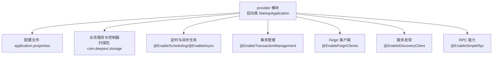
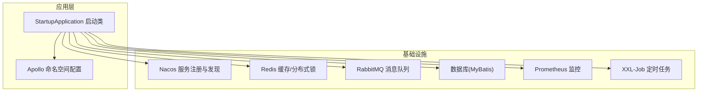
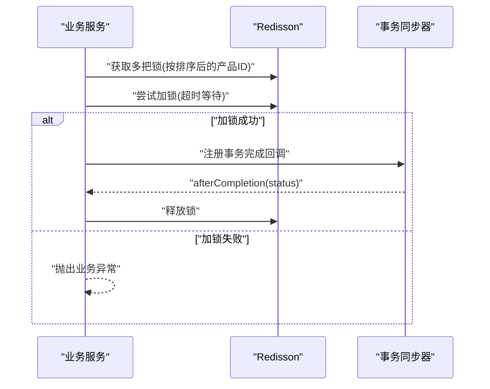
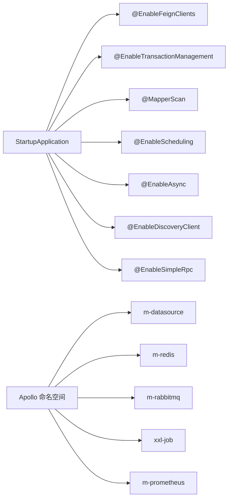

# 部署配置

<cite>
**本文引用的文件**
- [application.properties](file://guoke-deepexi-storage-center-provider/src/main/resources/application.properties)
- [StartupApplication.java](file://guoke-deepexi-storage-center-provider/src/main/java/com/deepexi/storage/StartupApplication.java)
- [ScStockServiceImpl.java](file://guoke-deepexi-storage-center-provider/src/main/java/com/deepexi/storage/service/impl/ScStockServiceImpl.java)
- [ScDeliveryInfoMainServiceImpl.java](file://guoke-deepexi-storage-center-provider/src/main/java/com/deepexi/storage/service/impl/ScDeliveryInfoMainServiceImpl.java)
- [UpdateDataServiceImpl.java](file://guoke-deepexi-storage-center-provider/src/main/java/com/deepexi/storage/service/UpdateDataServiceImpl.java)
- [pom.xml](file://pom.xml)
- [README.md](file://README.md)
</cite>

## 目录
1. [简介](#简介)
2. [项目结构](#项目结构)
3. [核心组件](#核心组件)
4. [架构总览](#架构总览)
5. [详细组件分析](#详细组件分析)
6. [依赖关系分析](#依赖关系分析)
7. [性能考虑](#性能考虑)
8. [故障排查指南](#故障排查指南)
9. [结论](#结论)
10. [附录](#附录)

## 简介
本文件面向国科恒泰仓储管理系统（Storage Center）的部署与配置，聚焦于应用配置文件结构与参数、数据库与Redis连接配置、线程池与异步调度配置、Swagger API文档、跨域与安全配置、多环境配置差异与最佳实践、Docker容器化与Kubernetes集群部署建议，以及配置加载顺序与优先级规则。内容基于仓库中实际存在的配置与代码进行梳理与说明。

## 项目结构
该工程采用多模块Maven结构，核心业务位于 provider 模块，入口启动类位于 provider 的 Java 包内，配置文件位于 provider 的 resources 目录下。Spring Boot 启动类启用多种能力：服务注册与发现、Feign 客户端、事务管理、MyBatis Mapper 扫描、定时任务与异步任务、RPC 能力等。

图表来源
- [StartupApplication.java:14-27](file://guoke-deepexi-storage-center-provider/src/main/java/com/deepexi/storage/StartupApplication.java#L14-L27)
- [application.properties:1-6](file://guoke-deepexi-storage-center-provider/src/main/resources/application.properties#L1-L6)

章节来源
- [StartupApplication.java:14-27](file://guoke-deepexi-storage-center-provider/src/main/java/com/deepexi/storage/StartupApplication.java#L14-L27)
- [application.properties:1-6](file://guoke-deepexi-storage-center-provider/src/main/resources/application.properties#L1-L6)

## 核心组件
- 应用配置文件
  - 通过 Apollo 启动引导加载命名空间，启用懒加载；激活 Spring Profile；允许 Bean 定义覆盖。
  - 命名空间包括：application、m-datasource、m-mybatis、m-common、m-nacos、m-redis、m-prometheus、xxl-job、m-rabbitmq、m-elasticsearch。
- 启动类
  - 开启 Feign、事务、Mapper 扫描、定时任务、异步任务、服务发现、RPC 能力等。
- 缓存与分布式锁
  - 多处使用 Redisson 进行分布式锁与缓存服务，体现对 Redis 的依赖。
- 数据访问
  - MyBatis Mapper 扫描路径在启动类中定义，结合命名空间 m-mybatis 的配置使用。

章节来源
- [application.properties:1-6](file://guoke-deepexi-storage-center-provider/src/main/resources/application.properties#L1-L6)
- [StartupApplication.java:14-27](file://guoke-deepexi-storage-center-provider/src/main/java/com/deepexi/storage/StartupApplication.java#L14-L27)
- [ScStockServiceImpl.java:3363-3407](file://guoke-deepexi-storage-center-provider/src/main/java/com/deepexi/storage/service/impl/ScStockServiceImpl.java#L3363-L3407)
- [ScDeliveryInfoMainServiceImpl.java:137-142](file://guoke-deepexi-storage-center-provider/src/main/java/com/deepexi/storage/service/impl/ScDeliveryInfoMainServiceImpl.java#L137-L142)

## 架构总览
系统以 Spring Boot 为基础，结合 Apollo 配置中心、Nacos 服务治理、Redis 缓存与分布式锁、消息队列（RabbitMQ）、定时任务（XXL-Job）与 Prometheus 监控等组件协同工作。启动类统一开启各类能力，并通过命名空间实现配置解耦。

图表来源
- [StartupApplication.java:14-27](file://guoke-deepexi-storage-center-provider/src/main/java/com/deepexi/storage/StartupApplication.java#L14-L27)
- [application.properties:5](file://guoke-deepexi-storage-center-provider/src/main/resources/application.properties#L5)

## 详细组件分析

### 应用配置文件结构与参数
- Apollo 启动引导
  - 启用 Apollo 配置中心并设置命名空间列表，便于集中管理数据库、Redis、消息队列、监控等配置。
  - 支持懒加载，减少启动时的配置读取压力。
- Spring Profile 激活
  - 通过环境变量 env 激活对应 profile，实现开发、测试、生产环境差异化配置。
- 允许 Bean 定义覆盖
  - 在某些场景下可避免重复定义导致的冲突。

章节来源
- [application.properties:1-6](file://guoke-deepexi-storage-center-provider/src/main/resources/application.properties#L1-L6)

### 数据库连接配置
- 命名空间：m-datasource
- MyBatis 配置：m-mybatis
- Mapper 扫描：启动类中定义了扫描路径，结合命名空间配置生效。
- 实践要点
  - 将数据库连接串、用户名、密码、连接池参数放入 m-datasource 命名空间。
  - MyBatis 相关参数（如映射、分页插件、日志等）放入 m-mybatis 命名空间。
  - 如需自定义数据源或连接池，可在对应 profile 下配置。

章节来源
- [application.properties:5](file://guoke-deepexi-storage-center-provider/src/main/resources/application.properties#L5)
- [StartupApplication.java:24](file://guoke-deepexi-storage-center-provider/src/main/java/com/deepexi/storage/StartupApplication.java#L24)

### Redis 缓存与分布式锁配置
- 命名空间：m-redis
- 分布式锁使用
  - 通过 Redisson 获取锁对象，支持多锁组合与超时等待。
  - 锁键生成策略：按公司ID与产品ID组合，排序后生成，避免死锁。
  - 事务完成后释放锁，保证一致性。
- 缓存服务
  - 通过 RedisConfig 初始化 ICacheService，用于用户缓存等场景。

图表来源
- [ScStockServiceImpl.java:3363-3407](file://guoke-deepexi-storage-center-provider/src/main/java/com/deepexi/storage/service/impl/ScStockServiceImpl.java#L3363-L3407)

章节来源
- [application.properties:5](file://guoke-deepexi-storage-center-provider/src/main/resources/application.properties#L5)
- [ScStockServiceImpl.java:3363-3407](file://guoke-deepexi-storage-center-provider/src/main/java/com/deepexi/storage/service/impl/ScStockServiceImpl.java#L3363-L3407)
- [ScDeliveryInfoMainServiceImpl.java:137-142](file://guoke-deepexi-storage-center-provider/src/main/java/com/deepexi/storage/service/impl/ScDeliveryInfoMainServiceImpl.java#L137-L142)

### 线程池与异步调度配置
- 启用异步与定时任务
  - 启动类启用 @EnableAsync 与 @EnableScheduling，表明系统具备异步方法与定时任务能力。
- 线程池与任务调度
  - 命名空间：xxl-job（定时任务），m-rabbitmq（消息队列），m-prometheus（监控指标）。
  - 可在对应命名空间中配置线程池大小、队列容量、超时时间等参数。
- 分布式锁与并发控制
  - 通过 Redisson 的多锁机制与排序策略降低死锁风险，配合事务回调确保锁释放。

章节来源
- [StartupApplication.java:19-25](file://guoke-deepexi-storage-center-provider/src/main/java/com/deepexi/storage/StartupApplication.java#L19-L25)
- [application.properties:5](file://guoke-deepexi-storage-center-provider/src/main/resources/application.properties#L5)
- [ScStockServiceImpl.java:3410-3415](file://guoke-deepexi-storage-center-provider/src/main/java/com/deepexi/storage/service/impl/ScStockServiceImpl.java#L3410-L3415)

### Swagger API 文档配置
- 扫描范围
  - 启动类使用 @SwakScan 指定扫描包 com.deepexi.storage，表明 API 文档会覆盖该包下的接口。
- 实践建议
  - 在 m-common 或 application 命名空间中配置 Swagger 文档标题、版本、描述、联系人等信息。
  - 如需分环境展示，可通过 profile 差异化配置。

章节来源
- [StartupApplication.java:26](file://guoke-deepexi-storage-center-provider/src/main/java/com/deepexi/storage/StartupApplication.java#L26)

### 跨域配置
- 当前仓库未发现显式的跨域配置类或属性。
- 建议方案
  - 在 application 命名空间中添加跨域相关配置项，或新增 WebMvcConfigurer 实现类。
  - 开发环境可放开所有来源，生产环境限定来源域名与方法。

[本节为通用实践说明，不直接分析具体文件，故无“章节来源”]

### 安全配置
- 认证与授权
  - 项目中存在 AuthManager、AuthFeignClient 等组件，表明系统具备认证与授权能力。
  - 建议在 m-common 或 application 命名空间中配置安全策略（如白名单、密钥、Token 过期时间等）。
- 接口安全
  - 对外接口可结合网关或过滤器进行鉴权与限流，生产环境务必开启 HTTPS 与请求签名校验。

[本节为通用实践说明，不直接分析具体文件，故无“章节来源”]

### 不同环境（开发、测试、生产）配置差异与最佳实践
- 开发环境
  - Profile：dev
  - 特点：本地数据库与 Redis、禁用或简化监控与定时任务。
- 测试环境
  - Profile：test
  - 特点：独立数据库与 Redis、开启部分监控、定时任务可降频。
- 生产环境
  - Profile：prod
  - 特点：高可用数据库与 Redis、完整监控与告警、严格的跨域与安全策略、只读接口白名单。

[本节为通用实践说明，不直接分析具体文件，故无“章节来源”]

### Docker 容器化部署配置
- 基础镜像与打包
  - 使用 Maven 插件进行编译与打包，产物为可运行的 JAR。
- 容器镜像
  - 建议基于官方 JRE 镜像构建，暴露应用端口，挂载配置目录映射 Apollo 命名空间配置。
- 环境变量
  - 设置 env 以激活对应 profile；设置 Apollo 地址与命名空间。
- 健康检查
  - 提供健康检查端点，结合容器编排进行探针配置。

[本节为通用实践说明，不直接分析具体文件，故无“章节来源”]

### Kubernetes 集群部署配置示例
- Deployment
  - 设置副本数、滚动更新策略、资源限制与请求。
- Service
  - 暴露 ClusterIP 或 LoadBalancer，结合 Ingress 对外开放。
- ConfigMap/Secret
  - 将 Apollo 命名空间配置映射为 ConfigMap；敏感信息放入 Secret。
- HPA/PDB
  - 根据 CPU/内存与业务指标配置水平扩展与可用性保护。
- Pod 规格
  - 为 Redis、数据库、消息队列准备独立的 StatefulSet 或服务依赖。

[本节为通用实践说明，不直接分析具体文件，故无“章节来源”]

### 配置加载顺序与优先级规则
- Spring Boot 配置优先级（从高到低）
  1) 命令行参数
  2) SPRING_APPLICATION_JSON
  3) 系统环境变量
  4) application-{profile}.properties
  5) application.properties
  6) @PropertySource 注解
  7) 默认属性
- Apollo 加载顺序
  - 启动阶段按命名空间顺序加载，支持懒加载；最终合并到 Spring Environment。
- 本项目中的关键点
  - 通过 env 激活 profile，再由 Apollo 加载对应命名空间。
  - 允许 Bean 定义覆盖，便于在不同环境覆盖默认配置。

章节来源
- [application.properties:4](file://guoke-deepexi-storage-center-provider/src/main/resources/application.properties#L4)
- [application.properties:5](file://guoke-deepexi-storage-center-provider/src/main/resources/application.properties#L5)
- [application.properties:6](file://guoke-deepexi-storage-center-provider/src/main/resources/application.properties#L6)

## 依赖关系分析
- 启动类依赖
  - 启动类启用多个注解，表明系统依赖：服务发现、Feign、事务、定时与异步、Mapper 扫描、RPC。
- 配置依赖
  - Apollo 命名空间 m-datasource、m-redis、m-rabbitmq、m-prometheus、xxl-job 等。
- 运行时依赖
  - Redisson 用于分布式锁；RabbitTemplate 用于消息发送；MyBatis Mapper 用于数据访问。

图表来源
- [StartupApplication.java:19-27](file://guoke-deepexi-storage-center-provider/src/main/java/com/deepexi/storage/StartupApplication.java#L19-L27)
- [application.properties:5](file://guoke-deepexi-storage-center-provider/src/main/resources/application.properties#L5)

章节来源
- [StartupApplication.java:19-27](file://guoke-deepexi-storage-center-provider/src/main/java/com/deepexi/storage/StartupApplication.java#L19-L27)
- [application.properties:5](file://guoke-deepexi-storage-center-provider/src/main/resources/application.properties#L5)

## 性能考虑
- Redis 缓存与分布式锁
  - 合理设置锁等待时间与过期时间，避免长时间占用；批量操作时按产品ID排序生成锁键，降低死锁概率。
- 数据库连接池
  - 结合业务峰值与慢查询，调整连接池大小、空闲超时与最大生命周期。
- 定时任务与异步线程池
  - XXL-Job 与 @Async 线程池应根据任务类型与CPU核数配置，避免阻塞与上下文切换开销。
- 监控与告警
  - Prometheus 指标与日志采集应覆盖关键链路，建立阈值告警与自动扩缩容策略。

[本节提供通用指导，不直接分析具体文件，故无“章节来源”]

## 故障排查指南
- 启动失败
  - 检查 env 是否正确设置；确认 Apollo 命名空间是否可访问；查看命名空间合并后的配置是否完整。
- Redis 相关问题
  - 分布式锁无法获取：检查锁键生成逻辑与排序策略；确认 Redis 可用性与网络连通。
- 数据库连接异常
  - 校验 m-datasource 命名空间配置；确认连接池参数与数据库实例状态。
- 定时任务未执行
  - 检查 xxl-job 与 @EnableScheduling 配置；确认任务调度器线程池充足。
- 跨域与安全
  - 若出现跨域错误，补充跨域配置；若鉴权失败，检查认证组件与 Token 有效性。

章节来源
- [application.properties:4-6](file://guoke-deepexi-storage-center-provider/src/main/resources/application.properties#L4-L6)
- [ScStockServiceImpl.java:3363-3407](file://guoke-deepexi-storage-center-provider/src/main/java/com/deepexi/storage/service/impl/ScStockServiceImpl.java#L3363-L3407)

## 结论
本项目通过 Apollo 命名空间实现配置集中化管理，结合 Spring Boot 启动类的能力，形成以数据库、Redis、消息队列、定时任务与监控为核心的仓储管理能力。建议在各环境中明确区分配置命名空间与 profile，完善跨域与安全策略，并结合容器化与 Kubernetes 实践提升部署效率与稳定性。

[本节为总结性内容，不直接分析具体文件，故无“章节来源”]

## 附录
- 项目根 POM
  - Maven 插件配置包含编译器与注解处理器，确保 MapStruct 与 Lombok 正常工作。
- 项目说明
  - README 文件包含非项目配置相关内容，与部署配置无直接关联。

章节来源
- [pom.xml:36-66](file://pom.xml#L36-L66)
- [README.md:1-92](file://README.md#L1-L92)