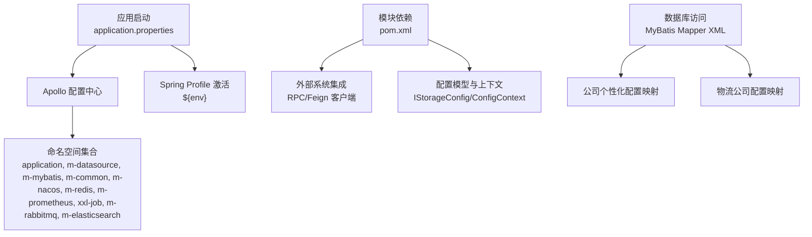
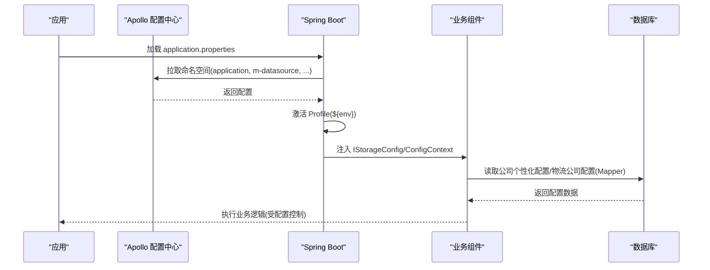
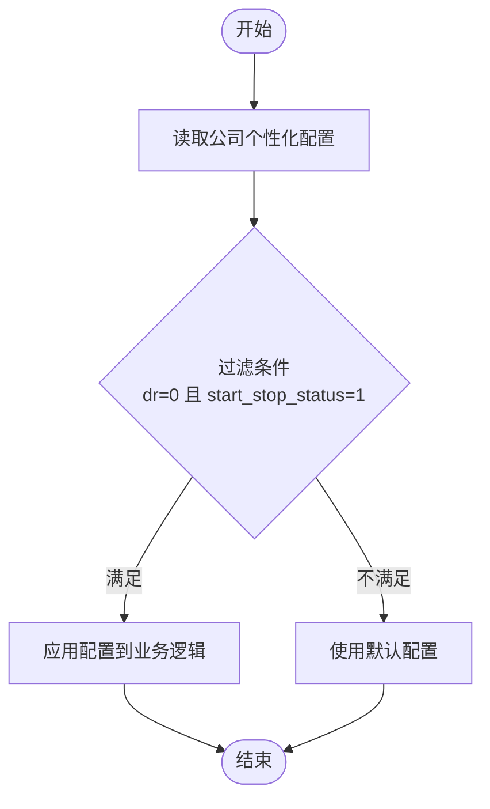
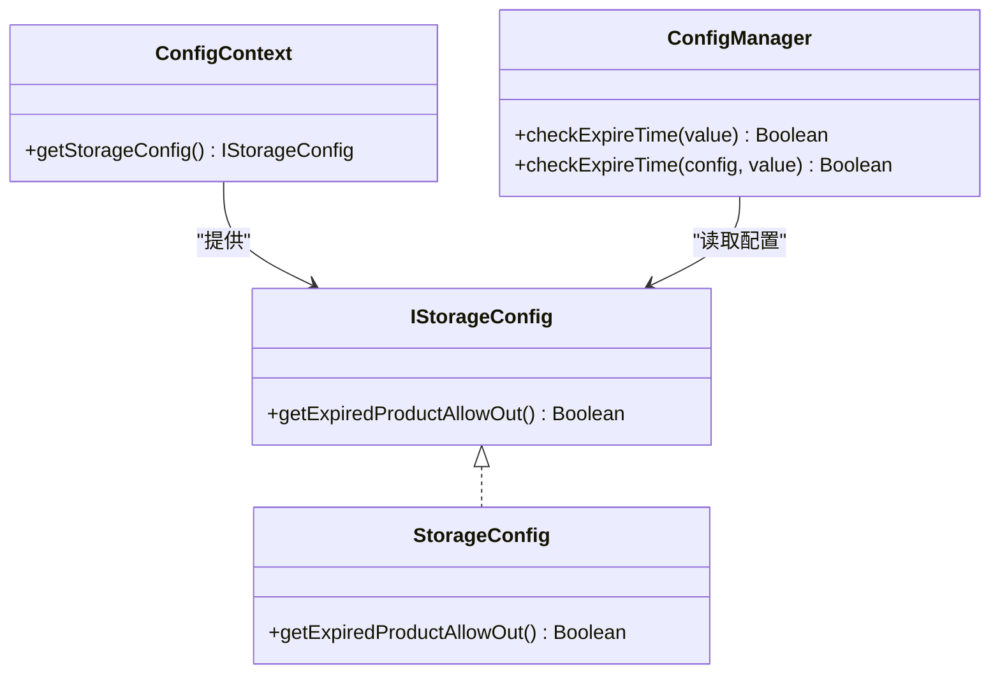
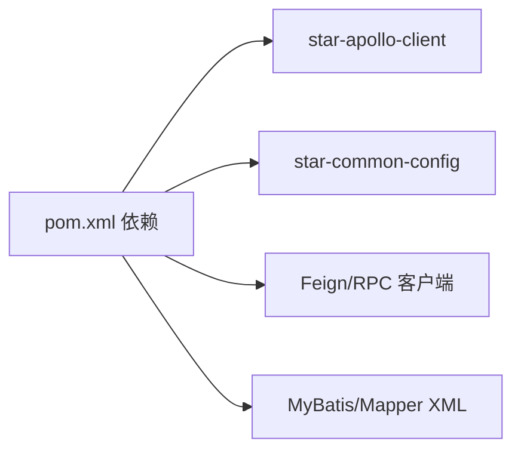

# 配置管理

<cite>
**本文引用的文件**
- [application.properties](file://guoke-deepexi-storage-center-provider/src/main/resources/application.properties)
- [pom.xml](file://guoke-deepexi-storage-center-provider/pom.xml)
- [ConfigManager.java](file://guoke-deepexi-storage-center-provider/src/main/java/com/ deepexi/storage/manager/ConfigManager.java)
- [ScCompanyIndividuationConfigMapper.xml](file://guoke-deepexi-storage-center-provider/src/main/resources/mapper/individuation/ScCompanyIndividuationConfigMapper.xml)
- [ScCompanyLogisticsConfigMapper.xml](file://guoke-deepexi-storage-center-provider/src/main/resources/mapper/logistics/ScCompanyLogisticsConfigMapper.xml)
- [ScStockServiceImpl.java](file://guoke-deepexi-storage-center-provider/src/main/java/com/ deepexi/storage/service/impl/ScStockServiceImpl.java)
- [README.md](file://README.md)
</cite>

## 目录
1. [引言](#引言)
2. [项目结构](#项目结构)
3. [核心组件](#核心组件)
4. [架构总览](#架构总览)
5. [详细组件分析](#详细组件分析)
6. [依赖分析](#依赖分析)
7. [性能考量](#性能考量)
8. [故障排查指南](#故障排查指南)
9. [结论](#结论)
10. [附录](#附录)

## 引言
本文件面向国科恒泰仓储管理系统，提供一套完整的配置管理文档，覆盖应用配置、数据库配置与外部系统配置三大部分。内容包括配置文件结构、参数含义、环境差异化策略、最佳实践与安全考虑、配置变更影响与回滚策略、配置热更新与验证机制以及配置监控建议，并针对不同角色（开发者、测试工程师、运维工程师、业务管理员）给出相应指导。

## 项目结构
该系统采用 Spring Boot 应用，通过 Apollo 进行集中配置管理，并按命名空间划分配置域。核心配置入口为应用启动时加载的属性文件，同时在模块中存在 MyBatis Mapper XML 文件用于数据库访问配置。

图表来源
- [application.properties:1-6](file://guoke-deepexi-storage-center-provider/src/main/resources/application.properties#L1-L6)
- [pom.xml:15-422](file://guoke-deepexi-storage-center-provider/pom.xml#L15-L422)

章节来源
- [application.properties:1-6](file://guoke-deepexi-storage-center-provider/src/main/resources/application.properties#L1-L6)
- [pom.xml:15-422](file://guoke-deepexi-storage-center-provider/pom.xml#L15-L422)

## 核心组件
- 应用配置入口
  - 启用 Apollo 配置拉取与预加载，激活 Spring Profile，允许 Bean 定义覆盖以支持动态替换。
  - 命名空间列表涵盖应用、数据源、MyBatis、通用、Nacos、Redis、Prometheus、调度任务、消息队列、Elasticsearch 等。
- 配置模型与上下文
  - 使用 IStorageConfig/ConfigContext 提供统一配置读取能力，便于在业务逻辑中注入与使用。
- 数据库配置
  - MyBatis Mapper XML 提供基于公司维度的个性化配置与物流公司配置的查询与写入能力。
- 外部系统配置
  - 通过 Feign 客户端与 RPC 接口对接授权中心、订单中心、产品中心等外部系统；依赖项中包含多个中心与服务的 API 依赖。

章节来源
- [application.properties:1-6](file://guoke-deepexi-storage-center-provider/src/main/resources/application.properties#L1-L6)
- [ConfigManager.java:1-58](file://guoke-deepexi-storage-center-provider/src/main/java/com/deepexi/storage/manager/ConfigManager.java#L1-L58)
- [ScCompanyIndividuationConfigMapper.xml:1-21](file://guoke-deepexi-storage-center-provider/src/main/resources/mapper/individuation/ScCompanyIndividuationConfigMapper.xml#L1-L21)
- [ScCompanyLogisticsConfigMapper.xml:1-39](file://guoke-deepexi-storage-center-provider/src/main/resources/mapper/logistics/ScCompanyLogisticsConfigMapper.xml#L1-L39)
- [pom.xml:15-422](file://guoke-deepexi-storage-center-provider/pom.xml#L15-L422)

## 架构总览
系统通过 Apollo 集中式配置中心分发配置，按命名空间隔离不同领域的配置；应用启动时根据环境变量选择 Profile 并加载对应命名空间；业务层通过配置模型读取配置并驱动行为；数据库访问通过 MyBatis Mapper 实现对个性化配置与物流配置的持久化。

图表来源
- [application.properties:1-6](file://guoke-deepexi-storage-center-provider/src/main/resources/application.properties#L1-L6)
- [ConfigManager.java:1-58](file://guoke-deepexi-storage-center-provider/src/main/java/com/deepexi/storage/manager/ConfigManager.java#L1-L58)
- [ScCompanyIndividuationConfigMapper.xml:1-21](file://guoke-deepexi-storage-center-provider/src/main/resources/mapper/individuation/ScCompanyIndividuationConfigMapper.xml#L1-L21)
- [ScCompanyLogisticsConfigMapper.xml:1-39](file://guoke-deepexi-storage-center-provider/src/main/resources/mapper/logistics/ScCompanyLogisticsConfigMapper.xml#L1-L39)

## 详细组件分析

### 应用配置（application.properties）
- 关键参数说明
  - app.id：应用标识，用于区分不同应用实例。
  - apollo.bootstrap.enabled：启用 Apollo 配置拉取。
  - apollo.bootstrap.eagerLoad.enabled：启用预加载，确保启动阶段即获得配置。
  - spring.profiles.active：激活的 Profile，来源于环境变量 ${env}。
  - apollo.bootstrap.namespaces：配置命名空间集合，覆盖应用、数据源、MyBatis、通用、Nacos、Redis、Prometheus、调度任务、消息队列、Elasticsearch 等。
  - spring.main.allow-bean-definition-overriding：允许 Bean 定义覆盖，便于运行时替换或热更新场景。
- 环境策略
  - 开发：设置 env=dev，拉取 dev 命名空间配置。
  - 测试：设置 env=test，拉取 test 命名空间配置。
  - 生产：设置 env=prod，拉取 prod 命名空间配置。
- 配置验证与监控
  - 建议在启动日志中输出已加载的命名空间与 Profile，便于验证配置来源。
  - 结合 Prometheus 监控指标，观察配置拉取成功率与延迟。

章节来源
- [application.properties:1-6](file://guoke-deepexi-storage-center-provider/src/main/resources/application.properties#L1-L6)

### 数据库配置（MyBatis Mapper）
- 公司个性化配置映射
  - 通过公司 ID 查询个性化配置，过滤逻辑删除(dr=0)与启用状态(start_stop_status=1)。
- 物流公司配置映射
  - 支持按公司 ID 查询物流公司配置，并提供批量插入能力。
- 配置变更影响
  - 个性化配置直接影响业务规则（如过期产品出库策略），需谨慎变更并进行灰度验证。
  - 物流配置变更可能影响发货流程与成本计算，应进行端到端联调测试。

图表来源
- [ScCompanyIndividuationConfigMapper.xml:1-21](file://guoke-deepexi-storage-center-provider/src/main/resources/mapper/individuation/ScCompanyIndividuationConfigMapper.xml#L1-L21)

章节来源
- [ScCompanyIndividuationConfigMapper.xml:1-21](file://guoke-deepexi-storage-center-provider/src/main/resources/mapper/individuation/ScCompanyIndividuationConfigMapper.xml#L1-L21)
- [ScCompanyLogisticsConfigMapper.xml:1-39](file://guoke-deepexi-storage-center-provider/src/main/resources/mapper/logistics/ScCompanyLogisticsConfigMapper.xml#L1-L39)

### 外部系统配置（Feign/RPC 依赖）
- 依赖范围
  - 包含授权中心、订单中心、产品中心、数据中心、报告中心、文件中心等多个中心的 API 依赖。
- 配置要点
  - 通过 Feign 客户端与 RPC 接口对接，需确保各中心的连接参数、超时与重试策略在 Apollo 对应命名空间中正确配置。
  - 建议为每个外部系统维护独立的命名空间，便于分域治理与快速回滚。

章节来源
- [pom.xml:15-422](file://guoke-deepexi-storage-center-provider/pom.xml#L15-L422)

### 配置模型与业务使用（ConfigManager 与 IStorageConfig）
- 配置模型
  - IStorageConfig/ConfigContext 提供统一配置读取接口，ConfigManager 在业务侧封装配置校验逻辑。
- 业务示例
  - 过期产品出库策略：若配置允许过期产品出库，则跳过有效期校验；否则委托枚举类型进行有效期判断。
- 配置热更新
  - Apollo 支持配置推送，结合 ConfigManager 的注入点可实现部分配置的热生效；对于数据库配置，需配合缓存与版本控制策略。

图表来源
- [ConfigManager.java:1-58](file://guoke-deepexi-storage-center-provider/src/main/java/com/deepexi/storage/manager/ConfigManager.java#L1-L58)

章节来源
- [ConfigManager.java:1-58](file://guoke-deepexi-storage-center-provider/src/main/java/com/deepexi/storage/manager/ConfigManager.java#L1-L58)

### 分布式锁与配置联动（Redisson）
- 锁策略
  - 通过 Redisson 获取分布式锁，支持多产品 ID 的批量锁与事务完成后自动释放。
- 配置影响
  - 锁等待时长与释放策略受配置影响，需在高并发场景下评估锁粒度与超时时间。

章节来源
- [ScStockServiceImpl.java:3365-3392](file://guoke-deepexi-storage-center-provider/src/main/java/com/deepexi/storage/service/impl/ScStockServiceImpl.java#L3365-L3392)

## 依赖分析
- 配置中心依赖
  - Apollo 客户端与通用配置模块，提供配置拉取与上下文能力。
- 外部系统依赖
  - 授权中心、订单中心、产品中心、数据中心、报告中心、文件中心等 API 依赖，均通过 Maven 管理。
- 数据访问依赖
  - MyBatis 与相关 Mapper XML，支撑个性化配置与物流公司配置的数据持久化。

图表来源
- [pom.xml:15-422](file://guoke-deepexi-storage-center-provider/pom.xml#L15-L422)

章节来源
- [pom.xml:15-422](file://guoke-deepexi-storage-center-provider/pom.xml#L15-L422)

## 性能考量
- 配置拉取性能
  - 预加载与命名空间拆分可降低启动时延；建议对热点配置进行本地缓存与版本标记。
- 数据库访问性能
  - 个性化配置与物流公司配置查询需建立合适索引，避免全表扫描。
- 外部系统性能
  - Feign/RPC 调用需设置合理的超时与重试策略，防止级联故障。

## 故障排查指南
- 配置未生效
  - 检查 application.properties 中的命名空间与 Profile 设置是否正确。
  - 确认 Apollo 命名空间中对应键值是否存在且拼写正确。
- 配置冲突
  - 若出现 Bean 定义覆盖导致的异常，检查 allow-bean-definition-overriding 的使用场景与顺序。
- 数据库配置异常
  - 核对 Mapper XML 的查询条件与字段映射，确认 dr 与启用状态字段值。
- 外部系统调用失败
  - 查看 Feign/RPC 客户端的日志与超时配置，必要时开启链路追踪定位问题。

章节来源
- [application.properties:1-6](file://guoke-deepexi-storage-center-provider/src/main/resources/application.properties#L1-L6)
- [ScCompanyIndividuationConfigMapper.xml:1-21](file://guoke-deepexi-storage-center-provider/src/main/resources/mapper/individuation/ScCompanyIndividuationConfigMapper.xml#L1-L21)
- [pom.xml:15-422](file://guoke-deepexi-storage-center-provider/pom.xml#L15-L422)

## 结论
本配置管理体系以 Apollo 为核心，结合命名空间隔离与 Profile 环境化策略，实现了应用、数据库与外部系统配置的统一治理。通过配置模型与业务组件的解耦，系统具备良好的可扩展性与可维护性。建议在实际落地中完善配置验证、热更新与监控告警机制，并针对不同角色制定标准化的操作手册与回滚预案。

## 附录
- 角色与职责
  - 开发者：负责配置模型设计与业务适配，编写配置验证与回滚脚本。
  - 测试工程师：负责环境配置一致性校验与回归测试，验证配置变更对功能的影响。
  - 运维工程师：负责 Apollo 配置中心与各命名空间的权限与发布流程管理，保障配置安全与稳定性。
  - 业务管理员：负责业务配置（如个性化配置、物流公司配置）的审批与上线，确保配置符合业务规则。
- 配置最佳实践
  - 命名空间按领域划分，避免交叉污染。
  - 为关键配置设置默认值与校验规则，防止空值或非法值进入业务。
  - 对高风险配置采用灰度发布与快速回滚策略。
  - 建立配置审计日志与变更追踪，确保可追溯性。
- 安全考虑
  - 严格控制 Apollo 命名空间访问权限，区分开发、测试与生产环境。
  - 对敏感配置（如密钥、地址）进行加密存储与最小暴露原则。
  - 定期审查配置权限与变更历史，防范内部风险。