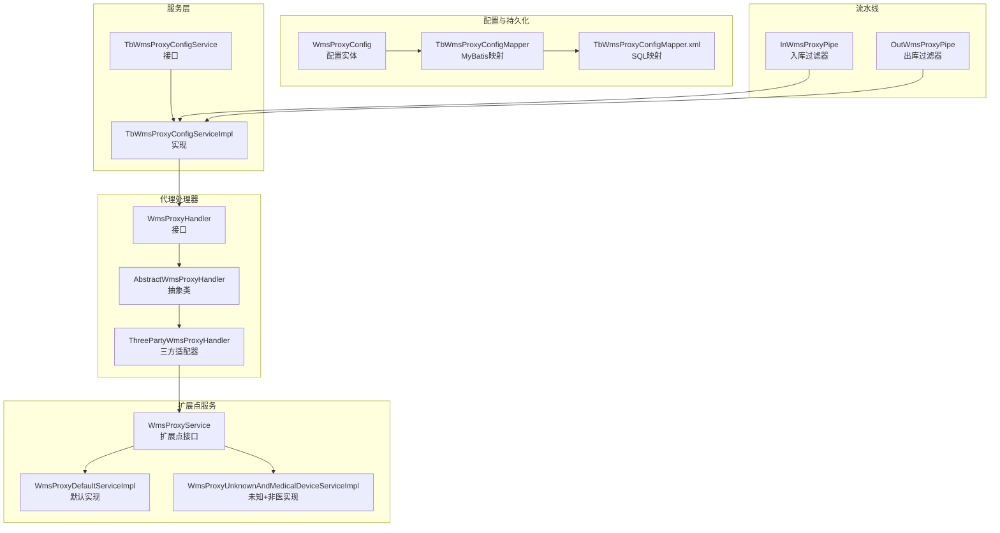
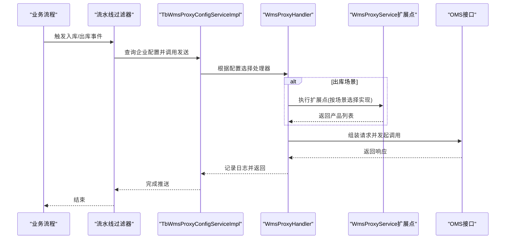
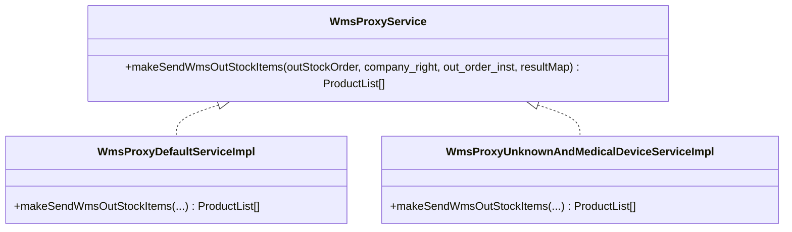
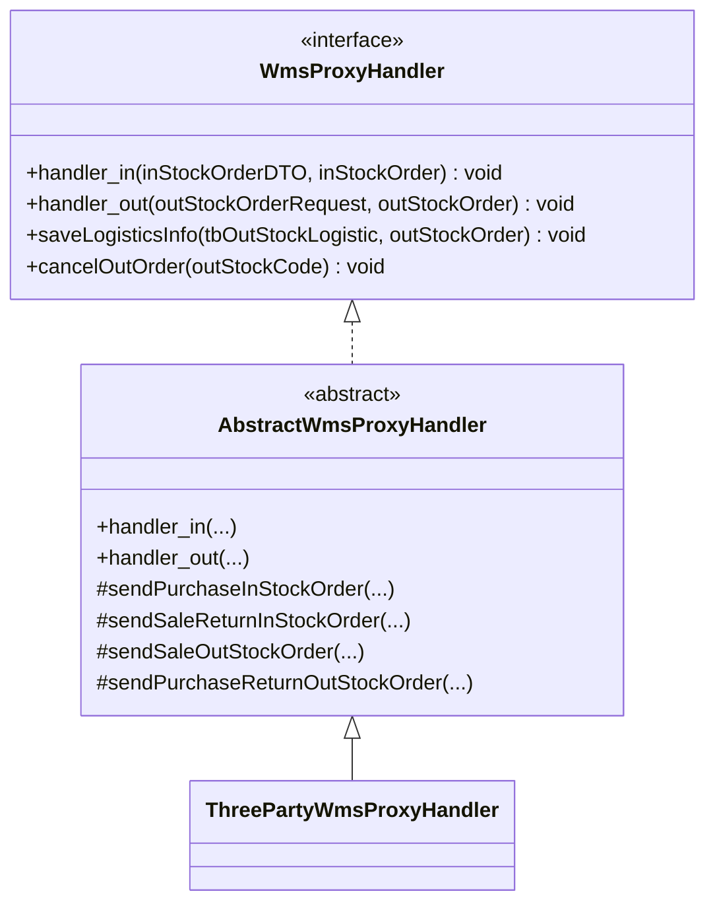
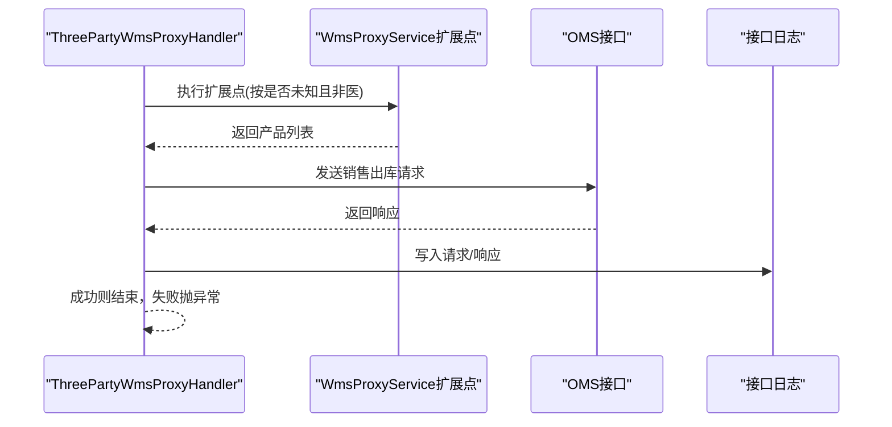
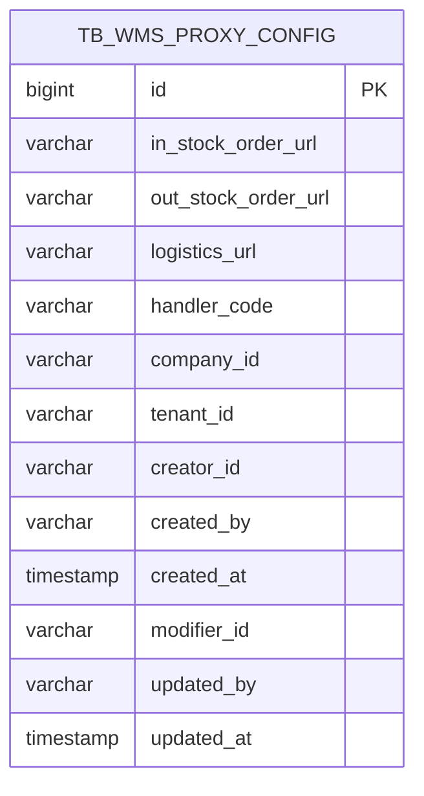
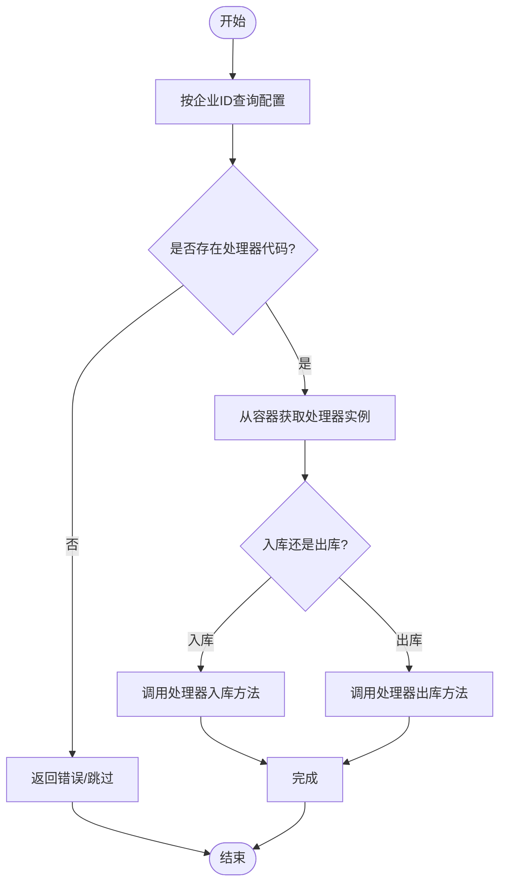
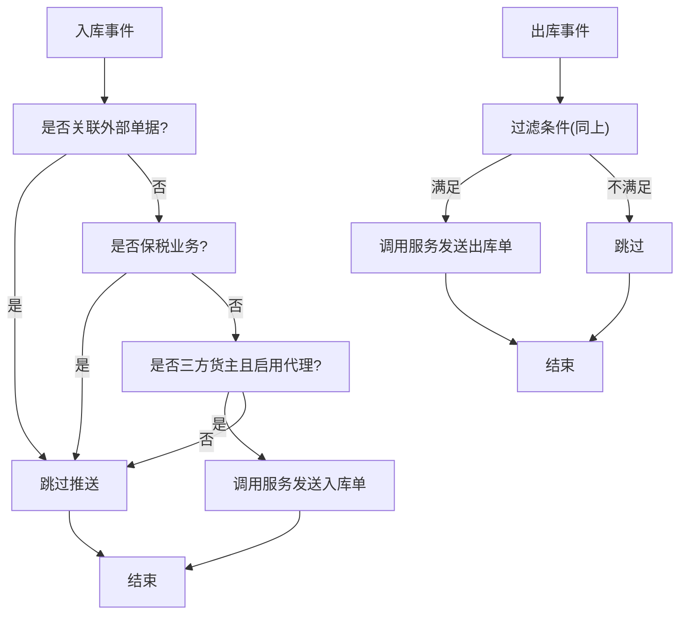
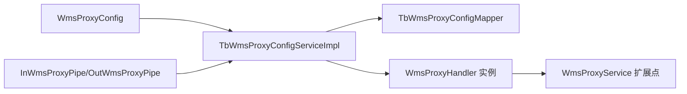

# WMS系统集成

<cite>
**本文引用的文件**
- [WmsProxyService.java](file://guoke-deepexi-storage-center-provider/src/main/java/com/deepexi/storage/service/three/WmsProxyService.java)
- [WmsProxyDefaultServiceImpl.java](file://guoke-deepexi-storage-center-provider/src/main/java/com/deepexi/storage/service/three/WmsProxyDefaultServiceImpl.java)
- [WmsProxyUnknownAndMedicalDeviceServiceImpl.java](file://guoke-deepexi-storage-center-provider/src/main/java/com/deepexi/storage/service/three/WmsProxyUnknownAndMedicalDeviceServiceImpl.java)
- [AbstractWmsProxyHandler.java](file://guoke-deepexi-storage-center-provider/src/main/java/com/deepexi/storage/service/hanlder/AbstractWmsProxyHandler.java)
- [WmsProxyHandler.java](file://guoke-deepexi-storage-center-provider/src/main/java/com/deepexi/storage/service/hanlder/WmsProxyHandler.java)
- [ThreePartyWmsProxyHandler.java](file://guoke-deepexi-storage-center-provider/src/main/java/com/deepexi/storage/service/hanlder/ThreePartyWmsProxyHandler.java)
- [WmsProxyConfig.java](file://guoke-deepexi-storage-center-provider/src/main/java/com/deepexi/storage/model/WmsProxyConfig.java)
- [TbWmsProxyConfigMapper.java](file://guoke-deepexi-storage-center-provider/src/main/java/com/deepexi/storage/mapper/TbWmsProxyConfigMapper.java)
- [TbWmsProxyConfigService.java](file://guoke-deepexi-storage-center-provider/src/main/java/com/deepexi/storage/service/TbWmsProxyConfigService.java)
- [TbWmsProxyConfigServiceImpl.java](file://guoke-deepexi-storage-center-provider/src/main/java/com/deepexi/storage/service/impl/TbWmsProxyConfigServiceImpl.java)
- [InWmsProxyPipe.java](file://guoke-deepexi-storage-center-provider/src/main/java/com/deepexi/storage/handler/in/pipe/InWmsProxyPipe.java)
- [OutWmsProxyPipe.java](file://guoke-deepexi-storage-center-provider/src/main/java/com/deepexi/storage/handler/out/pipe/OutWmsProxyPipe.java)
- [TbWmsProxyConfigMapper.xml](file://guoke-deepexi-storage-center-provider/src/main/resources/mapper/TbWmsProxyConfigMapper.xml)
</cite>

## 目录
1. [简介](#简介)
2. [项目结构](#项目结构)
3. [核心组件](#核心组件)
4. [架构总览](#架构总览)
5. [详细组件分析](#详细组件分析)
6. [依赖关系分析](#依赖关系分析)
7. [性能考量](#性能考量)
8. [故障排查指南](#故障排查指南)
9. [结论](#结论)
10. [附录](#附录)

## 简介
本文件面向国科恒泰仓储管理系统中的WMS系统集成，围绕“代理处理器”与“扩展点服务”的设计与实现，系统化阐述以下内容：
- 对接机制：如何根据企业配置选择代理处理器，以及在入库/出库流程中触发WMS推送。
- 代理处理器实现：抽象层、具体三方适配器及扩展点服务的职责划分。
- 配置管理：WMS代理配置模型、持久化与查询逻辑。
- 数据同步机制：从订单到OMS的单据转换、字段映射与回写。
- 扩展点与自定义适配：如何新增或替换适配器与扩展点服务。
- 接口调用示例、数据格式转换与错误处理策略。
- 最佳实践、性能优化建议与故障排查。

## 项目结构
围绕WMS集成的关键模块包括：
- 配置模型与持久化：WmsProxyConfig 及其 MyBatis 映射。
- 服务接口与实现：TbWmsProxyConfigService 及其实现类。
- 代理处理器接口与抽象类：WmsProxyHandler、AbstractWmsProxyHandler。
- 三方适配器：ThreePartyWmsProxyHandler。
- 扩展点服务：WmsProxyService 及默认实现、未知发货信息+非医疗器械实现。
- 流水线过滤器：InWmsProxyPipe、OutWmsProxyPipe。
- 入/出库流程：在对应业务阶段调用配置服务进行WMS推送。

图表来源
- [WmsProxyConfig.java:1-131](file://guoke-deepexi-storage-center-provider/src/main/java/com/deepexi/storage/model/WmsProxyConfig.java#L1-L131)
- [TbWmsProxyConfigMapper.java:1-19](file://guoke-deepexi-storage-center-provider/src/main/java/com/deepexi/storage/mapper/TbWmsProxyConfigMapper.java#L1-L19)
- [TbWmsProxyConfigMapper.xml:1-212](file://guoke-deepexi-storage-center-provider/src/main/resources/mapper/TbWmsProxyConfigMapper.xml#L1-L212)
- [TbWmsProxyConfigService.java:1-45](file://guoke-deepexi-storage-center-provider/src/main/java/com/deepexi/storage/service/TbWmsProxyConfigService.java#L1-L45)
- [TbWmsProxyConfigServiceImpl.java:1-101](file://guoke-deepexi-storage-center-provider/src/main/java/com/deepexi/storage/service/impl/TbWmsProxyConfigServiceImpl.java#L1-L101)
- [WmsProxyHandler.java:1-39](file://guoke-deepexi-storage-center-provider/src/main/java/com/deepexi/storage/service/hanlder/WmsProxyHandler.java#L1-L39)
- [AbstractWmsProxyHandler.java:1-69](file://guoke-deepexi-storage-center-provider/src/main/java/com/deepexi/storage/service/hanlder/AbstractWmsProxyHandler.java#L1-L69)
- [ThreePartyWmsProxyHandler.java:1-482](file://guoke-deepexi-storage-center-provider/src/main/java/com/deepexi/storage/service/hanlder/ThreePartyWmsProxyHandler.java#L1-L482)
- [WmsProxyService.java:1-24](file://guoke-deepexi-storage-center-provider/src/main/java/com/deepexi/storage/service/three/WmsProxyService.java#L1-L24)
- [WmsProxyDefaultServiceImpl.java:1-84](file://guoke-deepexi-storage-center-provider/src/main/java/com/deepexi/storage/service/three/WmsProxyDefaultServiceImpl.java#L1-L84)
- [WmsProxyUnknownAndMedicalDeviceServiceImpl.java:1-64](file://guoke-deepexi-storage-center-provider/src/main/java/com/deepexi/storage/service/three/WmsProxyUnknownAndMedicalDeviceServiceImpl.java#L1-L64)
- [InWmsProxyPipe.java:1-47](file://guoke-deepexi-storage-center-provider/src/main/java/com/deepexi/storage/handler/in/pipe/InWmsProxyPipe.java#L1-L47)
- [OutWmsProxyPipe.java](file://guoke-deepexi-storage-center-provider/src/main/java/com/deepexi/storage/handler/out/pipe/OutWmsProxyPipe.java)

章节来源
- [WmsProxyConfig.java:1-131](file://guoke-deepexi-storage-center-provider/src/main/java/com/deepexi/storage/model/WmsProxyConfig.java#L1-L131)
- [TbWmsProxyConfigMapper.java:1-19](file://guoke-deepexi-storage-center-provider/src/main/java/com/deepexi/storage/mapper/TbWmsProxyConfigMapper.java#L1-L19)
- [TbWmsProxyConfigMapper.xml:1-212](file://guoke-deepexi-storage-center-provider/src/main/resources/mapper/TbWmsProxyConfigMapper.xml#L1-L212)
- [TbWmsProxyConfigService.java:1-45](file://guoke-deepexi-storage-center-provider/src/main/java/com/deepexi/storage/service/TbWmsProxyConfigService.java#L1-L45)
- [TbWmsProxyConfigServiceImpl.java:1-101](file://guoke-deepexi-storage-center-provider/src/main/java/com/deepexi/storage/service/impl/TbWmsProxyConfigServiceImpl.java#L1-L101)
- [WmsProxyHandler.java:1-39](file://guoke-deepexi-storage-center-provider/src/main/java/com/deepexi/storage/service/hanlder/WmsProxyHandler.java#L1-L39)
- [AbstractWmsProxyHandler.java:1-69](file://guoke-deepexi-storage-center-provider/src/main/java/com/deepexi/storage/service/hanlder/AbstractWmsProxyHandler.java#L1-L69)
- [ThreePartyWmsProxyHandler.java:1-482](file://guoke-deepexi-storage-center-provider/src/main/java/com/deepexi/storage/service/hanlder/ThreePartyWmsProxyHandler.java#L1-L482)
- [WmsProxyService.java:1-24](file://guoke-deepexi-storage-center-provider/src/main/java/com/deepexi/storage/service/three/WmsProxyService.java#L1-L24)
- [WmsProxyDefaultServiceImpl.java:1-84](file://guoke-deepexi-storage-center-provider/src/main/java/com/deepexi/storage/service/three/WmsProxyDefaultServiceImpl.java#L1-L84)
- [WmsProxyUnknownAndMedicalDeviceServiceImpl.java:1-64](file://guoke-deepexi-storage-center-provider/src/main/java/com/deepexi/storage/service/three/WmsProxyUnknownAndMedicalDeviceServiceImpl.java#L1-L64)
- [InWmsProxyPipe.java:1-47](file://guoke-deepexi-storage-center-provider/src/main/java/com/deepexi/storage/handler/in/pipe/InWmsProxyPipe.java#L1-L47)
- [OutWmsProxyPipe.java](file://guoke-deepexi-storage-center-provider/src/main/java/com/deepexi/storage/handler/out/pipe/OutWmsProxyPipe.java)

## 核心组件
- WmsProxyConfig：存储企业级WMS代理配置，包括入库/出库/物流接口URL、处理器代码等。
- TbWmsProxyConfigService/TbWmsProxyConfigServiceImpl：提供按企业ID查询配置、触发入库/出库推送、取消出库单等能力。
- WmsProxyHandler/AbstractWmsProxyHandler：定义代理处理器接口与通用路由逻辑；ThreePartyWmsProxyHandler为具体三方适配器。
- WmsProxyService及其默认实现：作为扩展点，负责将出库明细转换为OMS可识别的产品列表，支持“未知发货信息+非医疗器械”场景。
- InWmsProxyPipe/OutWmsProxyPipe：在入库/出库流水线中进行条件过滤与调用。

章节来源
- [WmsProxyConfig.java:1-131](file://guoke-deepexi-storage-center-provider/src/main/java/com/deepexi/storage/model/WmsProxyConfig.java#L1-L131)
- [TbWmsProxyConfigService.java:1-45](file://guoke-deepexi-storage-center-provider/src/main/java/com/deepexi/storage/service/TbWmsProxyConfigService.java#L1-L45)
- [TbWmsProxyConfigServiceImpl.java:1-101](file://guoke-deepexi-storage-center-provider/src/main/java/com/deepexi/storage/service/impl/TbWmsProxyConfigServiceImpl.java#L1-L101)
- [WmsProxyHandler.java:1-39](file://guoke-deepexi-storage-center-provider/src/main/java/com/deepexi/storage/service/hanlder/WmsProxyHandler.java#L1-L39)
- [AbstractWmsProxyHandler.java:1-69](file://guoke-deepexi-storage-center-provider/src/main/java/com/deepexi/storage/service/hanlder/AbstractWmsProxyHandler.java#L1-L69)
- [ThreePartyWmsProxyHandler.java:1-482](file://guoke-deepexi-storage-center-provider/src/main/java/com/deepexi/storage/service/hanlder/ThreePartyWmsProxyHandler.java#L1-L482)
- [WmsProxyService.java:1-24](file://guoke-deepexi-storage-center-provider/src/main/java/com/deepexi/storage/service/three/WmsProxyService.java#L1-L24)
- [WmsProxyDefaultServiceImpl.java:1-84](file://guoke-deepexi-storage-center-provider/src/main/java/com/deepexi/storage/service/three/WmsProxyDefaultServiceImpl.java#L1-L84)
- [WmsProxyUnknownAndMedicalDeviceServiceImpl.java:1-64](file://guoke-deepexi-storage-center-provider/src/main/java/com/deepexi/storage/service/three/WmsProxyUnknownAndMedicalDeviceServiceImpl.java#L1-L64)
- [InWmsProxyPipe.java:1-47](file://guoke-deepexi-storage-center-provider/src/main/java/com/deepexi/storage/handler/in/pipe/InWmsProxyPipe.java#L1-L47)
- [OutWmsProxyPipe.java](file://guoke-deepexi-storage-center-provider/src/main/java/com/deepexi/storage/handler/out/pipe/OutWmsProxyPipe.java)

## 架构总览
WMS集成采用“配置驱动 + 处理器路由 + 扩展点服务”的分层架构：
- 配置层：以企业维度配置WMS接口地址与处理器代码。
- 路由层：服务实现根据配置选择具体处理器。
- 适配层：处理器封装与OMS交互的协议细节。
- 扩展层：通过Swak扩展点区分不同出库场景的数据转换策略。
- 流水线层：在业务流程中进行条件判断与触发。

图表来源
- [TbWmsProxyConfigServiceImpl.java:66-84](file://guoke-deepexi-storage-center-provider/src/main/java/com/deepexi/storage/service/impl/TbWmsProxyConfigServiceImpl.java#L66-L84)
- [ThreePartyWmsProxyHandler.java:308-314](file://guoke-deepexi-storage-center-provider/src/main/java/com/deepexi/storage/service/hanlder/ThreePartyWmsProxyHandler.java#L308-L314)
- [WmsProxyDefaultServiceImpl.java:40-80](file://guoke-deepexi-storage-center-provider/src/main/java/com/deepexi/storage/service/three/WmsProxyDefaultServiceImpl.java#L40-L80)
- [WmsProxyUnknownAndMedicalDeviceServiceImpl.java:32-62](file://guoke-deepexi-storage-center-provider/src/main/java/com/deepexi/storage/service/three/WmsProxyUnknownAndMedicalDeviceServiceImpl.java#L32-L62)

## 详细组件分析

### WmsProxyService接口与扩展点
- 设计目标：将出库明细转换为OMS产品列表，支持多场景差异化策略。
- 默认实现：基于库存UDI与货位信息逐条扣减，保证批次/效期/价格等字段准确映射。
- 未知发货信息+非医疗器械实现：在无明确发货信息时，仍能输出标准化产品列表，便于OMS接收。

图表来源
- [WmsProxyService.java:1-24](file://guoke-deepexi-storage-center-provider/src/main/java/com/deepexi/storage/service/three/WmsProxyService.java#L1-L24)
- [WmsProxyDefaultServiceImpl.java:1-84](file://guoke-deepexi-storage-center-provider/src/main/java/com/deepexi/storage/service/three/WmsProxyDefaultServiceImpl.java#L1-L84)
- [WmsProxyUnknownAndMedicalDeviceServiceImpl.java:1-64](file://guoke-deepexi-storage-center-provider/src/main/java/com/deepexi/storage/service/three/WmsProxyUnknownAndMedicalDeviceServiceImpl.java#L1-L64)

章节来源
- [WmsProxyService.java:1-24](file://guoke-deepexi-storage-center-provider/src/main/java/com/deepexi/storage/service/three/WmsProxyService.java#L1-L24)
- [WmsProxyDefaultServiceImpl.java:1-84](file://guoke-deepexi-storage-center-provider/src/main/java/com/deepexi/storage/service/three/WmsProxyDefaultServiceImpl.java#L1-L84)
- [WmsProxyUnknownAndMedicalDeviceServiceImpl.java:1-64](file://guoke-deepexi-storage-center-provider/src/main/java/com/deepexi/storage/service/three/WmsProxyUnknownAndMedicalDeviceServiceImpl.java#L1-L64)

### 代理处理器接口与抽象类
- WmsProxyHandler：定义入库/出库推送与物流信息保存、取消出库单等能力。
- AbstractWmsProxyHandler：统一路由逻辑，按单据类型分派到具体方法（采购入库、销退入库、销售出库、采退出库）。

图表来源
- [WmsProxyHandler.java:1-39](file://guoke-deepexi-storage-center-provider/src/main/java/com/deepexi/storage/service/hanlder/WmsProxyHandler.java#L1-L39)
- [AbstractWmsProxyHandler.java:1-69](file://guoke-deepexi-storage-center-provider/src/main/java/com/deepexi/storage/service/hanlder/AbstractWmsProxyHandler.java#L1-L69)
- [ThreePartyWmsProxyHandler.java:1-482](file://guoke-deepexi-storage-center-provider/src/main/java/com/deepexi/storage/service/hanlder/ThreePartyWmsProxyHandler.java#L1-L482)

章节来源
- [WmsProxyHandler.java:1-39](file://guoke-deepexi-storage-center-provider/src/main/java/com/deepexi/storage/service/hanlder/WmsProxyHandler.java#L1-L39)
- [AbstractWmsProxyHandler.java:1-69](file://guoke-deepexi-storage-center-provider/src/main/java/com/deepexi/storage/service/hanlder/AbstractWmsProxyHandler.java#L1-L69)
- [ThreePartyWmsProxyHandler.java:1-482](file://guoke-deepexi-storage-center-provider/src/main/java/com/deepexi/storage/service/hanlder/ThreePartyWmsProxyHandler.java#L1-L482)

### 三方适配器（ThreePartyWmsProxyHandler）
- 入库：采购入库与销退入库，组装单头与单行信息，调用OMS接口并记录日志。
- 出库：销售出库与采退出库，通过扩展点服务按场景生成产品列表，再调用OMS接口。
- 物流：根据出库单关联信息查询OMS物流并落库。
- 取消出库单：向OMS发送取消请求。

图表来源
- [ThreePartyWmsProxyHandler.java:308-314](file://guoke-deepexi-storage-center-provider/src/main/java/com/deepexi/storage/service/hanlder/ThreePartyWmsProxyHandler.java#L308-L314)
- [WmsProxyDefaultServiceImpl.java:40-80](file://guoke-deepexi-storage-center-provider/src/main/java/com/deepexi/storage/service/three/WmsProxyDefaultServiceImpl.java#L40-L80)
- [WmsProxyUnknownAndMedicalDeviceServiceImpl.java:32-62](file://guoke-deepexi-storage-center-provider/src/main/java/com/deepexi/storage/service/three/WmsProxyUnknownAndMedicalDeviceServiceImpl.java#L32-L62)

章节来源
- [ThreePartyWmsProxyHandler.java:1-482](file://guoke-deepexi-storage-center-provider/src/main/java/com/deepexi/storage/service/hanlder/ThreePartyWmsProxyHandler.java#L1-L482)

### 配置模型与持久化
- WmsProxyConfig：包含企业ID、处理器代码、各接口URL、租户信息等。
- Mapper/Xml：提供批量更新、插入或更新等操作，支持按企业ID查询。

图表来源
- [WmsProxyConfig.java:1-131](file://guoke-deepexi-storage-center-provider/src/main/java/com/deepexi/storage/model/WmsProxyConfig.java#L1-L131)
- [TbWmsProxyConfigMapper.xml:1-212](file://guoke-deepexi-storage-center-provider/src/main/resources/mapper/TbWmsProxyConfigMapper.xml#L1-L212)

章节来源
- [WmsProxyConfig.java:1-131](file://guoke-deepexi-storage-center-provider/src/main/java/com/deepexi/storage/model/WmsProxyConfig.java#L1-L131)
- [TbWmsProxyConfigMapper.java:1-19](file://guoke-deepexi-storage-center-provider/src/main/java/com/deepexi/storage/mapper/TbWmsProxyConfigMapper.java#L1-L19)
- [TbWmsProxyConfigMapper.xml:1-212](file://guoke-deepexi-storage-center-provider/src/main/resources/mapper/TbWmsProxyConfigMapper.xml#L1-L212)

### 服务层：配置与路由
- 按企业ID查询配置，根据处理器代码从Spring容器获取具体处理器实例。
- 提供发送入库/出库单据、取消出库单、查询三方企业配置等能力。

图表来源
- [TbWmsProxyConfigServiceImpl.java:66-84](file://guoke-deepexi-storage-center-provider/src/main/java/com/deepexi/storage/service/impl/TbWmsProxyConfigServiceImpl.java#L66-L84)

章节来源
- [TbWmsProxyConfigService.java:1-45](file://guoke-deepexi-storage-center-provider/src/main/java/com/deepexi/storage/service/TbWmsProxyConfigService.java#L1-L45)
- [TbWmsProxyConfigServiceImpl.java:1-101](file://guoke-deepexi-storage-center-provider/src/main/java/com/deepexi/storage/service/impl/TbWmsProxyConfigServiceImpl.java#L1-L101)

### 流水线过滤器
- InWmsProxyPipe：在入库阶段根据是否关联外部单据、是否保税业务、是否三方货主等条件决定是否推送。
- OutWmsProxyPipe：在出库阶段同样进行条件过滤与调用。

图表来源
- [InWmsProxyPipe.java:1-47](file://guoke-deepexi-storage-center-provider/src/main/java/com/deepexi/storage/handler/in/pipe/InWmsProxyPipe.java#L1-L47)
- [OutWmsProxyPipe.java](file://guoke-deepexi-storage-center-provider/src/main/java/com/deepexi/storage/handler/out/pipe/OutWmsProxyPipe.java)

章节来源
- [InWmsProxyPipe.java:1-47](file://guoke-deepexi-storage-center-provider/src/main/java/com/deepexi/storage/handler/in/pipe/InWmsProxyPipe.java#L1-L47)
- [OutWmsProxyPipe.java](file://guoke-deepexi-storage-center-provider/src/main/java/com/deepexi/storage/handler/out/pipe/OutWmsProxyPipe.java)

## 依赖关系分析
- 配置与服务：服务实现依赖Mapper查询配置，再根据处理器代码选择处理器实例。
- 处理器与扩展点：处理器在出库场景调用扩展点服务，按场景返回不同的产品列表。
- 流水线与服务：流水线在业务节点调用服务，触发配置查询与处理器执行。

图表来源
- [TbWmsProxyConfigServiceImpl.java:24-25](file://guoke-deepexi-storage-center-provider/src/main/java/com/deepexi/storage/service/impl/TbWmsProxyConfigServiceImpl.java#L24-L25)
- [ThreePartyWmsProxyHandler.java:308](file://guoke-deepexi-storage-center-provider/src/main/java/com/deepexi/storage/service/hanlder/ThreePartyWmsProxyHandler.java#L308)
- [InWmsProxyPipe.java:23-24](file://guoke-deepexi-storage-center-provider/src/main/java/com/deepexi/storage/handler/in/pipe/InWmsProxyPipe.java#L23-L24)

章节来源
- [TbWmsProxyConfigServiceImpl.java:1-101](file://guoke-deepexi-storage-center-provider/src/main/java/com/deepexi/storage/service/impl/TbWmsProxyConfigServiceImpl.java#L1-L101)
- [ThreePartyWmsProxyHandler.java:1-482](file://guoke-deepexi-storage-center-provider/src/main/java/com/deepexi/storage/service/hanlder/ThreePartyWmsProxyHandler.java#L1-L482)
- [InWmsProxyPipe.java:1-47](file://guoke-deepexi-storage-center-provider/src/main/java/com/deepexi/storage/handler/in/pipe/InWmsProxyPipe.java#L1-L47)

## 性能考量
- 扩展点执行：在出库场景通过Swak执行扩展点，避免在处理器内硬编码分支，提升可维护性与可测试性。
- 批量查询与映射：在组装产品列表前先批量获取授权产品信息，减少重复查询。
- 日志与重试：统一记录请求/响应，便于定位问题；对外部调用异常进行捕获与日志落库。
- 过滤前置：在流水线阶段提前过滤无需推送的场景，降低无效调用。

## 故障排查指南
- 常见问题
  - 未配置处理器代码：导致无法路由到具体处理器，检查配置表中处理器代码字段。
  - 扩展点未注册：若扩展点实现未被扫描或标签不匹配，将无法按场景返回产品列表。
  - 外部接口异常：OMS返回非成功状态码或抛出异常，需查看接口日志表中的响应内容。
  - 产品信息缺失：若授权产品信息为空，会抛出业务异常，需确认产品中心数据。
- 定位步骤
  - 查看流水线过滤器是否放行该单据。
  - 检查配置表中企业ID对应的配置是否存在。
  - 在接口日志表中核对请求/响应内容。
  - 若为出库单，确认扩展点实现是否正确返回产品列表。

章节来源
- [ThreePartyWmsProxyHandler.java:423-438](file://guoke-deepexi-storage-center-provider/src/main/java/com/deepexi/storage/service/hanlder/ThreePartyWmsProxyHandler.java#L423-L438)
- [TbWmsProxyConfigServiceImpl.java:66-84](file://guoke-deepexi-storage-center-provider/src/main/java/com/deepexi/storage/service/impl/TbWmsProxyConfigServiceImpl.java#L66-L84)

## 结论
本WMS集成方案通过“配置驱动 + 处理器路由 + 扩展点服务”的架构，实现了对不同WMS系统的灵活适配与高效扩展。三方适配器封装了与OMS交互的细节，扩展点服务则针对不同业务场景提供差异化的产品列表生成策略。结合流水线过滤器与完善的日志体系，系统具备良好的可观测性与可维护性。

## 附录

### WMS配置项清单
- 入库通知单请求URL
- 出库通知单请求URL
- 物流查询请求URL
- 处理器代码（用于路由到具体处理器）
- 企业ID
- 租户ID
- 创建/更新信息（创建人、创建时间、修改人、修改时间）

章节来源
- [WmsProxyConfig.java:22-104](file://guoke-deepexi-storage-center-provider/src/main/java/com/deepexi/storage/model/WmsProxyConfig.java#L22-L104)

### 代理处理器扩展点
- 新增处理器：实现 WmsProxyHandler 接口，按入库/出库/物流/取消等方法编写逻辑。
- 注册处理器：确保处理器被Spring容器管理，且处理器代码与配置一致。
- 新增扩展点服务：实现 WmsProxyService 接口，使用 Swak 注解标识标签，按场景返回产品列表。

章节来源
- [WmsProxyHandler.java:1-39](file://guoke-deepexi-storage-center-provider/src/main/java/com/deepexi/storage/service/hanlder/WmsProxyHandler.java#L1-L39)
- [WmsProxyService.java:1-24](file://guoke-deepexi-storage-center-provider/src/main/java/com/deepexi/storage/service/three/WmsProxyService.java#L1-L24)

### 自定义WMS适配器开发方法
- 步骤
  - 实现 WmsProxyHandler 接口或继承 AbstractWmsProxyHandler。
  - 在适配器中完成单据组装、调用外部接口、记录日志与异常处理。
  - 在配置表中设置处理器代码，使服务层能够正确路由。
  - 如涉及差异化数据转换，新增扩展点服务并在适配器中调用。

章节来源
- [AbstractWmsProxyHandler.java:1-69](file://guoke-deepexi-storage-center-provider/src/main/java/com/deepexi/storage/service/hanlder/AbstractWmsProxyHandler.java#L1-L69)
- [ThreePartyWmsProxyHandler.java:1-482](file://guoke-deepexi-storage-center-provider/src/main/java/com/deepexi/storage/service/hanlder/ThreePartyWmsProxyHandler.java#L1-L482)

### WMS接口调用示例与数据格式转换
- 入库场景
  - 采购入库：组装单头（业务类型、单号、日期、供应商/收货组织、仓库编码等），单行（产品编码、批号、有效期、数量、单价、金额等）。
  - 销退入库：组装单头（业务类型、单号、日期、客户/收货组织、仓库编码等），单行（产品编码、批号、有效期、数量、单价、金额等）。
- 出库场景
  - 销售出库：通过扩展点按场景生成产品列表，单行包含批次、有效期、单价、金额、货位等。
  - 采退出库：按库存UDI逐条扣减，确保批次/效期/价格等字段准确映射。
- 物流查询
  - 根据出库单关联信息构造请求体，调用OMS物流接口并落库。

章节来源
- [ThreePartyWmsProxyHandler.java:92-159](file://guoke-deepexi-storage-center-provider/src/main/java/com/deepexi/storage/service/hanlder/ThreePartyWmsProxyHandler.java#L92-L159)
- [ThreePartyWmsProxyHandler.java:167-246](file://guoke-deepexi-storage-center-provider/src/main/java/com/deepexi/storage/service/hanlder/ThreePartyWmsProxyHandler.java#L167-L246)
- [ThreePartyWmsProxyHandler.java:254-315](file://guoke-deepexi-storage-center-provider/src/main/java/com/deepexi/storage/service/hanlder/ThreePartyWmsProxyHandler.java#L254-L315)
- [ThreePartyWmsProxyHandler.java:323-419](file://guoke-deepexi-storage-center-provider/src/main/java/com/deepexi/storage/service/hanlder/ThreePartyWmsProxyHandler.java#L323-L419)
- [ThreePartyWmsProxyHandler.java:440-468](file://guoke-deepexi-storage-center-provider/src/main/java/com/deepexi/storage/service/hanlder/ThreePartyWmsProxyHandler.java#L440-L468)

### 错误处理策略
- 统一异常：对外部调用异常进行捕获并抛出业务异常，同时记录接口日志。
- 状态校验：若OMS返回非成功状态码，抛出业务异常并记录响应信息。
- 数据校验：在组装产品列表前校验是否存在产品实例，避免空数据导致异常。

章节来源
- [ThreePartyWmsProxyHandler.java:423-438](file://guoke-deepexi-storage-center-provider/src/main/java/com/deepexi/storage/service/hanlder/ThreePartyWmsProxyHandler.java#L423-L438)

### 最佳实践
- 配置优先：所有企业级WMS参数集中于配置表，避免硬编码。
- 分层清晰：处理器只负责与OMS交互，数据转换通过扩展点实现。
- 可观测性：统一记录接口日志，便于问题追踪与审计。
- 可扩展性：通过Swak扩展点与处理器代码实现灵活扩展。