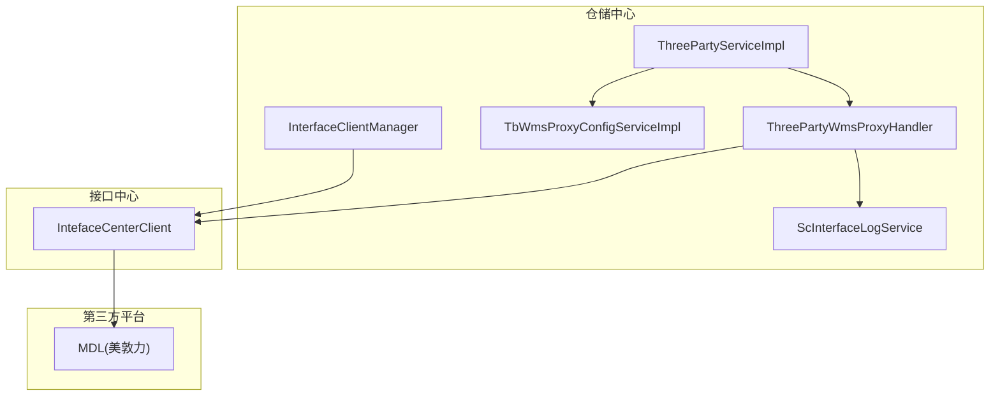
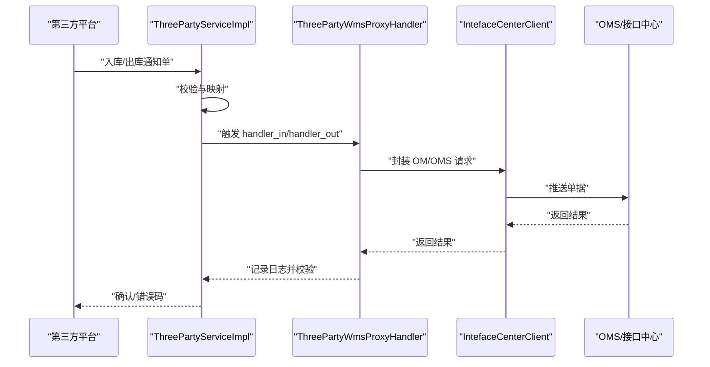
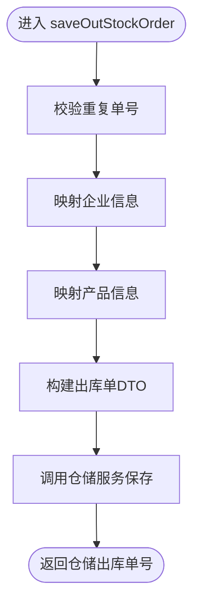
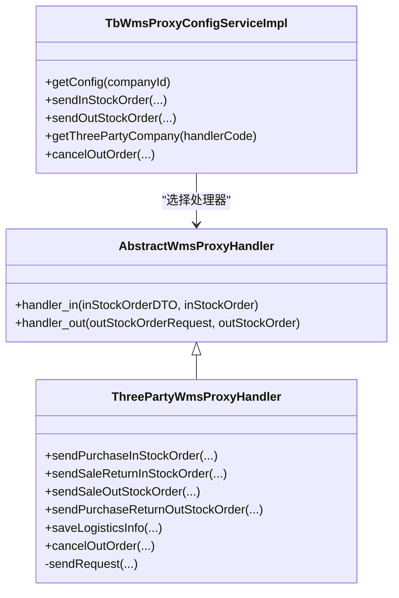
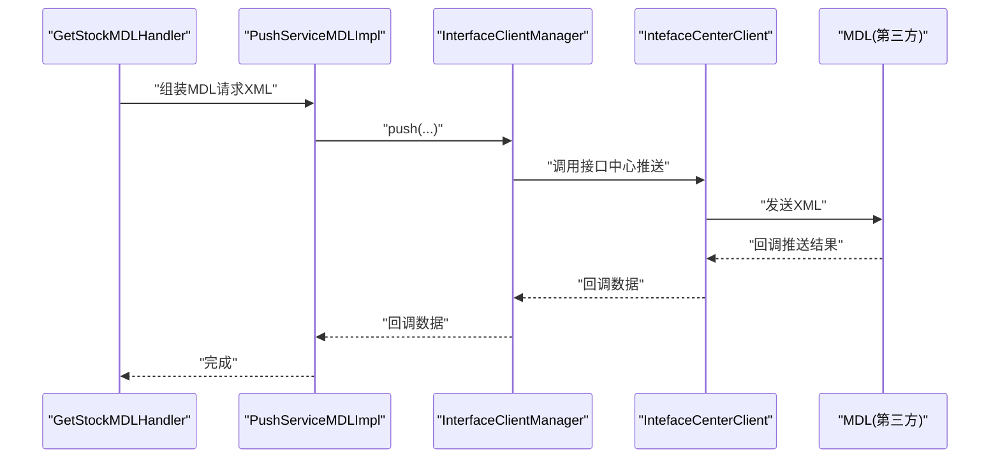
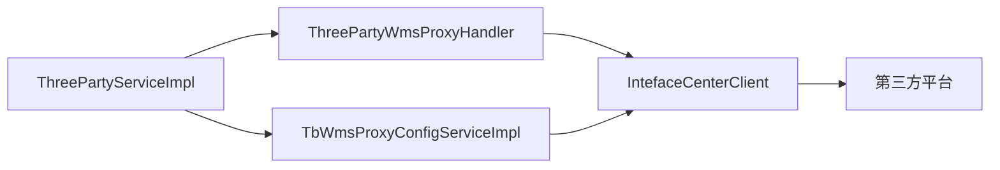

# 第三方平台对接

<cite>
**本文引用的文件**
- [ThreePartyService.java](file://guoke-deepexi-storage-center-provider/src/main/java/com/deepexi/storage/service/threeParty/ThreePartyService.java)
- [ThreePartyServiceImpl.java](file://guoke-deepexi-storage-center-provider/src/main/java/com/deepexi/storage/service/threeParty/ThreePartyServiceImpl.java)
- [ThreePartyWmsProxyHandler.java](file://guoke-deepexi-storage-center-provider/src/main/java/com/deepexi/storage/service/hanlder/ThreePartyWmsProxyHandler.java)
- [InterfaceClientManager.java](file://guoke-deepexi-storage-center-provider/src/main/java/com/deepexi/storage/manager/InterfaceClientManager.java)
- [TbWmsProxyConfigServiceImpl.java](file://guoke-deepexi-storage-center-provider/src/main/java/com/deepexi/storage/service/impl/TbWmsProxyConfigServiceImpl.java)
- [AbstractWmsProxyHandler.java](file://guoke-deepexi-storage-center-provider/src/main/java/com/deepexi/storage/service/hanlder/AbstractWmsProxyHandler.java)
- [WmsProxyHandler.java](file://guoke-deepexi-storage-center-provider/src/main/java/com/deepexi/storage/service/hanlder/WmsProxyHandler.java)
- [TbWmsProxyConfigMapper.xml](file://guoke-deepexi-storage-center-provider/src/main/resources/mapper/TbWmsProxyConfigMapper.xml)
- [InterfaceCallBackServiceImpl.java](file://guoke-deepexi-storage-center-provider/src/main/java/com/deepexi/storage/service/impl/InterfaceCallBackServiceImpl.java)
- [GetStockMDLHandler.java](file://guoke-deepexi-storage-center-provider/src/main/java/com/deepexi/storage/scheduled/GetStockMDLHandler.java)
- [PushServiceMDLImpl.java](file://guoke-deepexi-storage-center-provider/src/main/java/com/deepexi/storage/service/push/PushServiceMDLImpl.java)
- [MdlEdiSoapRequestEntity.java](file://guoke-deepexi-storage-center-api/src/main/java/com/deepexi/api/storage/dto/mdlEdi/MdlEdiSoapRequestEntity.java)
- [AuthHeaderEntity.java](file://guoke-deepexi-storage-center-api/src/main/java/com/deepexi/api/storage/dto/mdlEdi/AuthHeaderEntity.java)
- [StorageClient.java](file://guoke-deepexi-storage-center-api/src/main/java/com/deepexi/api/storage/StorageClient.java)
</cite>

## 目录
1. [简介](#简介)
2. [项目结构](#项目结构)
3. [核心组件](#核心组件)
4. [架构总览](#架构总览)
5. [详细组件分析](#详细组件分析)
6. [依赖分析](#依赖分析)
7. [性能考虑](#性能考虑)
8. [故障排查指南](#故障排查指南)
9. [结论](#结论)
10. [附录](#附录)

## 简介
本文件面向国科恒泰仓储管理系统与第三方平台的对接，聚焦于数据交换机制、接口客户端管理与统一回调处理。文档系统性阐述 ThreePartyService 的服务架构、接口客户端的配置与管理策略、认证机制、数据传输协议与安全防护，并提供接口调用示例、数据格式规范与错误处理流程，同时给出第三方平台集成的开发指南、测试策略与运维监控建议。

## 项目结构
围绕第三方平台对接的关键模块包括：
- 业务服务层：ThreePartyService 及其实现 ThreePartyServiceImpl，负责入库/出库通知单的接收、校验、转换与落库，并触发对外推送。
- 代理处理器：ThreePartyWmsProxyHandler 及抽象基类 AbstractWmsProxyHandler，封装 OM/OMS 推送、物流信息同步与取消出库等操作。
- 配置与路由：TbWmsProxyConfigServiceImpl 与 TbWmsProxyConfigMapper.xml，基于企业配置选择具体代理处理器。
- 接口客户端管理：InterfaceClientManager，统一封装对“接口中心”的调用，包括物流下单、库存查询、取消入库等。
- 回调处理：InterfaceCallBackServiceImpl，处理第三方平台回调（如美敦力库存/出库推送结果），并写入内部关联单据。
- 定时任务与推送：GetStockMDLHandler 与 PushServiceMDLImpl，演示定时拉取库存与推送出库单至第三方平台（MDL）。
- API 客户端：StorageClient，定义与仓储中心内部 RPC 的接口契约。

图示来源
- [ThreePartyServiceImpl.java:104-188](file://guoke-deepexi-storage-center-provider/src/main/java/com/deepexi/storage/service/threeParty/ThreePartyServiceImpl.java#L104-L188)
- [ThreePartyWmsProxyHandler.java:92-159](file://guoke-deepexi-storage-center-provider/src/main/java/com/deepexi/storage/service/hanlder/ThreePartyWmsProxyHandler.java#L92-L159)
- [TbWmsProxyConfigServiceImpl.java:66-84](file://guoke-deepexi-storage-center-provider/src/main/java/com/deepexi/storage/service/impl/TbWmsProxyConfigServiceImpl.java#L66-L84)
- [InterfaceClientManager.java:71-84](file://guoke-deepexi-storage-center-provider/src/main/java/com/deepexi/storage/manager/InterfaceClientManager.java#L71-L84)

章节来源
- [ThreePartyServiceImpl.java:104-188](file://guoke-deepexi-storage-center-provider/src/main/java/com/deepexi/storage/service/threeParty/ThreePartyServiceImpl.java#L104-L188)
- [ThreePartyWmsProxyHandler.java:92-159](file://guoke-deepexi-storage-center-provider/src/main/java/com/deepexi/storage/service/hanlder/ThreePartyWmsProxyHandler.java#L92-L159)
- [TbWmsProxyConfigServiceImpl.java:66-84](file://guoke-deepexi-storage-center-provider/src/main/java/com/deepexi/storage/service/impl/TbWmsProxyConfigServiceImpl.java#L66-L84)
- [InterfaceClientManager.java:71-84](file://guoke-deepexi-storage-center-provider/src/main/java/com/deepexi/storage/manager/InterfaceClientManager.java#L71-L84)

## 核心组件
- ThreePartyService：定义第三方平台对接的核心能力，包括入库/出库通知单保存、订单记录查询、取消入库/出库以及 CD 入库通知发送。
- ThreePartyServiceImpl：实现业务编排，完成单据去重校验、企业与产品映射、物流信息装配、调用仓储内部服务生成正式出入库单，并触发对外推送。
- ThreePartyWmsProxyHandler：封装 OM/OMS 推送逻辑，支持采购入库、销退入库、销售出库、采退出库四种场景，统一记录接口日志并处理返回结果。
- TbWmsProxyConfigServiceImpl：根据企业 ID 获取代理配置，选择对应代理处理器并执行 handler_in/handler_out。
- InterfaceClientManager：统一对“接口中心”调用，提供物流下单、库存查询、取消入库等能力。
- InterfaceCallBackServiceImpl：处理第三方平台回调，解析 XML，写入内部关联单据并校验推送结果。
- GetStockMDLHandler/PushServiceMDLImpl：演示定时任务拉取第三方库存与推送出库单的完整流程。

章节来源
- [ThreePartyService.java:14-61](file://guoke-deepexi-storage-center-provider/src/main/java/com/deepexi/storage/service/threeParty/ThreePartyService.java#L14-L61)
- [ThreePartyServiceImpl.java:104-536](file://guoke-deepexi-storage-center-provider/src/main/java/com/deepexi/storage/service/threeParty/ThreePartyServiceImpl.java#L104-L536)
- [ThreePartyWmsProxyHandler.java:92-480](file://guoke-deepexi-storage-center-provider/src/main/java/com/deepexi/storage/service/hanlder/ThreePartyWmsProxyHandler.java#L92-L480)
- [TbWmsProxyConfigServiceImpl.java:66-100](file://guoke-deepexi-storage-center-provider/src/main/java/com/deepexi/storage/service/impl/TbWmsProxyConfigServiceImpl.java#L66-L100)
- [InterfaceClientManager.java:145-181](file://guoke-deepexi-storage-center-provider/src/main/java/com/deepexi/storage/manager/InterfaceClientManager.java#L145-L181)
- [InterfaceCallBackServiceImpl.java:55-165](file://guoke-deepexi-storage-center-provider/src/main/java/com/deepexi/storage/service/impl/InterfaceCallBackServiceImpl.java#L55-L165)
- [GetStockMDLHandler.java:53-82](file://guoke-deepexi-storage-center-provider/src/main/java/com/deepexi/storage/scheduled/GetStockMDLHandler.java#L53-L82)
- [PushServiceMDLImpl.java:92-162](file://guoke-deepexi-storage-center-provider/src/main/java/com/deepexi/storage/service/push/PushServiceMDLImpl.java#L92-L162)

## 架构总览
第三方平台对接采用“业务编排 + 代理处理器 + 接口客户端 + 统一回调”的分层设计：
- 业务编排层：ThreePartyServiceImpl 负责单据校验、映射与仓储内部流程触发。
- 代理处理层：ThreePartyWmsProxyHandler 将仓储内部单据转换为 OM/OMS 协议并推送。
- 配置路由层：TbWmsProxyConfigServiceImpl 基于企业配置选择代理处理器。
- 客户端管理层：InterfaceClientManager 统一调用“接口中心”，屏蔽第三方差异。
- 回调处理层：InterfaceCallBackServiceImpl 解析第三方回调并写入内部关联单据。

图示来源
- [ThreePartyServiceImpl.java:104-188](file://guoke-deepexi-storage-center-provider/src/main/java/com/deepexi/storage/service/threeParty/ThreePartyServiceImpl.java#L104-L188)
- [ThreePartyWmsProxyHandler.java:423-438](file://guoke-deepexi-storage-center-provider/src/main/java/com/deepexi/storage/service/hanlder/ThreePartyWmsProxyHandler.java#L423-L438)

## 详细组件分析

### ThreePartyService 与 ThreePartyServiceImpl
- 能力范围
  - 保存入库通知单：校验重复单号、企业与产品有效性、装配物流信息，生成仓储内部入库通知单并返回仓储单号。
  - 保存出库通知单：校验重复单号、企业与产品有效性、装配物流信息，生成仓储内部出库通知单并返回仓储单号。
  - 查询入库/出库记录：按订单号列表查询已完成的出入库记录及明细。
  - 取消入库/出库：入库单直接删除；出库单需未产生出库记录且解锁库存，随后调用代理处理器取消出库。
  - 发送 CD 入库通知：根据请求装配物流与参与方信息，调用代理处理器推送采购入库。
- 关键要点
  - 使用企业与产品映射工具完成信用代码与产品编码到内部标识的转换。
  - 对重复单据进行拦截，避免重复推送。
  - 出库取消前进行库存解锁与前置校验。

图示来源
- [ThreePartyServiceImpl.java:192-277](file://guoke-deepexi-storage-center-provider/src/main/java/com/deepexi/storage/service/threeParty/ThreePartyServiceImpl.java#L192-L277)

章节来源
- [ThreePartyService.java:14-61](file://guoke-deepexi-storage-center-provider/src/main/java/com/deepexi/storage/service/threeParty/ThreePartyService.java#L14-L61)
- [ThreePartyServiceImpl.java:104-536](file://guoke-deepexi-storage-center-provider/src/main/java/com/deepexi/storage/service/threeParty/ThreePartyServiceImpl.java#L104-L536)

### 代理处理器与配置路由
- 代理处理器
  - AbstractWmsProxyHandler：定义 handler_in/handler_out 的入口，根据单据类型分发到具体推送方法。
  - ThreePartyWmsProxyHandler：实现四种场景的 OM/OMS 推送，统一记录接口日志并通过 sendRequest 校验返回结果。
  - 物流信息同步：saveLogisticsInfo 从接口中心获取物流信息并持久化。
  - 取消出库：cancelOutOrder 调用接口中心取消出库单。
- 配置路由
  - TbWmsProxyConfigServiceImpl：根据企业 ID 获取代理配置，选择对应处理器执行 handler_in/handler_out。
  - TbWmsProxyConfigMapper.xml：存储企业与处理器代码、URL 等配置。

图示来源
- [AbstractWmsProxyHandler.java:17-27](file://guoke-deepexi-storage-center-provider/src/main/java/com/deepexi/storage/service/hanlder/AbstractWmsProxyHandler.java#L17-L27)
- [ThreePartyWmsProxyHandler.java:92-480](file://guoke-deepexi-storage-center-provider/src/main/java/com/deepexi/storage/service/hanlder/ThreePartyWmsProxyHandler.java#L92-L480)
- [TbWmsProxyConfigServiceImpl.java:66-100](file://guoke-deepexi-storage-center-provider/src/main/java/com/deepexi/storage/service/impl/TbWmsProxyConfigServiceImpl.java#L66-L100)

章节来源
- [AbstractWmsProxyHandler.java:17-27](file://guoke-deepexi-storage-center-provider/src/main/java/com/deepexi/storage/service/hanlder/AbstractWmsProxyHandler.java#L17-L27)
- [ThreePartyWmsProxyHandler.java:92-480](file://guoke-deepexi-storage-center-provider/src/main/java/com/deepexi/storage/service/hanlder/ThreePartyWmsProxyHandler.java#L92-L480)
- [TbWmsProxyConfigServiceImpl.java:66-100](file://guoke-deepexi-storage-center-provider/src/main/java/com/deepexi/storage/service/impl/TbWmsProxyConfigServiceImpl.java#L66-L100)
- [TbWmsProxyConfigMapper.xml:21-212](file://guoke-deepexi-storage-center-provider/src/main/resources/mapper/TbWmsProxyConfigMapper.xml#L21-L212)

### 接口客户端管理与统一回调
- InterfaceClientManager
  - 提供物流下单、库存查询、取消入库等统一调用入口，封装错误处理与返回值校验。
  - push 方法用于向第三方平台推送业务数据（如 MDL 的库存/出库单 XML）。
- InterfaceCallBackServiceImpl
  - 处理第三方平台回调：解析 JSON 中转义后的 XML，提取关键节点，写入内部关联单据。
  - 对库存同步回调与出库推送回调分别处理，确保业务闭环。

图示来源
- [GetStockMDLHandler.java:53-82](file://guoke-deepexi-storage-center-provider/src/main/java/com/deepexi/storage/scheduled/GetStockMDLHandler.java#L53-L82)
- [PushServiceMDLImpl.java:92-162](file://guoke-deepexi-storage-center-provider/src/main/java/com/deepexi/storage/service/push/PushServiceMDLImpl.java#L92-L162)
- [InterfaceClientManager.java:145-150](file://guoke-deepexi-storage-center-provider/src/main/java/com/deepexi/storage/manager/InterfaceClientManager.java#L145-L150)

章节来源
- [InterfaceClientManager.java:145-181](file://guoke-deepexi-storage-center-provider/src/main/java/com/deepexi/storage/manager/InterfaceClientManager.java#L145-L181)
- [InterfaceCallBackServiceImpl.java:55-165](file://guoke-deepexi-storage-center-provider/src/main/java/com/deepexi/storage/service/impl/InterfaceCallBackServiceImpl.java#L55-L165)
- [GetStockMDLHandler.java:53-82](file://guoke-deepexi-storage-center-provider/src/main/java/com/deepexi/storage/scheduled/GetStockMDLHandler.java#L53-L82)
- [PushServiceMDLImpl.java:92-162](file://guoke-deepexi-storage-center-provider/src/main/java/com/deepexi/storage/service/push/PushServiceMDLImpl.java#L92-L162)

### 数据模型与传输协议
- SOAP/XML 模型
  - MdlEdiSoapRequestEntity：封装 SOAP Envelope/Header/Body，支持认证头与业务体。
  - AuthHeaderEntity：包含用户名与密码字段，用于第三方平台鉴权。
- 传输协议
  - 内部 OM/OMS 推送：通过 IntefaceCenterClient 调用接口中心，统一返回码校验。
  - 第三方回调：回调数据经 HTML 转义与 JSON 转 XML 解析，提取关键节点写入内部单据。

章节来源
- [MdlEdiSoapRequestEntity.java:8-31](file://guoke-deepexi-storage-center-api/src/main/java/com/deepexi/api/storage/dto/mdlEdi/MdlEdiSoapRequestEntity.java#L8-L31)
- [AuthHeaderEntity.java:15-24](file://guoke-deepexi-storage-center-api/src/main/java/com/deepexi/api/storage/dto/mdlEdi/AuthHeaderEntity.java#L15-L24)
- [ThreePartyWmsProxyHandler.java:423-438](file://guoke-deepexi-storage-center-provider/src/main/java/com/deepexi/storage/service/hanlder/ThreePartyWmsProxyHandler.java#L423-L438)

## 依赖分析
- 组件耦合
  - ThreePartyServiceImpl 依赖仓储内部服务与产品/企业映射工具，最终通过代理处理器与接口中心交互。
  - 代理处理器依赖接口中心客户端与仓储内部服务，形成“仓储内部 → OM/OMS → 第三方平台”的链路。
  - 配置路由通过 Map 注入处理器，降低硬编码耦合。
- 外部依赖
  - 接口中心：统一承载 OM/OMS 推送与第三方回调接入。
  - 第三方平台：MDL 示例展示库存同步与出库推送。

图示来源
- [ThreePartyServiceImpl.java:96-100](file://guoke-deepexi-storage-center-provider/src/main/java/com/deepexi/storage/service/threeParty/ThreePartyServiceImpl.java#L96-L100)
- [ThreePartyWmsProxyHandler.java:50-51](file://guoke-deepexi-storage-center-provider/src/main/java/com/deepexi/storage/service/hanlder/ThreePartyWmsProxyHandler.java#L50-L51)
- [TbWmsProxyConfigServiceImpl.java:24-25](file://guoke-deepexi-storage-center-provider/src/main/java/com/deepexi/storage/service/impl/TbWmsProxyConfigServiceImpl.java#L24-L25)

章节来源
- [ThreePartyServiceImpl.java:96-100](file://guoke-deepexi-storage-center-provider/src/main/java/com/deepexi/storage/service/threeParty/ThreePartyServiceImpl.java#L96-L100)
- [ThreePartyWmsProxyHandler.java:50-51](file://guoke-deepexi-storage-center-provider/src/main/java/com/deepexi/storage/service/hanlder/ThreePartyWmsProxyHandler.java#L50-L51)
- [TbWmsProxyConfigServiceImpl.java:24-25](file://guoke-deepexi-storage-center-provider/src/main/java/com/deepexi/storage/service/impl/TbWmsProxyConfigServiceImpl.java#L24-L25)

## 性能考虑
- 批量与分组
  - 在查询与映射阶段尽量使用批量接口（如产品映射、企业映射），减少多次远程调用。
- 缓存与去重
  - 对重复单据进行快速校验，避免重复推送与落库。
- 异步与队列
  - 对第三方平台推送可引入消息队列异步化，提升吞吐与稳定性。
- 日志与可观测性
  - 统一记录接口日志，便于追踪与审计；对异常进行分类统计与告警。

## 故障排查指南
- 推送失败
  - 检查 sendRequest 返回码与异常信息，定位 OM/OMS 返回错误。
  - 核对代理处理器中 OM/OMS 请求体字段完整性。
- 回调解析异常
  - 确认回调数据的 HTML 转义与 JSON 转 XML 步骤正确，检查关键节点路径。
  - 校验第三方平台返回的 result/rtnVal 字段以判断推送是否成功。
- 重复单据
  - 入库/出库保存前进行重复单号校验，避免业务异常。
- 取消出库
  - 出库取消需确保未产生出库记录且库存已解锁，否则拒绝取消。

章节来源
- [ThreePartyWmsProxyHandler.java:423-438](file://guoke-deepexi-storage-center-provider/src/main/java/com/deepexi/storage/service/hanlder/ThreePartyWmsProxyHandler.java#L423-L438)
- [InterfaceCallBackServiceImpl.java:139-165](file://guoke-deepexi-storage-center-provider/src/main/java/com/deepexi/storage/service/impl/InterfaceCallBackServiceImpl.java#L139-L165)
- [ThreePartyServiceImpl.java:107-114](file://guoke-deepexi-storage-center-provider/src/main/java/com/deepexi/storage/service/threeParty/ThreePartyServiceImpl.java#L107-L114)

## 结论
本对接方案通过“业务编排 + 代理处理器 + 配置路由 + 客户端管理 + 统一回调”的架构，实现了与第三方平台的稳定对接。ThreePartyService 提供清晰的业务边界，ThreePartyWmsProxyHandler 与 TbWmsProxyConfigServiceImpl 实现了灵活的路由与 OM/OMS 推送，InterfaceClientManager 与 InterfaceCallBackServiceImpl 则保障了与第三方平台的双向通信与闭环处理。建议在生产环境中结合异步化与监控告警，持续优化性能与可靠性。

## 附录

### 开发指南
- 单据保存
  - 入库：调用 saveInStockOrder，确保单号唯一、企业与产品有效、物流信息完整。
  - 出库：调用 saveOutStockOrder，确保单号唯一、企业与产品有效、物流信息完整。
- 推送与取消
  - 入库/出库完成后由代理处理器自动推送 OM/OMS；取消出库需满足前置条件。
- 回调接入
  - 在接口中心配置回调地址，回调服务解析 XML 并写入内部关联单据。

章节来源
- [ThreePartyService.java:14-61](file://guoke-deepexi-storage-center-provider/src/main/java/com/deepexi/storage/service/threeParty/ThreePartyService.java#L14-L61)
- [ThreePartyServiceImpl.java:104-536](file://guoke-deepexi-storage-center-provider/src/main/java/com/deepexi/storage/service/threeParty/ThreePartyServiceImpl.java#L104-L536)
- [ThreePartyWmsProxyHandler.java:92-480](file://guoke-deepexi-storage-center-provider/src/main/java/com/deepexi/storage/service/hanlder/ThreePartyWmsProxyHandler.java#L92-L480)
- [InterfaceCallBackServiceImpl.java:55-165](file://guoke-deepexi-storage-center-provider/src/main/java/com/deepexi/storage/service/impl/InterfaceCallBackServiceImpl.java#L55-L165)

### 测试策略
- 单元测试
  - 针对单据保存与取消的边界条件（重复单号、企业/产品不存在、未产生出库记录等）编写用例。
- 集成测试
  - 搭建接口中心与第三方平台模拟器，验证 OM/OMS 推送与回调解析。
- 回归测试
  - 对配置变更（企业代理处理器切换）进行回归验证。

### 运维监控
- 日志与指标
  - 统一记录 OM/OMS 推送日志与耗时指标，设置失败率阈值告警。
- 配置管理
  - 通过 TbWmsProxyConfigMapper.xml 动态维护企业代理配置，支持灰度切换。
- 安全与合规
  - 对第三方平台认证信息进行密文存储与轮换，定期审计访问日志。