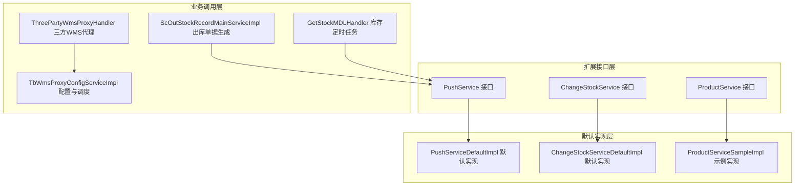
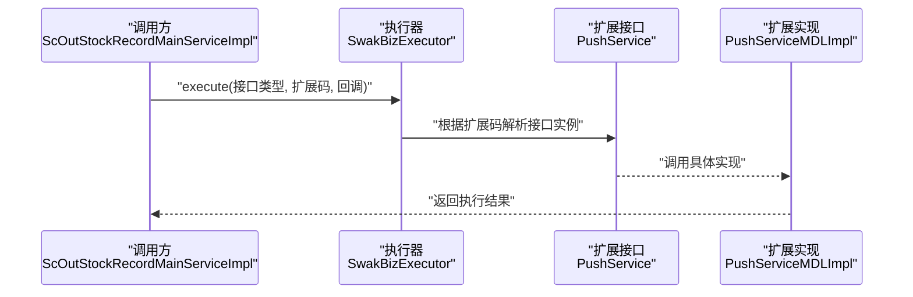
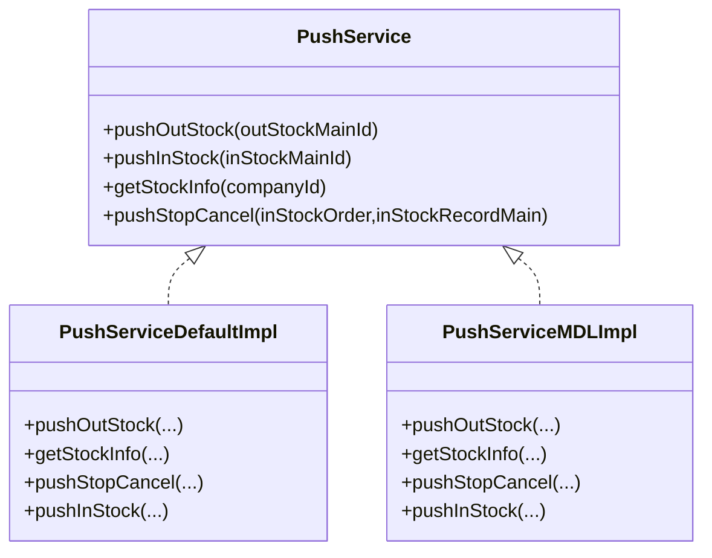
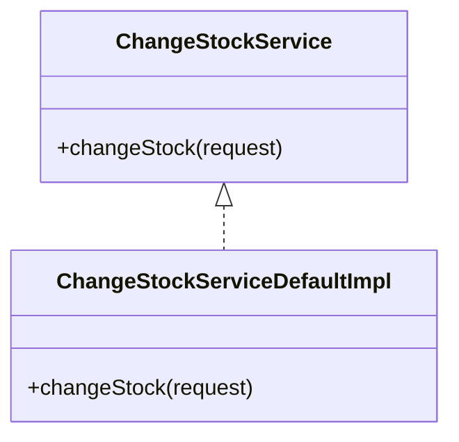
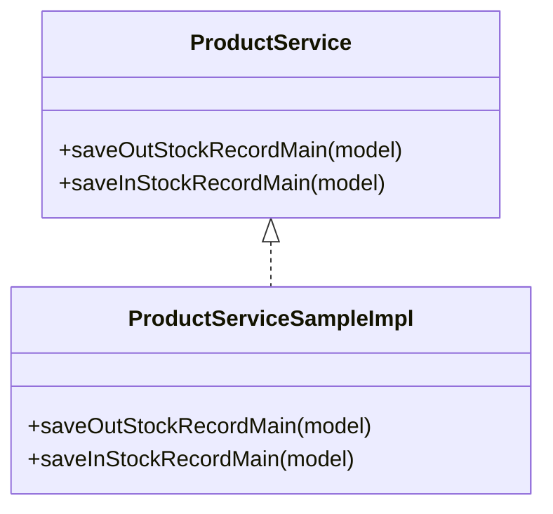
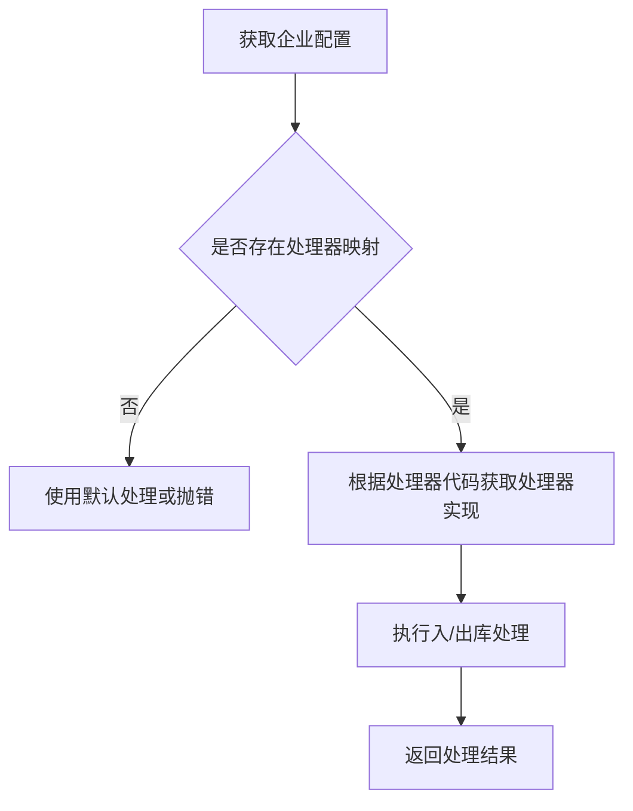
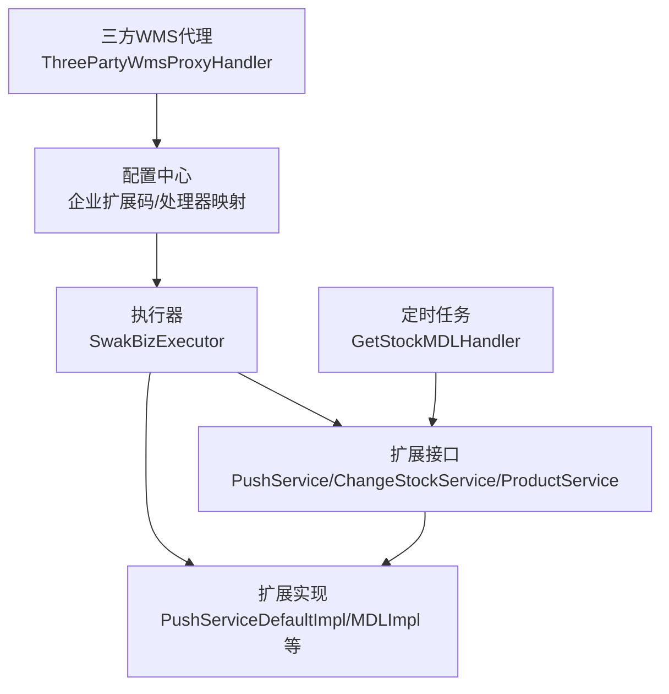

# 自定义扩展开发

<cite>
**本文引用的文件**
- [PushService.java](file://guoke-deepexi-storage-center-provider/src/main/java/com/deepexi/storage/service/push/PushService.java)
- [PushServiceDefaultImpl.java](file://guoke-deepexi-storage-center-provider/src/main/java/com/deepexi/storage/service/push/PushServiceDefaultImpl.java)
- [PushServiceMDLImpl.java](file://guoke-deepexi-storage-center-provider/src/main/java/com/deepexi/storage/service/push/PushServiceMDLImpl.java)
- [ChangeStockService.java](file://guoke-deepexi-storage-center-provider/src/main/java/com/depth/storage/service/changeStock/ChangeStockService.java)
- [ChangeStockServiceDefaultImpl.java](file://guoke-deepexi-storage-center-provider/src/main/java/com/depth/storage/service/changeStock/ChangeStockServiceDefaultImpl.java)
- [ScOutStockRecordMainServiceImpl.java](file://guoke-deepexi-storage-center-provider/src/main/java/com/depth/storage/service/impl/ScOutStockRecordMainServiceImpl.java)
- [GetStockMDLHandler.java](file://guoke-deepexi-storage-center-provider/src/main/java/com/depth/storage/scheduled/GetStockMDLHandler.java)
- [ThreePartyWmsProxyHandler.java](file://guoke-deepexi-storage-center-provider/src/main/java/com/depth/storage/service/hanlder/ThreePartyWmsProxyHandler.java)
- [TbWmsProxyConfigServiceImpl.java](file://guoke-deepexi-storage-center-provider/src/main/java/com/depth/storage/service/impl/TbWmsProxyConfigServiceImpl.java)
- [ProductService.java](file://guoke-deepexi-storage-center-provider/src/main/java/com/depth/storage/service/product/ProductService.java)
- [ProductServiceSampleImpl.java](file://guoke-deepexi-storage-center-provider/src/main/java/com/depth/storage/service/product/ProductServiceSampleImpl.java)
</cite>

## 目录
1. [简介](#简介)
2. [项目结构](#项目结构)
3. [核心组件](#核心组件)
4. [架构总览](#架构总览)
5. [详细组件分析](#详细组件分析)
6. [依赖分析](#依赖分析)
7. [性能考虑](#性能考虑)
8. [故障排查指南](#故障排查指南)
9. [结论](#结论)
10. [附录](#附录)

## 简介
本文件面向国科恒泰仓储管理系统（Storage Center）的自定义扩展开发者，系统性阐述扩展机制、插件架构与自定义实现接口。重点围绕以下核心扩展接口进行设计与实现解析：
- PushService：推送与库存拉取扩展接口
- ChangeStockService：库存变更扩展接口
- ProductService：出入库单据生成扩展接口
- WMS代理扩展：基于处理器映射的三方WMS对接扩展

同时，文档记录了扩展点的注册机制、SPI（服务提供者接口）使用与动态加载策略，并给出自定义扩展的开发流程、接口实现示例与测试验证方法，最后提供最佳实践、性能优化建议与兼容性保证策略。

## 项目结构
仓储中心采用分层+模块化组织，扩展能力主要集中在 provider 模块的服务层与业务实现层，通过注解驱动的 SPI 机制与执行器进行动态加载与调用。

图表来源
- [PushService.java:1-26](file://guoke-deepexi-storage-center-provider/src/main/java/com/depth/storage/service/push/PushService.java#L1-L26)
- [PushServiceDefaultImpl.java:1-31](file://guoke-deepexi-storage-center-provider/src/main/java/com/depth/storage/service/push/PushServiceDefaultImpl.java#L1-L31)
- [ChangeStockService.java:1-14](file://guoke-deepexi-storage-center-provider/src/main/java/com/depth/storage/service/changeStock/ChangeStockService.java#L1-L14)
- [ChangeStockServiceDefaultImpl.java:1-15](file://guoke-deepexi-storage-center-provider/src/main/java/com/depth/storage/service/changeStock/ChangeStockServiceDefaultImpl.java#L1-L15)
- [ProductService.java:1-19](file://guoke-deepexi-storage-center-provider/src/main/java/com/depth/storage/service/product/ProductService.java#L1-L19)
- [ProductServiceSampleImpl.java:1-36](file://guoke-deepexi-storage-center-provider/src/main/java/com/depth/storage/service/product/ProductServiceSampleImpl.java#L1-L36)
- [ScOutStockRecordMainServiceImpl.java:66-327](file://guoke-deepexi-storage-center-provider/src/main/java/com/depth/storage/service/impl/ScOutStockRecordMainServiceImpl.java#L66-L327)
- [GetStockMDLHandler.java:34-62](file://guoke-deepexi-storage-center-provider/src/main/java/com/depth/storage/scheduled/GetStockMDLHandler.java#L34-L62)
- [ThreePartyWmsProxyHandler.java:26-74](file://guoke-deepexi-storage-center-provider/src/main/java/com/depth/storage/service/hanlder/ThreePartyWmsProxyHandler.java#L26-L74)
- [TbWmsProxyConfigServiceImpl.java:33-75](file://guoke-deepexi-storage-center-provider/src/main/java/com/depth/storage/service/impl/TbWmsProxyConfigServiceImpl.java#L33-L75)

章节来源
- [ScOutStockRecordMainServiceImpl.java:66-327](file://guoke-deepexi-storage-center-provider/src/main/java/com/depth/storage/service/impl/ScOutStockRecordMainServiceImpl.java#L66-L327)
- [GetStockMDLHandler.java:34-62](file://guoke-deepexi-storage-center-provider/src/main/java/com/depth/storage/scheduled/GetStockMDLHandler.java#L34-L62)
- [ThreePartyWmsProxyHandler.java:26-74](file://guoke-deepexi-storage-center-provider/src/main/java/com/depth/storage/service/hanlder/ThreePartyWmsProxyHandler.java#L26-L74)
- [TbWmsProxyConfigServiceImpl.java:33-75](file://guoke-deepexi-storage-center-provider/src/main/java/com/depth/storage/service/impl/TbWmsProxyConfigServiceImpl.java#L33-L75)

## 核心组件
本节聚焦于三大扩展接口及其默认实现，说明设计理念与实现方式。

- PushService（推送与库存拉取）
  - 设计理念：以接口抽象对外部系统进行统一推送与库存拉取，支持多厂商适配与默认兜底。
  - 关键方法：推送出库、推送入库、获取库存、推送反审核。
  - 默认实现：提供空实现或日志占位，确保系统在未配置具体实现时仍可运行。
  - 典型扩展：针对特定厂商（如美敦力）实现具体推送逻辑。

- ChangeStockService（库存变更）
  - 设计理念：统一库存变更入口，接收标准化请求对象，便于接入不同库存源或规则引擎。
  - 关键方法：变更库存。
  - 默认实现：空实现，便于按需覆盖。

- ProductService（出入库单据生成）
  - 设计理念：抽象出入库单据生成流程，支持多场景（如样机业务）差异化实现。
  - 关键方法：生成出库单、生成入库单。
  - 示例实现：提供样机业务场景的实现示例，展示如何注入服务与处理业务。

章节来源
- [PushService.java:1-26](file://guoke-deepexi-storage-center-provider/src/main/java/com/depth/storage/service/push/PushService.java#L1-L26)
- [PushServiceDefaultImpl.java:1-31](file://guoke-deepexi-storage-center-provider/src/main/java/com/depth/storage/service/push/PushServiceDefaultImpl.java#L1-L31)
- [ChangeStockService.java:1-14](file://guoke-deepexi-storage-center-provider/src/main/java/com/depth/storage/service/changeStock/ChangeStockService.java#L1-L14)
- [ChangeStockServiceDefaultImpl.java:1-15](file://guoke-deepexi-storage-center-provider/src/main/java/com/depth/storage/service/changeStock/ChangeStockServiceDefaultImpl.java#L1-L15)
- [ProductService.java:1-19](file://guoke-deepexi-storage-center-provider/src/main/java/com/depth/storage/service/product/ProductService.java#L1-L19)
- [ProductServiceSampleImpl.java:1-36](file://guoke-deepexi-storage-center-provider/src/main/java/com/depth/storage/service/product/ProductServiceSampleImpl.java#L1-L36)

## 架构总览
系统通过注解标记扩展接口与实现，结合执行器与配置中心，实现扩展点的动态加载与调用。下图展示了典型调用链路与扩展点位置。

图表来源
- [ScOutStockRecordMainServiceImpl.java:66-327](file://guoke-deepexi-storage-center-provider/src/main/java/com/depth/storage/service/impl/ScOutStockRecordMainServiceImpl.java#L66-L327)
- [PushService.java:1-26](file://guoke-deepexi-storage-center-provider/src/main/java/com/depth/storage/service/push/PushService.java#L1-L26)
- [PushServiceMDLImpl.java:189-204](file://guoke-deepexi-storage-center-provider/src/main/java/com/depth/storage/service/push/PushServiceMDLImpl.java#L189-L204)

## 详细组件分析

### PushService 扩展分析
- 接口职责：封装对外系统推送与库存拉取能力，支持按企业扩展码隔离不同实现。
- 默认实现：提供空实现，避免调用失败。
- 典型实现：针对特定厂商（如美敦力）实现具体推送逻辑，包括推送出库、推送入库、获取库存等。
- 调用时机：在出库单据生成后触发推送；也可由定时任务触发库存拉取。

图表来源
- [PushService.java:1-26](file://guoke-deepexi-storage-center-provider/src/main/java/com/depth/storage/service/push/PushService.java#L1-L26)
- [PushServiceDefaultImpl.java:1-31](file://guoke-deepexi-storage-center-provider/src/main/java/com/depth/storage/service/push/PushServiceDefaultImpl.java#L1-L31)
- [PushServiceMDLImpl.java:189-204](file://guoke-deepexi-storage-center-provider/src/main/java/com/depth/storage/service/push/PushServiceMDLImpl.java#L189-L204)

章节来源
- [PushService.java:1-26](file://guoke-deepexi-storage-center-provider/src/main/java/com/depth/storage/service/push/PushService.java#L1-L26)
- [PushServiceDefaultImpl.java:1-31](file://guoke-deepexi-storage-center-provider/src/main/java/com/depth/storage/service/push/PushServiceDefaultImpl.java#L1-L31)
- [PushServiceMDLImpl.java:189-204](file://guoke-deepexi-storage-center-provider/src/main/java/com/depth/storage/service/push/PushServiceMDLImpl.java#L189-L204)

### ChangeStockService 扩展分析
- 接口职责：统一库存变更入口，接收标准化请求对象，便于接入不同库存源或规则引擎。
- 默认实现：空实现，便于按需覆盖。
- 调用场景：可在出入库单据生成后触发库存变更，或由定时任务触发。

图表来源
- [ChangeStockService.java:1-14](file://guoke-deepexi-storage-center-provider/src/main/java/com/depth/storage/service/changeStock/ChangeStockService.java#L1-L14)
- [ChangeStockServiceDefaultImpl.java:1-15](file://guoke-deepexi-storage-center-provider/src/main/java/com/depth/storage/service/changeStock/ChangeStockServiceDefaultImpl.java#L1-L15)

章节来源
- [ChangeStockService.java:1-14](file://guoke-deepexi-storage-center-provider/src/main/java/com/depth/storage/service/changeStock/ChangeStockService.java#L1-L14)
- [ChangeStockServiceDefaultImpl.java:1-15](file://guoke-deepexi-storage-center-provider/src/main/java/com/depth/storage/service/changeStock/ChangeStockServiceDefaultImpl.java#L1-L15)

### ProductService 扩展分析
- 接口职责：抽象出入库单据生成流程，支持多场景差异化实现。
- 示例实现：提供样机业务场景的实现示例，展示如何注入服务与处理业务。
- 调用场景：在单据生成流程中，按企业扩展码选择对应实现。

图表来源
- [ProductService.java:1-19](file://guoke-deepexi-storage-center-provider/src/main/java/com/depth/storage/service/product/ProductService.java#L1-L19)
- [ProductServiceSampleImpl.java:1-36](file://guoke-deepexi-storage-center-provider/src/main/java/com/depth/storage/service/product/ProductServiceSampleImpl.java#L1-L36)

章节来源
- [ProductService.java:1-19](file://guoke-deepexi-storage-center-provider/src/main/java/com/depth/storage/service/product/ProductService.java#L1-L19)
- [ProductServiceSampleImpl.java:1-36](file://guoke-deepexi-storage-center-provider/src/main/java/com/depth/storage/service/product/ProductServiceSampleImpl.java#L1-L36)

### WMS 代理扩展分析
- 处理器映射：通过配置表获取企业对应的处理器代码，再从处理器映射中解析具体处理器实现。
- 调用流程：根据入/出库场景调用对应处理器，完成与三方WMS的对接。

图表来源
- [TbWmsProxyConfigServiceImpl.java:33-75](file://guoke-deepexi-storage-center-provider/src/main/java/com/depth/storage/service/impl/TbWmsProxyConfigServiceImpl.java#L33-L75)
- [ThreePartyWmsProxyHandler.java:26-74](file://guoke-deepexi-storage-center-provider/src/main/java/com/depth/storage/service/hanlder/ThreePartyWmsProxyHandler.java#L26-L74)

章节来源
- [TbWmsProxyConfigServiceImpl.java:33-75](file://guoke-deepexi-storage-center-provider/src/main/java/com/depth/storage/service/impl/TbWmsProxyConfigServiceImpl.java#L33-L75)
- [ThreePartyWmsProxyHandler.java:26-74](file://guoke-deepexi-storage-center-provider/src/main/java/com/depth/storage/service/hanlder/ThreePartyWmsProxyHandler.java#L26-L74)

## 依赖分析
- 注解驱动的 SPI：通过注解标记接口与实现，形成标准扩展契约。
- 执行器调用：业务层通过执行器按企业扩展码动态解析并调用具体实现。
- 定时任务与处理器：定时任务触发库存拉取，处理器负责与三方系统交互。
- 配置中心：通过配置中心读取企业扩展码与相关配置，决定扩展实现的选择。

图表来源
- [ScOutStockRecordMainServiceImpl.java:66-327](file://guoke-deepexi-storage-center-provider/src/main/java/com/depth/storage/service/impl/ScOutStockRecordMainServiceImpl.java#L66-L327)
- [GetStockMDLHandler.java:34-62](file://guoke-deepexi-storage-center-provider/src/main/java/com/depth/storage/scheduled/GetStockMDLHandler.java#L34-L62)
- [PushService.java:1-26](file://guoke-deepexi-storage-center-provider/src/main/java/com/depth/storage/service/push/PushService.java#L1-L26)
- [PushServiceDefaultImpl.java:1-31](file://guoke-deepexi-storage-center-provider/src/main/java/com/depth/storage/service/push/PushServiceDefaultImpl.java#L1-L31)
- [PushServiceMDLImpl.java:189-204](file://guoke-deepexi-storage-center-provider/src/main/java/com/depth/storage/service/push/PushServiceMDLImpl.java#L189-L204)
- [ChangeStockService.java:1-14](file://guoke-deepexi-storage-center-provider/src/main/java/com/depth/storage/service/changeStock/ChangeStockService.java#L1-L14)
- [ChangeStockServiceDefaultImpl.java:1-15](file://guoke-deepexi-storage-center-provider/src/main/java/com/depth/storage/service/changeStock/ChangeStockServiceDefaultImpl.java#L1-L15)
- [ProductService.java:1-19](file://guoke-deepexi-storage-center-provider/src/main/java/com/depth/storage/service/product/ProductService.java#L1-L19)
- [ProductServiceSampleImpl.java:1-36](file://guoke-deepexi-storage-center-provider/src/main/java/com/depth/storage/service/product/ProductServiceSampleImpl.java#L1-L36)
- [ThreePartyWmsProxyHandler.java:26-74](file://guoke-deepexi-storage-center-provider/src/main/java/com/depth/storage/service/hanlder/ThreePartyWmsProxyHandler.java#L26-L74)
- [TbWmsProxyConfigServiceImpl.java:33-75](file://guoke-deepexi-storage-center-provider/src/main/java/com/depth/storage/service/impl/TbWmsProxyConfigServiceImpl.java#L33-L75)

章节来源
- [ScOutStockRecordMainServiceImpl.java:66-327](file://guoke-deepexi-storage-center-provider/src/main/java/com/depth/storage/service/impl/ScOutStockRecordMainServiceImpl.java#L66-L327)
- [GetStockMDLHandler.java:34-62](file://guoke-deepexi-storage-center-provider/src/main/java/com/depth/storage/scheduled/GetStockMDLHandler.java#L34-L62)
- [PushService.java:1-26](file://guoke-deepexi-storage-center-provider/src/main/java/com/depth/storage/service/push/PushService.java#L1-L26)
- [PushServiceDefaultImpl.java:1-31](file://guoke-deepexi-storage-center-provider/src/main/java/com/depth/storage/service/push/PushServiceDefaultImpl.java#L1-L31)
- [PushServiceMDLImpl.java:189-204](file://guoke-deepexi-storage-center-provider/src/main/java/com/depth/storage/service/push/PushServiceMDLImpl.java#L189-L204)
- [ChangeStockService.java:1-14](file://guoke-deepexi-storage-center-provider/src/main/java/com/depth/storage/service/changeStock/ChangeStockService.java#L1-L14)
- [ChangeStockServiceDefaultImpl.java:1-15](file://guoke-deepexi-storage-center-provider/src/main/java/com/depth/storage/service/changeStock/ChangeStockServiceDefaultImpl.java#L1-L15)
- [ProductService.java:1-19](file://guoke-deepexi-storage-center-provider/src/main/java/com/depth/storage/service/product/ProductService.java#L1-L19)
- [ProductServiceSampleImpl.java:1-36](file://guoke-deepexi-storage-center-provider/src/main/java/com/depth/storage/service/product/ProductServiceSampleImpl.java#L1-L36)
- [ThreePartyWmsProxyHandler.java:26-74](file://guoke-deepexi-storage-center-provider/src/main/java/com/depth/storage/service/hanlder/ThreePartyWmsProxyHandler.java#L26-L74)
- [TbWmsProxyConfigServiceImpl.java:33-75](file://guoke-deepexi-storage-center-provider/src/main/java/com/depth/storage/service/impl/TbWmsProxyConfigServiceImpl.java#L33-L75)

## 性能考虑
- 异步化与批处理：在出入库单据生成与库存拉取等重操作中，优先采用异步线程池与批处理策略，降低主线程阻塞风险。
- 缓存与去重：对高频查询（如企业配置、扩展码解析）引入缓存，避免重复解析与网络开销。
- 超时与重试：对外部系统调用设置合理超时与指数退避重试，防止雪崩效应。
- 并发控制：在高并发场景下，对扩展实现进行限流与熔断，保障系统稳定性。
- 日志与监控：为扩展实现增加埋点与指标采集，便于定位性能瓶颈。

## 故障排查指南
- 扩展未生效
  - 检查扩展实现是否标注注解并被容器扫描。
  - 确认企业扩展码与处理器映射正确配置。
  - 核对执行器调用参数与扩展码是否一致。
- 调用异常
  - 查看执行器日志与异常栈，定位具体实现类。
  - 对外接口调用失败时，检查网络连通性与鉴权配置。
- 定时任务异常
  - 检查任务调度状态与异常日志。
  - 确认企业配置与接口中心可用性。

章节来源
- [ScOutStockRecordMainServiceImpl.java:66-327](file://guoke-deepexi-storage-center-provider/src/main/java/com/depth/storage/service/impl/ScOutStockRecordMainServiceImpl.java#L66-L327)
- [GetStockMDLHandler.java:34-62](file://guoke-deepexi-storage-center-provider/src/main/java/com/depth/storage/scheduled/GetStockMDLHandler.java#L34-L62)

## 结论
本系统通过注解驱动的扩展接口与执行器机制，实现了灵活的插件化架构。开发者只需遵循扩展接口规范，提供对应实现并正确配置企业扩展码，即可无缝接入系统。建议在扩展开发中注重接口幂等、错误隔离与可观测性，确保系统在复杂业务场景下的稳定性与可维护性。

## 附录
- 开发流程
  - 定义扩展接口（若已有接口则跳过）。
  - 实现扩展接口并标注注解。
  - 在配置中心为指定企业配置扩展码或处理器映射。
  - 在业务调用处通过执行器按扩展码调用。
  - 编写单元测试与集成测试，验证边界条件与异常路径。
- 接口实现示例
  - PushService：参考默认实现与厂商实现，按需覆盖。
  - ChangeStockService：参考默认实现，按库存源定制。
  - ProductService：参考样机实现，按业务场景扩展。
- 测试验证方法
  - 单元测试：模拟执行器调用，验证接口行为。
  - 集成测试：在真实环境中验证扩展码解析与调用链路。
  - 压力测试：评估高并发下的扩展实现性能与稳定性。
- 最佳实践
  - 接口设计：保持输入输出稳定，避免频繁变更。
  - 错误处理：提供明确的错误码与日志，便于定位问题。
  - 兼容性：为旧版本提供降级策略，确保平滑升级。
  - 文档与注释：完善扩展接口与实现的文档说明。