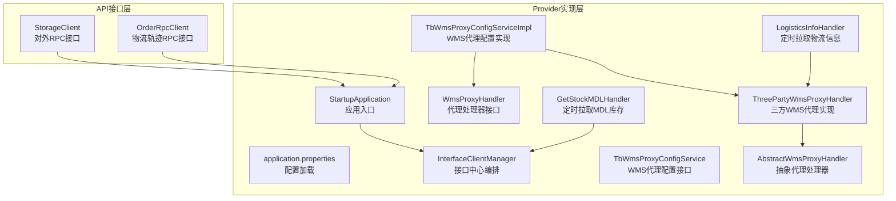
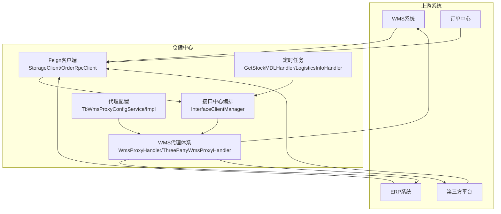
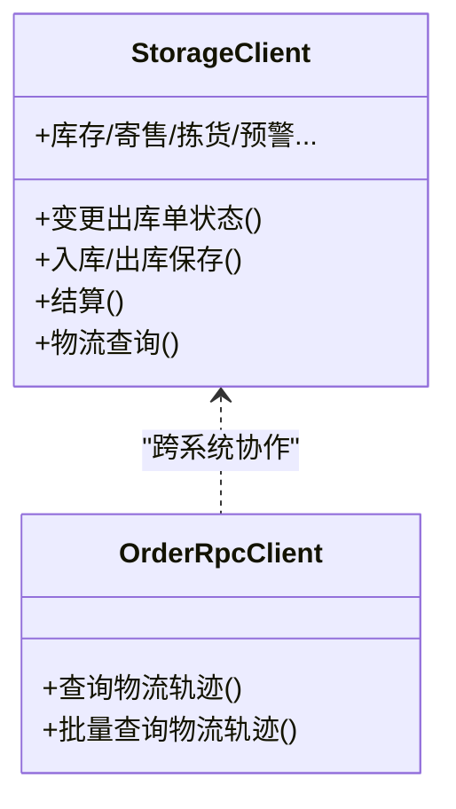
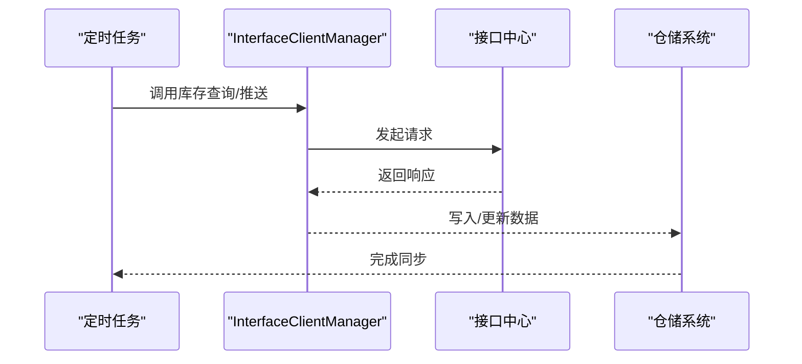
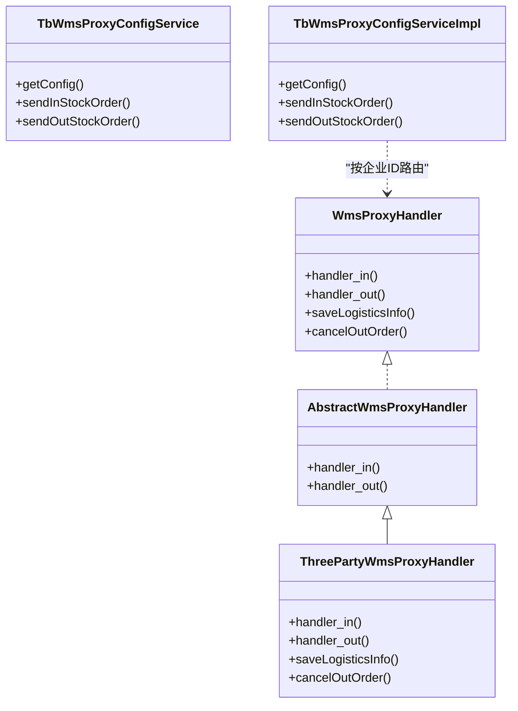
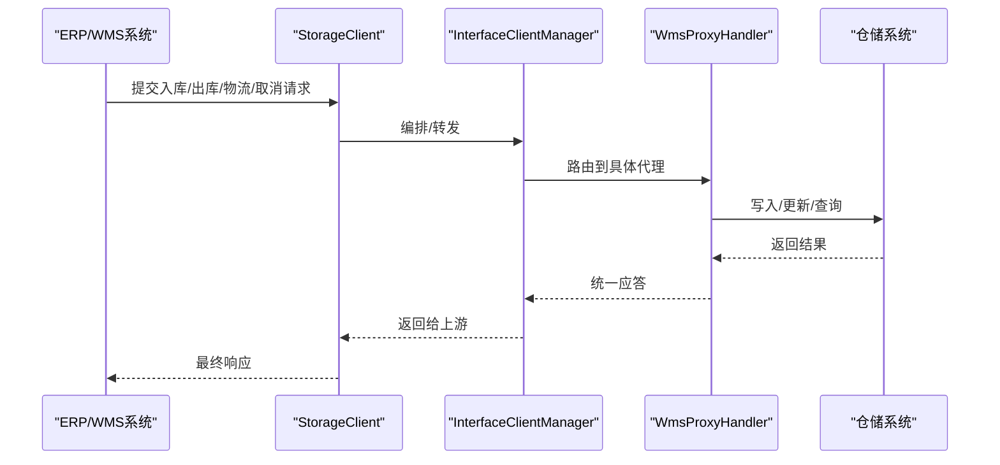
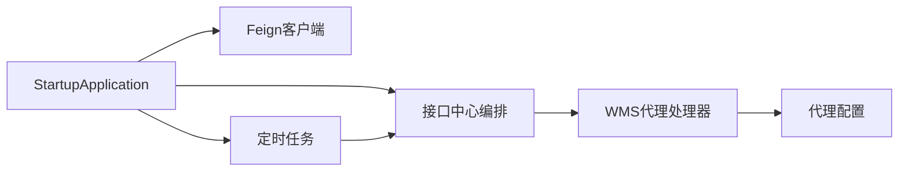

# 集成与扩展

<cite>
**本文引用的文件**   
- [StorageClient.java](file://guoke-deepexi-storage-center-api/src/main/java/com/ deepexi/api/storage/StorageClient.java)
- [OrderRpcClient.java](file://guoke-deepexi-storage-center-api/src/main/java/com/ deepexi/api/storage/OrderRpcClient.java)
- [StartupApplication.java](file://guoke-deepexi-storage-center-provider/src/main/java/com/ deepexi/storage/StartupApplication.java)
- [application.properties](file://guoke-deepexi-storage-center-provider/src/main/resources/application.properties)
- [InterfaceClientManager.java](file://guoke-deepexi-storage-center-provider/src/main/java/com/ deepexi/storage/manager/InterfaceClientManager.java)
- [TbWmsProxyConfigService.java](file://guoke-deepexi-storage-center-provider/src/main/java/com/ deepexi/storage/service/TbWmsProxyConfigService.java)
- [TbWmsProxyConfigServiceImpl.java](file://guoke-deepexi-storage-center-provider/src/main/java/com/ deepexi/storage/service/impl/TbWmsProxyConfigServiceImpl.java)
- [AbstractWmsProxyHandler.java](file://guoke-deepexi-storage-center-provider/src/main/java/com/ deepexi/storage/service/hanlder/AbstractWmsProxyHandler.java)
- [WmsProxyHandler.java](file://guoke-deepexi-storage-center-provider/src/main/java/com/ deepexi/storage/service/hanlder/WmsProxyHandler.java)
- [ThreePartyWmsProxyHandler.java](file://guoke-deepexi-storage-center-provider/src/main/java/com/ deepexi/storage/service/ hanlder/ThreePartyWmsProxyHandler.java)
- [GetStockMDLHandler.java](file://guoke-deepexi-storage-center-provider/src/main/java/com/ deepexi/storage/scheduled/GetStockMDLHandler.java)
- [LogisticsInfoHandler.java](file://guoke-deepexi-storage-center-provider/src/main/java/com/ deepexi/storage/scheduled/LogisticsInfoHandler.java)
</cite>

## 目录
1. [引言](#引言)
2. [项目结构](#项目结构)
3. [核心组件](#核心组件)
4. [架构总览](#架构总览)
5. [详细组件分析](#详细组件分析)
6. [依赖分析](#依赖分析)
7. [性能考虑](#性能考虑)
8. [故障排除指南](#故障排除指南)
9. [结论](#结论)
10. [附录](#附录)

## 引言
本文件面向系统集成商与扩展开发者，系统性梳理国科恒泰仓储管理系统在与WMS系统、ERP系统、第三方平台对接方面的集成机制，覆盖Feign客户端使用、自定义扩展开发与插件化代理体系、集成点与扩展接口、定制化开发指南、安全与性能优化、监控策略以及常见问题排查。文档以代码为依据，结合架构图与流程图，帮助读者快速理解并高效落地集成与扩展。

## 项目结构
系统采用分层+模块化组织：
- API接口层：定义对外RPC接口与DTO，统一暴露给上游系统与第三方平台。
- Provider实现层：基于Spring Cloud与Feign实现服务发现与远程调用，内置定时任务与代理处理器，支撑WMS/ERP/第三方平台对接。
- 配置与启动：通过Apollo/Nacos等配置中心加载环境变量，启用服务注册、Feign、RPC、事务、定时任务等能力。

图表来源
- [StartupApplication.java:1-33](file://guoke-deepexi-storage-center-provider/src/main/java/com/deepexi/storage/StartupApplication.java#L1-L33)
- [application.properties:1-6](file://guoke-deepexi-storage-center-provider/src/main/resources/application.properties#L1-L6)
- [StorageClient.java:105-107](file://guoke-deepexi-storage-center-api/src/main/java/com/deepexi/api/storage/StorageClient.java#L105-L107)
- [OrderRpcClient.java:19-21](file://guoke-deepexi-storage-center-api/src/main/java/com/deepexi/api/storage/OrderRpcClient.java#L19-L21)
- [InterfaceClientManager.java:30-36](file://guoke-deepexi-storage-center-provider/src/main/java/com/deepexi/storage/manager/InterfaceClientManager.java#L30-L36)
- [TbWmsProxyConfigService.java:12-44](file://guoke-deepexi-storage-center-provider/src/main/java/com/deepexi/storage/service/TbWmsProxyConfigService.java#L12-L44)
- [TbWmsProxyConfigServiceImpl.java:20-100](file://guoke-deepexi-storage-center-provider/src/main/java/com/deepexi/storage/service/impl/TbWmsProxyConfigServiceImpl.java#L20-L100)
- [AbstractWmsProxyHandler.java:14-27](file://guoke-deepexi-storage-center-provider/src/main/java/com/deepexi/storage/service/hanlder/AbstractWmsProxyHandler.java#L14-L27)
- [WmsProxyHandler.java:12-38](file://guoke-deepexi-storage-center-provider/src/main/java/com/deepexi/storage/service/hanlder/WmsProxyHandler.java#L12-L38)
- [ThreePartyWmsProxyHandler.java:46-74](file://guoke-deepexi-storage-center-provider/src/main/java/com/deepexi/storage/service/hanlder/ThreePartyWmsProxyHandler.java#L46-L74)
- [GetStockMDLHandler.java:31-51](file://guoke-deepexi-storage-center-provider/src/main/java/com/deepexi/storage/scheduled/GetStockMDLHandler.java#L31-L51)
- [LogisticsInfoHandler.java:39-61](file://guoke-deepexi-storage-center-provider/src/main/java/com/deepexi/storage/scheduled/LogisticsInfoHandler.java#L39-L61)

章节来源
- [StartupApplication.java:19-27](file://guoke-deepexi-storage-center-provider/src/main/java/com/deepexi/storage/StartupApplication.java#L19-L27)
- [application.properties:1-6](file://guoke-deepexi-storage-center-provider/src/main/resources/application.properties#L1-L6)

## 核心组件
- Feign客户端与服务暴露
  - StorageClient：声明式Feign客户端，暴露仓储核心RPC接口，涵盖出入库、库存、寄售、物流、结算、预警、拣货等。
  - OrderRpcClient：面向订单中心的物流轨迹查询RPC接口。
- 启动与配置
  - StartupApplication：启用服务发现、Feign、RPC、事务、定时任务、MyBatis Mapper扫描与Swak注解扫描。
  - application.properties：启用Apollo配置、多命名空间加载、Nacos/Redis/Prometheus等配置。
- 接口中心编排
  - InterfaceClientManager：封装对“接口中心”的统一调用，包括下单、库存查询、推送、取消入库通知等。
- WMS代理与扩展
  - TbWmsProxyConfigService/Impl：集中管理WMS代理配置与发送逻辑，按企业ID路由至不同代理处理器。
  - WmsProxyHandler接口与AbstractWmsProxyHandler抽象类：定义统一的出入库代理协议与默认分支逻辑。
  - ThreePartyWmsProxyHandler：三方货主代理实现，负责对接第三方WMS，支持入库/出库/物流/取消等流程。
- 定时任务
  - GetStockMDLHandler：定时从接口中心拉取MDL库存数据。
  - LogisticsInfoHandler：定时抓取物流信息并写回仓储系统。

章节来源
- [StorageClient.java:105-107](file://guoke-deepexi-storage-center-api/src/main/java/com/deepexi/api/storage/StorageClient.java#L105-L107)
- [OrderRpcClient.java:19-21](file://guoke-deepexi-storage-center-api/src/main/java/com/deepexi/api/storage/OrderRpcClient.java#L19-L21)
- [StartupApplication.java:19-27](file://guoke-deepexi-storage-center-provider/src/main/java/com/deepexi/storage/StartupApplication.java#L19-L27)
- [application.properties:1-6](file://guoke-deepexi-storage-center-provider/src/main/resources/application.properties#L1-L6)
- [InterfaceClientManager.java:30-36](file://guoke-deepexi-storage-center-provider/src/main/java/com/deepexi/storage/manager/InterfaceClientManager.java#L30-L36)
- [TbWmsProxyConfigService.java:12-44](file://guoke-deepexi-storage-center-provider/src/main/java/com/deepexi/storage/service/TbWmsProxyConfigService.java#L12-L44)
- [TbWmsProxyConfigServiceImpl.java:66-100](file://guoke-deepexi-storage-center-provider/src/main/java/com/deepexi/storage/service/impl/TbWmsProxyConfigServiceImpl.java#L66-L100)
- [AbstractWmsProxyHandler.java:14-27](file://guoke-deepexi-storage-center-provider/src/main/java/com/deepexi/storage/service/hanlder/AbstractWmsProxyHandler.java#L14-L27)
- [WmsProxyHandler.java:12-38](file://guoke-deepexi-storage-center-provider/src/main/java/com/deepexi/storage/service/hanlder/WmsProxyHandler.java#L12-L38)
- [ThreePartyWmsProxyHandler.java:46-74](file://guoke-deepexi-storage-center-provider/src/main/java/com/deepexi/storage/service/hanlder/ThreePartyWmsProxyHandler.java#L46-L74)
- [GetStockMDLHandler.java:31-51](file://guoke-deepexi-storage-center-provider/src/main/java/com/deepexi/storage/scheduled/GetStockMDLHandler.java#L31-L51)
- [LogisticsInfoHandler.java:39-61](file://guoke-deepexi-storage-center-provider/src/main/java/com/deepexi/storage/scheduled/LogisticsInfoHandler.java#L39-L61)

## 架构总览
系统通过Feign客户端与接口中心实现与WMS/ERP/第三方平台的解耦集成，采用“代理处理器”模式按企业ID动态路由到不同的对接实现，配合定时任务完成异步数据同步与物流信息回写。

图表来源
- [StorageClient.java:105-107](file://guoke-deepexi-storage-center-api/src/main/java/com/deepexi/api/storage/StorageClient.java#L105-L107)
- [OrderRpcClient.java:19-21](file://guoke-deepexi-storage-center-api/src/main/java/com/deepexi/api/storage/OrderRpcClient.java#L19-L21)
- [InterfaceClientManager.java:30-36](file://guoke-deepexi-storage-center-provider/src/main/java/com/deepexi/storage/manager/InterfaceClientManager.java#L30-L36)
- [TbWmsProxyConfigServiceImpl.java:66-100](file://guoke-deepexi-storage-center-provider/src/main/java/com/deepexi/storage/service/impl/TbWmsProxyConfigServiceImpl.java#L66-L100)
- [AbstractWmsProxyHandler.java:14-27](file://guoke-deepexi-storage-center-provider/src/main/java/com/deepexi/storage/service/hanlder/AbstractWmsProxyHandler.java#L14-L27)
- [ThreePartyWmsProxyHandler.java:46-74](file://guoke-deepexi-storage-center-provider/src/main/java/com/deepexi/storage/service/hanlder/ThreePartyWmsProxyHandler.java#L46-L74)
- [GetStockMDLHandler.java:31-51](file://guoke-deepexi-storage-center-provider/src/main/java/com/deepexi/storage/scheduled/GetStockMDLHandler.java#L31-L51)
- [LogisticsInfoHandler.java:39-61](file://guoke-deepexi-storage-center-provider/src/main/java/com/deepexi/storage/scheduled/LogisticsInfoHandler.java#L39-L61)

## 详细组件分析

### Feign客户端与服务暴露
- StorageClient
  - 通过@FeignClient("guoke-deepexi-storage-center")与@RequestMapping("/guoke-deepexi-storage-center")声明服务名与基础路径，统一暴露仓储RPC接口。
  - 涵盖出入库、库存、寄售、物流、结算、预警、拣货、地址、仓库、报损、温度控制、调拨、产品查询等接口。
- OrderRpcClient
  - 面向订单中心的RPC接口，提供物流轨迹查询与批量查询能力。

图表来源
- [StorageClient.java:105-107](file://guoke-deepexi-storage-center-api/src/main/java/com/deepexi/api/storage/StorageClient.java#L105-L107)
- [OrderRpcClient.java:19-21](file://guoke-deepexi-storage-center-api/src/main/java/com/deepexi/api/storage/OrderRpcClient.java#L19-L21)

章节来源
- [StorageClient.java:105-107](file://guoke-deepexi-storage-center-api/src/main/java/com/deepexi/api/storage/StorageClient.java#L105-L107)
- [OrderRpcClient.java:19-21](file://guoke-deepexi-storage-center-api/src/main/java/com/deepexi/api/storage/OrderRpcClient.java#L19-L21)

### 接口中心编排与第三方对接
- InterfaceClientManager
  - 封装对“接口中心”的调用，包括下单、库存查询、推送、取消入库通知等。
  - 对外部返回进行统一校验与异常抛出，保证上层调用的一致性。
- 定时任务
  - GetStockMDLHandler：定时从接口中心拉取MDL库存，组装SOAP请求并回调仓储系统。
  - LogisticsInfoHandler：定时抓取物流信息并写回仓储系统。

图表来源
- [InterfaceClientManager.java:145-181](file://guoke-deepexi-storage-center-provider/src/main/java/com/deepexi/storage/manager/InterfaceClientManager.java#L145-L181)
- [GetStockMDLHandler.java:39-51](file://guoke-deepexi-storage-center-provider/src/main/java/com/deepexi/storage/scheduled/GetStockMDLHandler.java#L39-L51)
- [LogisticsInfoHandler.java:48-61](file://guoke-deepexi-storage-center-provider/src/main/java/com/deepexi/storage/scheduled/LogisticsInfoHandler.java#L48-L61)

章节来源
- [InterfaceClientManager.java:30-36](file://guoke-deepexi-storage-center-provider/src/main/java/com/deepexi/storage/manager/InterfaceClientManager.java#L30-L36)
- [GetStockMDLHandler.java:31-51](file://guoke-deepexi-storage-center-provider/src/main/java/com/deepexi/storage/scheduled/GetStockMDLHandler.java#L31-L51)
- [LogisticsInfoHandler.java:39-61](file://guoke-deepexi-storage-center-provider/src/main/java/com/deepexi/storage/scheduled/LogisticsInfoHandler.java#L39-L61)

### WMS代理与插件化扩展
- 代理配置
  - TbWmsProxyConfigService/Impl：按企业ID获取代理配置，决定使用哪种代理处理器。
- 处理器接口与抽象
  - WmsProxyHandler：定义统一的出入库代理协议与物流/取消接口。
  - AbstractWmsProxyHandler：默认分支逻辑，区分采购入库、销售退回等场景。
- 三方WMS代理
  - ThreePartyWmsProxyHandler：实现三方货主代理，注入仓储服务与接口中心客户端，完成入库/出库/物流/取消等流程。

图表来源
- [WmsProxyHandler.java:12-38](file://guoke-deepexi-storage-center-provider/src/main/java/com/deepexi/storage/service/hanlder/WmsProxyHandler.java#L12-L38)
- [AbstractWmsProxyHandler.java:14-27](file://guoke-deepexi-storage-center-provider/src/main/java/com/deepexi/storage/service/hanlder/AbstractWmsProxyHandler.java#L14-L27)
- [ThreePartyWmsProxyHandler.java:46-74](file://guoke-deepexi-storage-center-provider/src/main/java/com/deepexi/storage/service/hanlder/ThreePartyWmsProxyHandler.java#L46-L74)
- [TbWmsProxyConfigService.java:12-44](file://guoke-deepexi-storage-center-provider/src/main/java/com/deepexi/storage/service/TbWmsProxyConfigService.java#L12-L44)
- [TbWmsProxyConfigServiceImpl.java:66-100](file://guoke-deepexi-storage-center-provider/src/main/java/com/deepexi/storage/service/impl/TbWmsProxyConfigServiceImpl.java#L66-L100)

章节来源
- [TbWmsProxyConfigService.java:12-44](file://guoke-deepexi-storage-center-provider/src/main/java/com/deepexi/storage/service/TbWmsProxyConfigService.java#L12-L44)
- [TbWmsProxyConfigServiceImpl.java:20-100](file://guoke-deepexi-storage-center-provider/src/main/java/com/deepexi/storage/service/impl/TbWmsProxyConfigServiceImpl.java#L20-L100)
- [AbstractWmsProxyHandler.java:14-27](file://guoke-deepexi-storage-center-provider/src/main/java/com/deepexi/storage/service/hanlder/AbstractWmsProxyHandler.java#L14-L27)
- [WmsProxyHandler.java:12-38](file://guoke-deepexi-storage-center-provider/src/main/java/com/deepexi/storage/service/hanlder/WmsProxyHandler.java#L12-L38)
- [ThreePartyWmsProxyHandler.java:46-74](file://guoke-deepexi-storage-center-provider/src/main/java/com/deepexi/storage/service/hanlder/ThreePartyWmsProxyHandler.java#L46-L74)

### 入库/出库/物流/取消流程（序列图）

图表来源
- [StorageClient.java:105-107](file://guoke-deepexi-storage-center-api/src/main/java/com/deepexi/api/storage/StorageClient.java#L105-L107)
- [InterfaceClientManager.java:145-181](file://guoke-deepexi-storage-center-provider/src/main/java/com/deepexi/storage/manager/InterfaceClientManager.java#L145-L181)
- [TbWmsProxyConfigServiceImpl.java:66-100](file://guoke-deepexi-storage-center-provider/src/main/java/com/deepexi/storage/service/impl/TbWmsProxyConfigServiceImpl.java#L66-L100)
- [AbstractWmsProxyHandler.java:14-27](file://guoke-deepexi-storage-center-provider/src/main/java/com/deepexi/storage/service/hanlder/AbstractWmsProxyHandler.java#L14-L27)
- [WmsProxyHandler.java:12-38](file://guoke-deepexi-storage-center-provider/src/main/java/com/deepexi/storage/service/hanlder/WmsProxyHandler.java#L12-L38)

## 依赖分析
- 组件耦合
  - StorageClient/OrderRpcClient依赖服务发现与Feign，向上游屏蔽底层网络细节。
  - InterfaceClientManager聚合接口中心能力，降低各业务线重复接入成本。
  - WMS代理体系通过配置表与处理器映射实现“按企业ID插件化路由”，避免硬编码耦合。
- 外部依赖
  - Apollo/Nacos：配置中心与服务注册。
  - XXL-Job：定时任务调度。
  - MyBatis/Redis/Prometheus：持久化、缓存与监控。

图表来源
- [StartupApplication.java:19-27](file://guoke-deepexi-storage-center-provider/src/main/java/com/deepexi/storage/StartupApplication.java#L19-L27)
- [application.properties:1-6](file://guoke-deepexi-storage-center-provider/src/main/resources/application.properties#L1-L6)
- [InterfaceClientManager.java:30-36](file://guoke-deepexi-storage-center-provider/src/main/java/com/deepexi/storage/manager/InterfaceClientManager.java#L30-L36)
- [TbWmsProxyConfigServiceImpl.java:25-26](file://guoke-deepexi-storage-center-provider/src/main/java/com/deepexi/storage/service/impl/TbWmsProxyConfigServiceImpl.java#L25-L26)

章节来源
- [StartupApplication.java:19-27](file://guoke-deepexi-storage-center-provider/src/main/java/com/deepexi/storage/StartupApplication.java#L19-L27)
- [application.properties:1-6](file://guoke-deepexi-storage-center-provider/src/main/resources/application.properties#L1-L6)

## 性能考虑
- 异步与批处理
  - 使用XXL-Job定时任务拉取库存与物流，避免阻塞主线程。
  - 批量查询物流轨迹接口减少多次往返开销。
- 缓存与降级
  - Redis缓存常用配置与热点数据，降低数据库压力。
  - 接口中心调用增加超时与重试策略，必要时降级返回兜底数据。
- 并发与限流
  - Feign客户端配置合理超时与连接池大小，避免雪崩。
  - 对高频接口增加限流与熔断保护。

## 故障排除指南
- 常见问题定位
  - Feign调用失败：检查服务名、网关路由、服务健康状态与负载均衡。
  - 接口中心调用异常：查看返回码与消息，确认鉴权与参数完整性。
  - WMS代理路由错误：核对代理配置表中企业ID与处理器编码。
  - 定时任务未执行：检查XXL-Job调度器状态与任务日志。
- 日志与追踪
  - 关键流程打印traceId，便于跨系统串联排查。
  - 对异常调用记录详细入参与响应，辅助复盘。

章节来源
- [InterfaceClientManager.java:158-166](file://guoke-deepexi-storage-center-provider/src/main/java/com/deepexi/storage/manager/InterfaceClientManager.java#L158-L166)
- [GetStockMDLHandler.java:46-48](file://guoke-deepexi-storage-center-provider/src/main/java/com/deepexi/storage/scheduled/GetStockMDLHandler.java#L46-L48)
- [LogisticsInfoHandler.java:48-61](file://guoke-deepexi-storage-center-provider/src/main/java/com/deepexi/storage/scheduled/LogisticsInfoHandler.java#L48-L61)

## 结论
本系统通过Feign与接口中心实现与WMS/ERP/第三方平台的解耦集成，借助“代理处理器+配置表”的插件化架构，实现了按企业ID的灵活路由与扩展。结合定时任务与统一编排，满足了异步同步、物流回写与库存对账等核心需求。建议在生产环境中完善安全认证、限流熔断与可观测性建设，确保系统稳定与可运维。

## 附录

### 集成点与扩展接口清单
- 对外RPC接口
  - 入库/出库/结算/拣货/寄售/库存/预警/物流/地址/仓库/报损/温度控制/调拨等接口，详见StorageClient。
- 第三方RPC接口
  - 物流轨迹查询与批量查询，详见OrderRpcClient。
- 代理扩展接口
  - WmsProxyHandler：统一代理协议。
  - AbstractWmsProxyHandler：默认分支逻辑。
  - ThreePartyWmsProxyHandler：三方WMS代理实现。
- 配置与编排
  - TbWmsProxyConfigService/Impl：按企业ID获取代理配置与发送逻辑。
  - InterfaceClientManager：接口中心统一编排。

章节来源
- [StorageClient.java:105-107](file://guoke-deepexi-storage-center-api/src/main/java/com/deepexi/api/storage/StorageClient.java#L105-L107)
- [OrderRpcClient.java:19-21](file://guoke-deepexi-storage-center-api/src/main/java/com/deepexi/api/storage/OrderRpcClient.java#L19-L21)
- [WmsProxyHandler.java:12-38](file://guoke-deepexi-storage-center-provider/src/main/java/com/deepexi/storage/service/hanlder/WmsProxyHandler.java#L12-L38)
- [AbstractWmsProxyHandler.java:14-27](file://guoke-deepexi-storage-center-provider/src/main/java/com/deepexi/storage/service/hanlder/AbstractWmsProxyHandler.java#L14-L27)
- [ThreePartyWmsProxyHandler.java:46-74](file://guoke-deepexi-storage-center-provider/src/main/java/com/deepexi/storage/service/hanlder/ThreePartyWmsProxyHandler.java#L46-L74)
- [TbWmsProxyConfigService.java:12-44](file://guoke-deepexi-storage-center-provider/src/main/java/com/deepexi/storage/service/TbWmsProxyConfigService.java#L12-L44)
- [TbWmsProxyConfigServiceImpl.java:66-100](file://guoke-deepexi-storage-center-provider/src/main/java/com/deepexi/storage/service/impl/TbWmsProxyConfigServiceImpl.java#L66-L100)
- [InterfaceClientManager.java:145-181](file://guoke-deepexi-storage-center-provider/src/main/java/com/deepexi/storage/manager/InterfaceClientManager.java#L145-L181)

### 定制化开发最佳实践
- 插件化扩展
  - 新增企业对接：在代理配置表新增企业ID与处理器编码映射。
  - 新增代理处理器：实现WmsProxyHandler接口，按需覆盖handler_in/handler_out/saveLogisticsInfo/cancelOutOrder。
- 参数与安全
  - 对外接口统一使用@Valid/@SpringQueryMap参数校验，避免脏数据进入核心流程。
  - 对第三方接口调用增加鉴权与签名校验，敏感参数脱敏记录。
- 监控与告警
  - 为关键接口埋点Prometheus指标，设置SLA阈值与告警规则。
  - 定时任务增加执行耗时与失败次数统计，异常邮件/消息通知。