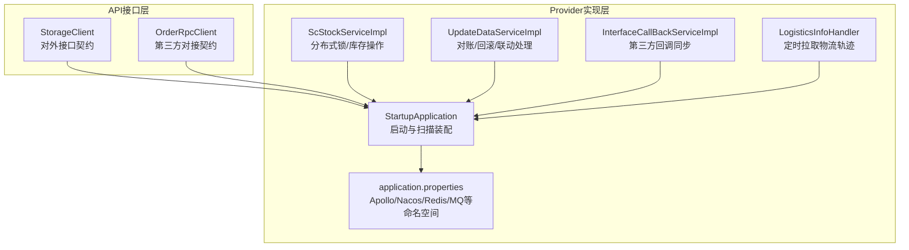
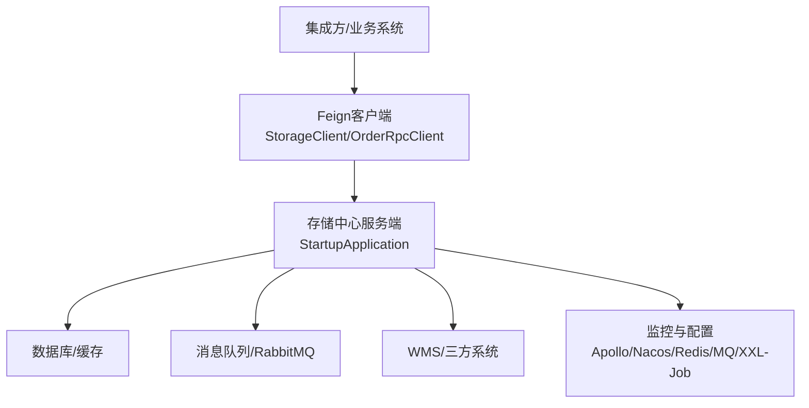
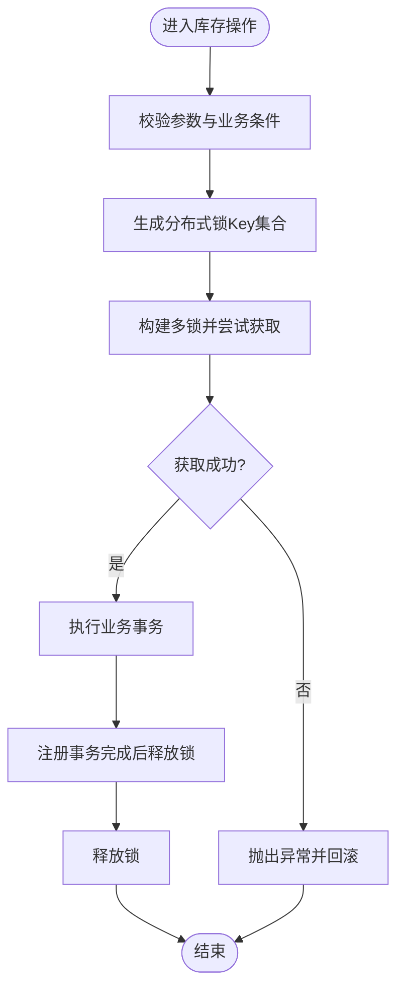
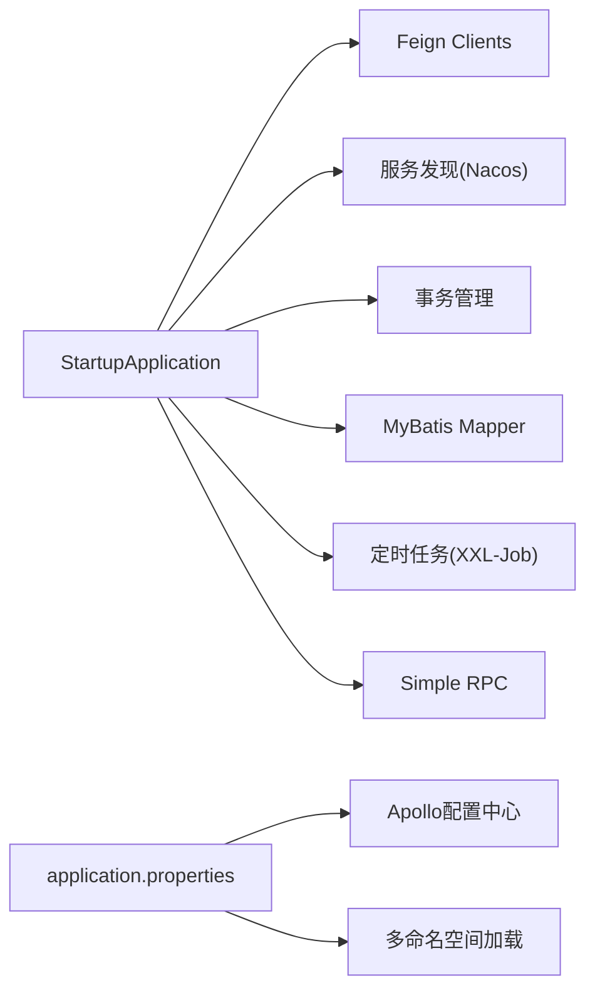

# 集成模式与最佳实践

<cite>
**本文引用的文件**   
- [StorageClient.java](file://guoke-deepexi-storage-center-api/src/main/java/com/deepexi/api/storage/StorageClient.java)
- [OrderRpcClient.java](file://guoke-deepexi-storage-center-api/src/main/java/com/deepexi/api/storage/OrderRpcClient.java)
- [StartupApplication.java](file://guoke-deepexi-storage-center-provider/src/main/java/com/deepexi/storage/StartupApplication.java)
- [application.properties](file://guoke-deepexi-storage-center-provider/src/main/resources/application.properties)
- [InOutStockAbstractItemResponse.java](file://guoke-deepexi-storage-center-api/src/main/java/com/deepexi/api/storage/dto/InOutStockAbstractItemResponse.java)
- [CompanyResponse.java](file://guoke-deepexi-storage-center-api/src/main/java/com/deepexi/api/storage/dto/CompanyResponse.java)
- [WarehouseInfoResponse.java](file://guoke-deepexi-storage-center-api/src/main/java/com/deepexi/api/storage/dto/WarehouseInfoResponse.java)
- [InterfaceCallBackServiceImpl.java](file://guoke-deepexi-storage-center-provider/src/main/java/com/depexi/storage/service/impl/InterfaceCallBackServiceImpl.java)
- [UpdateDataServiceImpl.java](file://guoke-deepexi-storage-center-provider/src/main/java/com/depexi/storage/service/UpdateDataServiceImpl.java)
- [ScStockServiceImpl.java](file://guoke-deepexi-storage-center-provider/src/main/java/com/depexi/storage/service/impl/ScStockServiceImpl.java)
- [LogisticsInfoHandler.java](file://guoke-deepexi-storage-center-provider/src/main/java/com/depexi/storage/scheduled/LogisticsInfoHandler.java)
- [pom.xml](file://guoke-deepexi-storage-center-provider/pom.xml)
</cite>

## 目录
1. [引言](#引言)
2. [项目结构](#项目结构)
3. [核心组件](#核心组件)
4. [架构总览](#架构总览)
5. [详细组件分析](#详细组件分析)
6. [依赖关系分析](#依赖关系分析)
7. [性能考量](#性能考量)
8. [故障排查指南](#故障排查指南)
9. [结论](#结论)
10. [附录](#附录)

## 引言
本文件面向国科恒泰仓储管理系统（以下简称“存储中心”）的集成方与维护方，系统性总结集成设计模式、架构原则与实施标准，覆盖API设计规范、日志记录策略、响应处理机制、错误处理与重试、降级策略、集成测试方法、性能监控指标与运维保障，并提供常见集成场景的解决方案、风险控制策略与故障恢复方案，以及集成项目的管理规范、质量保证体系与持续改进机制。

## 项目结构
存储中心采用分层+模块化组织方式：
- API接口层：定义对外RPC/HTTP接口契约，统一在API模块中声明，便于消费端按需引入。
- Provider实现层：提供业务逻辑、数据访问、定时任务、分布式协调等能力，承载核心集成流程。
- 资源与配置：应用启动入口、环境配置、命名空间与外部依赖装配。

图示来源
- [StorageClient.java](file://guoke-deepexi-storage-center-api/src/main/java/com/depexi/api/storage/StorageClient.java)
- [OrderRpcClient.java](file://guoke-deepexi-storage-center-api/src/main/java/com/depexi/api/storage/OrderRpcClient.java)
- [StartupApplication.java](file://guoke-deepexi-storage-center-provider/src/main/java/com/depexi/storage/StartupApplication.java)
- [application.properties](file://guoke-deepexi-storage-center-provider/src/main/resources/application.properties)

章节来源
- [StartupApplication.java:14-27](file://guoke-deepexi-storage-center-provider/src/main/java/com/depexi/storage/StartupApplication.java#L14-L27)
- [application.properties:1-6](file://guoke-deepexi-storage-center-provider/src/main/resources/application.properties#L1-L6)

## 核心组件
- 接口契约与客户端
  - StorageClient：统一暴露仓储相关RPC/HTTP接口，涵盖出入库、库存、寄售、物流、预警、调拨、产品查询等。
  - OrderRpcClient：对接订单中心，提供物流轨迹查询等能力。
- 启动与装配
  - StartupApplication：启用服务发现、Feign、事务、MyBatis Mapper扫描、定时任务、RPC等。
  - application.properties：启用Apollo配置中心、多命名空间加载、允许Bean定义覆盖等。
- 数据传输对象（DTO）
  - InOutStockAbstractItemResponse：出入库抽象明细字段聚合，便于跨模块复用。
  - CompanyResponse/WarehouseInfoResponse：公司与仓库信息标准化输出模型。

章节来源
- [StorageClient.java:105-800](file://guoke-deepexi-storage-center-api/src/main/java/com/depexi/api/storage/StorageClient.java#L105-L800)
- [OrderRpcClient.java:19-34](file://guoke-deepexi-storage-center-api/src/main/java/com/depexi/api/storage/OrderRpcClient.java#L19-L34)
- [StartupApplication.java:19-27](file://guoke-deepexi-storage-center-provider/src/main/java/com/depexi/storage/StartupApplication.java#L19-L27)
- [application.properties:1-6](file://guoke-deepexi-storage-center-provider/src/main/resources/application.properties#L1-L6)
- [InOutStockAbstractItemResponse.java:17-116](file://guoke-deepexi-storage-center-api/src/main/java/com/depexi/api/storage/dto/InOutStockAbstractItemResponse.java#L17-L116)
- [CompanyResponse.java:15-20](file://guoke-deepexi-storage-center-api/src/main/java/com/depexi/api/storage/dto/CompanyResponse.java#L15-L20)
- [WarehouseInfoResponse.java:14-42](file://guoke-deepexi-storage-center-api/src/main/java/com/depexi/api/storage/dto/WarehouseInfoResponse.java#L14-L42)

## 架构总览
系统采用微服务架构，以Feign进行服务间通信，结合Apollo配置中心、Nacos注册发现、Redisson分布式锁、XXL-Job定时任务、RabbitMQ消息队列等基础设施，形成“接口契约—实现—编排—监控”的闭环。

图示来源
- [StorageClient.java:105-800](file://guoke-deepexi-storage-center-api/src/main/java/com/depexi/api/storage/StorageClient.java#L105-L800)
- [OrderRpcClient.java:19-34](file://guoke-deepexi-storage-center-api/src/main/java/com/depexi/api/storage/OrderRpcClient.java#L19-L34)
- [StartupApplication.java:19-27](file://guoke-deepexi-storage-center-provider/src/main/java/com/depexi/storage/StartupApplication.java#L19-L27)
- [application.properties:1-6](file://guoke-deepexi-storage-center-provider/src/main/resources/application.properties#L1-L6)

## 详细组件分析

### 接口契约与API设计规范
- 设计原则
  - 明确的路径前缀与版本化：如“/api/v1/...”、“/rpc/v1/...”，便于演进与灰度。
  - 统一响应包装：返回值多采用统一的响应体封装，便于消费端一致处理。
  - 参数校验：大量使用注解式参数校验，减少空指针与非法输入。
- 常见接口域
  - 入库/出库：保存、主单生成、批量保存、取消、明细查询等。
  - 库存与寄售：锁定/解锁、序列号/批号查询、库存查询、寄售池查询与退货。
  - 物流与预警：物流查询、时效/运费配置、预警推送。
  - 调拨与产品：调拨单保存/查询、产品列表/详情、销售校验。
- DTO复用
  - 使用InOutStockAbstractItemResponse等通用模型，降低重复定义与耦合。

章节来源
- [StorageClient.java:105-800](file://guoke-deepexi-storage-center-api/src/main/java/com/depexi/api/storage/StorageClient.java#L105-L800)
- [InOutStockAbstractItemResponse.java:17-116](file://guoke-deepexi-storage-center-api/src/main/java/com/depexi/api/storage/dto/InOutStockAbstractItemResponse.java#L17-L116)
- [CompanyResponse.java:15-20](file://guoke-deepexi-storage-center-api/src/main/java/com/depexi/api/storage/dto/CompanyResponse.java#L15-L20)
- [WarehouseInfoResponse.java:14-42](file://guoke-deepexi-storage-center-api/src/main/java/com/depexi/api/storage/dto/WarehouseInfoResponse.java#L14-L42)

### 日志记录策略
- 统一日志上下文
  - 在定时任务中注入traceId，便于全链路追踪与问题定位。
- 关键流程日志
  - 回调同步、对账回滚、分布式锁等关键节点均记录入参、结果与异常堆栈。
- 建议
  - 对外接口统一记录请求ID、租户ID、用户ID等上下文信息，确保可审计与可追溯。

章节来源
- [LogisticsInfoHandler.java:48-61](file://guoke-deepexi-storage-center-provider/src/main/java/com/depexi/storage/scheduled/LogisticsInfoHandler.java#L48-L61)
- [InterfaceCallBackServiceImpl.java:55-59](file://guoke-deepexi-storage-center-provider/src/main/java/com/depexi/storage/service/impl/InterfaceCallBackServiceImpl.java#L55-L59)
- [UpdateDataServiceImpl.java:610-676](file://guoke-deepexi-storage-center-provider/src/main/java/com/depexi/storage/service/UpdateDataServiceImpl.java#L610-L676)

### 响应处理机制
- 统一响应体
  - 多数接口返回统一的响应封装，便于消费端解析与错误识别。
- 分页与列表
  - 提供PageBean等分页模型，支持大数据量场景下的稳定返回。
- 字段标准化
  - DTO如InOutStockAbstractItemResponse、WarehouseInfoResponse等，统一字段语义，降低对接成本。

章节来源
- [StorageClient.java:105-800](file://guoke-deepexi-storage-center-api/src/main/java/com/depexi/api/storage/StorageClient.java#L105-L800)
- [InOutStockAbstractItemResponse.java:17-116](file://guoke-deepexi-storage-center-api/src/main/java/com/depexi/api/storage/dto/InOutStockAbstractItemResponse.java#L17-L116)
- [WarehouseInfoResponse.java:14-42](file://guoke-deepexi-storage-center-api/src/main/java/com/depexi/api/storage/dto/WarehouseInfoResponse.java#L14-L42)

### 错误处理、重试与降级
- 错误处理
  - 对外调用失败时记录异常并返回明确错误信息；对账/回滚场景中逐条记录失败原因。
- 重试机制
  - 对于可恢复的网络抖动或第三方超时，建议在消费端实现指数退避重试；服务端对关键流程增加幂等与补偿。
- 降级策略
  - 对非核心接口（如物流轨迹查询）在下游不可用时返回兜底数据或快速失败，避免级联故障。
- 幂等与补偿
  - 回调同步、对账回滚等流程需具备幂等校验与补偿动作，防止重复处理与数据不一致。

章节来源
- [UpdateDataServiceImpl.java:610-676](file://guoke-deepexi-storage-center-provider/src/main/java/com/depexi/storage/service/UpdateDataServiceImpl.java#L610-L676)
- [InterfaceCallBackServiceImpl.java:55-59](file://guoke-deepexi-storage-center-provider/src/main/java/com/depexi/storage/service/impl/InterfaceCallBackServiceImpl.java#L55-L59)

### 分布式锁与并发控制
- 场景
  - 库存扣减、寄售锁定/解锁等高并发敏感操作。
- 实现
  - 使用Redisson分布式锁，支持多key组合锁与超时自动释放。
  - 事务完成后自动释放锁，避免死锁与资源泄漏。
- 建议
  - 锁粒度最小化、超时时间合理设置、异常路径释放锁。

图示来源
- [ScStockServiceImpl.java:3365-3392](file://guoke-deepexi-storage-center-provider/src/main/java/com/depexi/storage/service/impl/ScStockServiceImpl.java#L3365-L3392)

章节来源
- [ScStockServiceImpl.java:3365-3392](file://guoke-deepexi-storage-center-provider/src/main/java/com/depexi/storage/service/impl/ScStockServiceImpl.java#L3365-L3392)

### 定时任务与异步编排
- 物流轨迹定时拉取
  - 基于XXL-Job调度，按状态轮询并调用WMS代理处理器，统一写入物流信息。
- 建议
  - 任务参数化、失败重试、限流与去重，避免重复抓取与系统压力。

章节来源
- [LogisticsInfoHandler.java:48-61](file://guoke-deepexi-storage-center-provider/src/main/java/com/depexi/storage/scheduled/LogisticsInfoHandler.java#L48-L61)

### 第三方回调与对账
- 回调同步
  - 接收第三方推送后，解析并落库，必要时触发后续流程。
- 对账与回滚
  - 按批次/单据号调用订单中心接口，获取差异明细并执行回滚或修正。

章节来源
- [InterfaceCallBackServiceImpl.java:55-59](file://guoke-deepexi-storage-center-provider/src/main/java/com/depexi/storage/service/impl/InterfaceCallBackServiceImpl.java#L55-L59)
- [UpdateDataServiceImpl.java:610-676](file://guoke-deepexi-storage-center-provider/src/main/java/com/depexi/storage/service/UpdateDataServiceImpl.java#L610-L676)

## 依赖关系分析
- 启动与装配
  - 启用Feign、服务发现、事务、Mapper扫描、定时任务、RPC、Swak等。
- 配置与命名空间
  - Apollo多命名空间加载，支持数据源、MyBatis、Nacos、Redis、Prometheus、RabbitMQ、Elasticsearch、XXL-Job等。
- 外部依赖
  - 包含订单中心、产品中心、认证中心、数据中心、报告中心、医院中心等多方接口依赖。

图示来源
- [StartupApplication.java:19-27](file://guoke-deepexi-storage-center-provider/src/main/java/com/depexi/storage/StartupApplication.java#L19-L27)
- [application.properties:1-6](file://guoke-deepexi-storage-center-provider/src/main/resources/application.properties#L1-L6)
- [pom.xml:15-394](file://guoke-deepexi-storage-center-provider/pom.xml#L15-L394)

章节来源
- [StartupApplication.java:19-27](file://guoke-deepexi-storage-center-provider/src/main/java/com/depexi/storage/StartupApplication.java#L19-L27)
- [application.properties:1-6](file://guoke-deepexi-storage-center-provider/src/main/resources/application.properties#L1-L6)
- [pom.xml:15-394](file://guoke-deepexi-storage-center-provider/pom.xml#L15-L394)

## 性能考量
- 接口层面
  - 使用分页模型与批量接口，避免一次性返回大列表。
  - 对高频查询建立缓存策略，结合Redisson分布式锁避免缓存击穿。
- 并发与锁
  - 合理设置分布式锁超时时间，避免长时间持锁导致雪崩。
- 定时任务
  - 控制任务并发度与限流，避免对下游造成瞬时压力。
- 监控与告警
  - 基于Prometheus与日志采集，建立RT、错误率、锁等待时长等指标。

## 故障排查指南
- 快速定位
  - 通过traceId串联请求链路，查看关键日志节点。
- 常见问题
  - 分布式锁获取失败：检查锁Key生成规则、超时时间与并发度。
  - 对账失败：核对调用参数、返回码与异常堆栈，逐条记录失败原因。
  - 物流轨迹缺失：确认定时任务状态、WMS代理处理器可用性与网络连通性。
- 回滚与补偿
  - 对账失败时按单据号回滚，必要时人工介入修正。

章节来源
- [LogisticsInfoHandler.java:48-61](file://guoke-deepexi-storage-center-provider/src/main/java/com/depexi/storage/scheduled/LogisticsInfoHandler.java#L48-L61)
- [UpdateDataServiceImpl.java:610-676](file://guoke-deepexi-storage-center-provider/src/main/java/com/depexi/storage/service/UpdateDataServiceImpl.java#L610-L676)
- [ScStockServiceImpl.java:3365-3392](file://guoke-deepexi-storage-center-provider/src/main/java/com/depexi/storage/service/impl/ScStockServiceImpl.java#L3365-L3392)

## 结论
存储中心通过清晰的接口契约、完善的日志与监控、严格的错误处理与幂等设计，以及分布式锁与定时任务编排，形成了稳健的集成基座。建议在实际集成中遵循本文的API规范、日志策略、错误与重试、降级与补偿、性能与监控等最佳实践，确保系统在高并发与复杂业务场景下的稳定性与可维护性。

## 附录
- 集成测试方法
  - 单元测试：针对关键服务与工具类编写单元测试，覆盖正常与异常分支。
  - 集成测试：基于Mock或预生产环境验证接口契约、数据一致性与流程完整性。
  - 回归测试：在每次变更后执行回归测试，确保历史功能不受影响。
- 运维保障
  - 配置管理：通过Apollo集中管理配置，支持灰度发布与快速回滚。
  - 告警与可观测性：建立完善的日志、指标与链路追踪体系。
  - 容灾与备份：对关键数据与流程建立备份与容灾预案。
- 管理规范与持续改进
  - 规范：制定接口评审、变更审批、上线发布与回滚流程。
  - 质量：引入静态检查、代码走查与自动化测试，持续提升质量门禁。
  - 改进：定期回顾集成问题与优化点，沉淀经验并迭代改进。