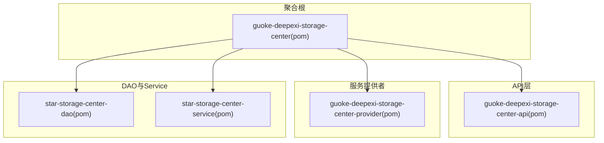
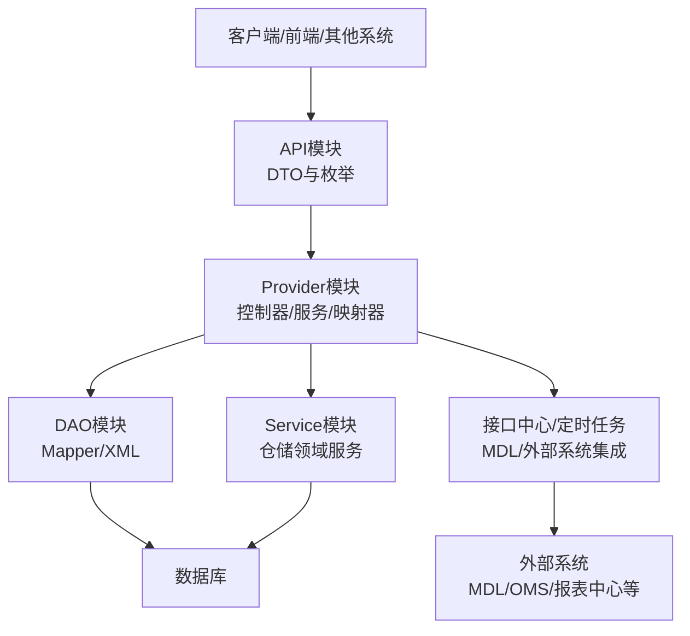
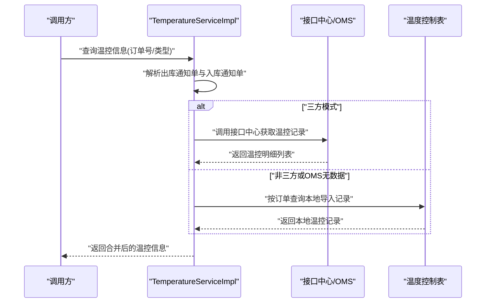
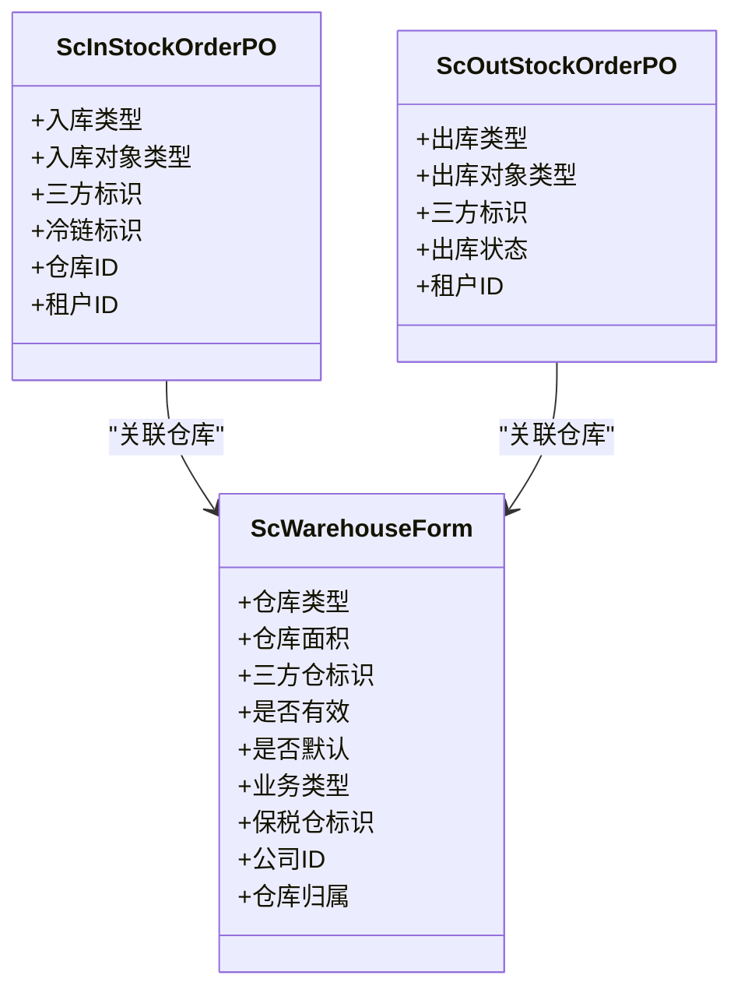
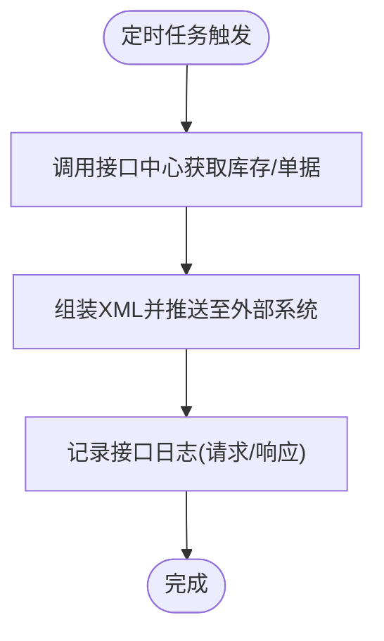
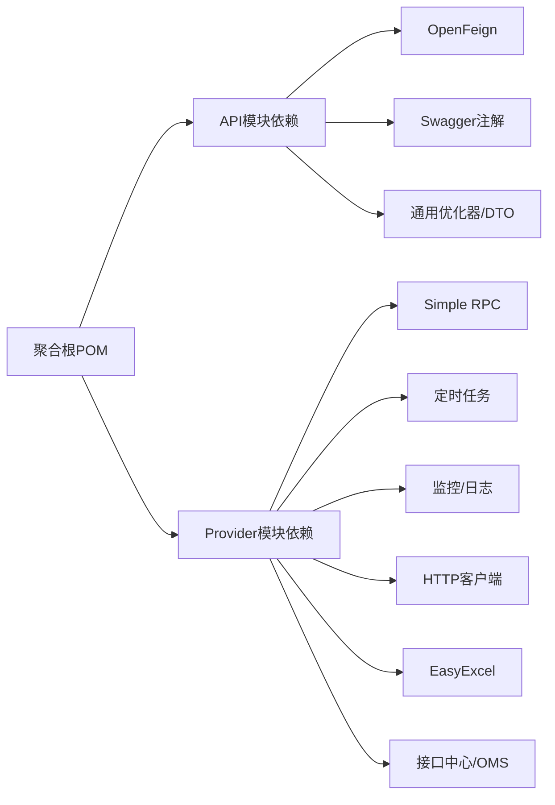

# 项目概述

<cite>
**本文引用的文件**   
- [README.md](file://README.md)
- [pom.xml](file://pom.xml)
- [guoke-deepexi-storage-center-api/pom.xml](file://guoke-deepexi-storage-center-api/pom.xml)
- [guoke-deepexi-storage-center-provider/pom.xml](file://guoke-deepexi-storage-center-provider/pom.xml)
- [StartupApplication.java](file://guoke-deepexi-storage-center-provider/src/main/java/com/ deepexi/storage/StartupApplication.java)
- [ScInStockOrderPO.java](file://guoke-deepexi-storage-center-provider/src/main/java/com/deepexi/storage/model/ScInStockOrderPO.java)
- [ScOutStockOrderPO.java](file://guoke-deepexi-storage-center-provider/src/main/java/com/deepexi/storage/model/ScOutStockOrderPO.java)
- [ScWarehouseForm.java](file://guoke-deepexi-storage-center-provider/src/main/java/com/deepexi/storage/pojo/form/warehouse/ScWarehouseForm.java)
- [TemperatureService.java](file://guoke-deepexi-storage-center-provider/src/main/java/com/deepexi/storage/service/TemperatureService.java)
- [TemperatureServiceImpl.java](file://guoke-deepexi-storage-center-provider/src/main/java/com/deepexi/storage/service/impl/TemperatureServiceImpl.java)
- [TbTemperatureControlInfoMapper.xml](file://guoke-deepexi-storage-center-provider/src/main/resources/mapper/TbTemperatureControlInfoMapper.xml)
- [ScInterfaceLogService.java](file://guoke-deepexi-storage-center-provider/src/main/java/com/deepexi/storage/service/ScInterfaceLogService.java)
- [ScInterfaceLogMapper.xml](file://guoke-deepexi-storage-center-provider/src/main/resources/mapper/ScInterfaceLogMapper.xml)
- [GetStockMDLHandler.java](file://guoke-deepexi-storage-center-provider/src/main/java/com/deepexi/storage/scheduled/GetStockMDLHandler.java)
- [PushServiceMDLImpl.java](file://guoke-deepexi-storage-center-provider/src/main/java/com/deepexi/storage/service/push/PushServiceMDLImpl.java)
</cite>

## 目录
1. [引言](#引言)
2. [项目结构](#项目结构)
3. [核心组件](#核心组件)
4. [架构总览](#架构总览)
5. [详细组件分析](#详细组件分析)
6. [依赖分析](#依赖分析)
7. [性能考虑](#性能考虑)
8. [故障排查指南](#故障排查指南)
9. [结论](#结论)
10. [附录](#附录)

## 引言
本项目为国科恒泰仓储管理系统，面向微服务架构的仓储管理解决方案，围绕“多租户、多仓库、温度监控”等核心业务诉求构建。系统通过统一的API模块定义对外能力，以Provider模块承载业务实现与数据访问，结合DAO与Service模块支撑数据持久化与领域服务，形成完整的仓储业务闭环。

系统具备以下关键特性：
- 微服务化：基于Spring Boot与服务注册发现机制，支持独立部署与扩展。
- 多租户隔离：通过租户ID贯穿业务表与查询条件，保障数据隔离与权限边界。
- 多仓库管理：支持普通仓、样品仓、三方仓、保税仓等多种仓库类型与属性配置。
- 温度监控：对接第三方温控设备与接口，支持导入与查询温控数据，满足冷链与IVD合规要求。
- 对外集成：通过接口中心与定时任务对接外部系统（如MDL），实现库存与单据的双向同步。

## 项目结构
项目采用多模块聚合结构，核心模块如下：
- guoke-deepexi-storage-center-api：对外API与DTO定义，包含入库、出库、库存、温度、仓库、预警等领域的请求/响应模型与枚举。
- guoke-deepexi-storage-center-provider：核心业务实现，包含控制器、服务、映射器、定时任务、RPC客户端等。
- star-storage-center-dao：MyBatis Mapper与XML映射文件，负责仓储相关表的CRUD与复杂查询。
- star-storage-center-service：仓储服务封装与领域逻辑实现，提供仓储业务能力。

**图表来源**
- [pom.xml:21-26](file://pom.xml#L21-L26)

**章节来源**
- [pom.xml:1-68](file://pom.xml#L1-L68)

## 核心组件
- 启动入口与容器配置
  - 启动类启用服务发现、Feign客户端、事务管理、MyBatis扫描、定时任务与RPC能力，确保系统可发现、可调用、可持久化、可调度。
- 数据模型与仓储对象
  - 入库通知单与出库通知单模型定义了业务类型、状态、关联单据、三方/冷链标识等关键字段，支撑多业务形态与合规要求。
- 仓库与温度监控
  - 仓库表单包含仓库类型、面积、三方仓标识、默认仓等字段，支持多仓库差异化配置。
  - 温度服务实现支持三方模式与本地导入两种数据来源，提供查询与异步处理能力。
- 接口日志与外部集成
  - 接口日志服务记录业务类型、发送方、接收方、请求/响应体，便于问题追踪与审计。
  - 定时任务与推送实现对接第三方系统（如MDL），完成库存与单据的双向同步。

**章节来源**
- [StartupApplication.java:14-33](file://guoke-deepexi-storage-center-provider/src/main/java/com/deepexi/storage/StartupApplication.java#L14-L33)
- [ScInStockOrderPO.java:1-192](file://guoke-deepexi-storage-center-provider/src/main/java/com/deepexi/storage/model/ScInStockOrderPO.java#L1-L192)
- [ScOutStockOrderPO.java:1-200](file://guoke-deepexi-storage-center-provider/src/main/java/com/deepexi/storage/model/ScOutStockOrderPO.java#L1-L200)
- [ScWarehouseForm.java:121-149](file://guoke-deepexi-storage-center-provider/src/main/java/com/deepexi/storage/pojo/form/warehouse/ScWarehouseForm.java#L121-L149)
- [TemperatureService.java:1-29](file://guoke-deepexi-storage-center-provider/src/main/java/com/deepexi/storage/service/TemperatureService.java#L1-L29)
- [TemperatureServiceImpl.java:77-160](file://guoke-deepexi-storage-center-provider/src/main/java/com/deepexi/storage/service/impl/TemperatureServiceImpl.java#L77-L160)
- [TbTemperatureControlInfoMapper.xml:1-19](file://guoke-deepexi-storage-center-provider/src/main/resources/mapper/TbTemperatureControlInfoMapper.xml#L1-L19)
- [ScInterfaceLogService.java:1-20](file://guoke-deepexi-storage-center-provider/src/main/java/com/deepexi/storage/service/ScInterfaceLogService.java#L1-L20)
- [ScInterfaceLogMapper.xml:134-174](file://guoke-deepexi-storage-center-provider/src/main/resources/mapper/ScInterfaceLogMapper.xml#L134-L174)

## 架构总览
系统采用微服务架构，API层定义对外契约，Provider层承载业务与数据交互，DAO层负责持久化，Service层封装领域服务。系统通过接口中心与定时任务实现与外部系统的集成。

**图表来源**
- [guoke-deepexi-storage-center-api/pom.xml:14-63](file://guoke-deepexi-storage-center-api/pom.xml#L14-L63)
- [guoke-deepexi-storage-center-provider/pom.xml:15-394](file://guoke-deepexi-storage-center-provider/pom.xml#L15-L394)
- [GetStockMDLHandler.java:34-62](file://guoke-deepexi-storage-center-provider/src/main/java/com/deepexi/storage/scheduled/GetStockMDLHandler.java#L34-L62)
- [PushServiceMDLImpl.java:140-167](file://guoke-deepexi-storage-center-provider/src/main/java/com/deepexi/storage/service/push/PushServiceMDLImpl.java#L140-L167)

## 详细组件分析

### 温度监控组件分析
温度监控模块支持两类数据来源：三方模式（通过接口中心调用OMS获取）与本地导入（Excel导入后存储于温度控制表）。服务实现中对三方与非三方模式做了分支处理，并在OMS未返回数据时回退至本地导入数据。

**图表来源**
- [TemperatureServiceImpl.java:77-160](file://guoke-deepexi-storage-center-provider/src/main/java/com/deepexi/storage/service/impl/TemperatureServiceImpl.java#L77-L160)
- [TbTemperatureControlInfoMapper.xml:1-19](file://guoke-deepexi-storage-center-provider/src/main/resources/mapper/TbTemperatureControlInfoMapper.xml#L1-L19)

**章节来源**
- [TemperatureService.java:1-29](file://guoke-deepexi-storage-center-provider/src/main/java/com/deepexi/storage/service/TemperatureService.java#L1-L29)
- [TemperatureServiceImpl.java:77-160](file://guoke-deepexi-storage-center-provider/src/main/java/com/deepexi/storage/service/impl/TemperatureServiceImpl.java#L77-L160)
- [TbTemperatureControlInfoMapper.xml:1-19](file://guoke-deepexi-storage-center-provider/src/main/resources/mapper/TbTemperatureControlInfoMapper.xml#L1-L19)

### 多仓库与多租户设计
仓库表单包含仓库类型、面积、三方仓标识、默认仓、保税仓标识等字段，支持普通仓、样品仓、三方仓、保税仓等差异化配置。多租户通过租户ID贯穿查询与写入，确保不同租户数据隔离。

**图表来源**
- [ScWarehouseForm.java:121-149](file://guoke-deepexi-storage-center-provider/src/main/java/com/deepexi/storage/pojo/form/warehouse/ScWarehouseForm.java#L121-L149)
- [ScInStockOrderPO.java:139-151](file://guoke-deepexi-storage-center-provider/src/main/java/com/deepexi/storage/model/ScInStockOrderPO.java#L139-L151)
- [ScOutStockOrderPO.java:192-200](file://guoke-deepexi-storage-center-provider/src/main/java/com/deepexi/storage/model/ScOutStockOrderPO.java#L192-L200)

**章节来源**
- [ScWarehouseForm.java:121-149](file://guoke-deepexi-storage-center-provider/src/main/java/com/deepexi/storage/pojo/form/warehouse/ScWarehouseForm.java#L121-L149)
- [ScInStockOrderPO.java:139-151](file://guoke-deepexi-storage-center-provider/src/main/java/com/deepexi/storage/model/ScInStockOrderPO.java#L139-L151)
- [ScOutStockOrderPO.java:192-200](file://guoke-deepexi-storage-center-provider/src/main/java/com/deepexi/storage/model/ScOutStockOrderPO.java#L192-L200)

### 外部系统集成与接口日志
系统通过定时任务与推送实现与外部系统的集成（如MDL），并记录接口日志以便问题定位与审计。

**图表来源**
- [GetStockMDLHandler.java:34-62](file://guoke-deepexi-storage-center-provider/src/main/java/com/deepexi/storage/scheduled/GetStockMDLHandler.java#L34-L62)
- [PushServiceMDLImpl.java:140-167](file://guoke-deepexi-storage-center-provider/src/main/java/com/deepexi/storage/service/push/PushServiceMDLImpl.java#L140-L167)
- [ScInterfaceLogMapper.xml:134-174](file://guoke-deepexi-storage-center-provider/src/main/resources/mapper/ScInterfaceLogMapper.xml#L134-L174)

**章节来源**
- [GetStockMDLHandler.java:34-62](file://guoke-deepexi-storage-center-provider/src/main/java/com/deepexi/storage/scheduled/GetStockMDLHandler.java#L34-L62)
- [PushServiceMDLImpl.java:140-167](file://guoke-deepexi-storage-center-provider/src/main/java/com/deepexi/storage/service/push/PushServiceMDLImpl.java#L140-L167)
- [ScInterfaceLogService.java:1-20](file://guoke-deepexi-storage-center-provider/src/main/java/com/deepexi/storage/service/ScInterfaceLogService.java#L1-L20)
- [ScInterfaceLogMapper.xml:134-174](file://guoke-deepexi-storage-center-provider/src/main/resources/mapper/ScInterfaceLogMapper.xml#L134-L174)

## 依赖分析
- 聚合根POM声明四个子模块，API与Provider分别承担契约与实现职责。
- Provider模块引入大量外部依赖，覆盖RPC、定时任务、监控、邮件、缓存、HTTP客户端、Excel处理、接口中心等能力，支撑多租户、多仓库与温度监控等核心能力。
- API模块依赖Swagger、Feign、通用优化器与各中心API，保证对外契约清晰与跨系统协作。

**图表来源**
- [pom.xml:21-26](file://pom.xml#L21-L26)
- [guoke-deepexi-storage-center-api/pom.xml:14-63](file://guoke-deepexi-storage-center-api/pom.xml#L14-L63)
- [guoke-deepexi-storage-center-provider/pom.xml:15-394](file://guoke-deepexi-storage-center-provider/pom.xml#L15-L394)

**章节来源**
- [pom.xml:1-68](file://pom.xml#L1-L68)
- [guoke-deepexi-storage-center-api/pom.xml:14-63](file://guoke-deepexi-storage-center-api/pom.xml#L14-L63)
- [guoke-deepexi-storage-center-provider/pom.xml:15-394](file://guoke-deepexi-storage-center-provider/pom.xml#L15-L394)

## 性能考虑
- 温度监控查询：优先从三方接口中心获取，若失败回退本地导入数据，避免重复IO与计算。
- 接口日志：统一记录请求/响应体，便于快速定位性能瓶颈与异常。
- 定时任务：按需触发外部系统同步，避免频繁轮询造成资源浪费。
- 缓存与并发：建议在热点查询上引入缓存策略（如Redis），并对高并发场景进行限流与重试控制。

## 故障排查指南
- 温度监控无数据
  - 检查三方模式是否开启且接口中心返回成功；若失败，确认本地导入数据是否存在。
  - 参考路径：[TemperatureServiceImpl.java:124-152](file://guoke-deepexi-storage-center-provider/src/main/java/com/deepexi/storage/service/impl/TemperatureServiceImpl.java#L124-L152)
- 外部系统集成失败
  - 查看接口日志表记录，确认请求/响应体与错误信息。
  - 参考路径：[ScInterfaceLogMapper.xml:134-174](file://guoke-deepexi-storage-center-provider/src/main/resources/mapper/ScInterfaceLogMapper.xml#L134-L174)
- 多租户数据隔离异常
  - 确认查询条件中包含租户ID，避免跨租户数据泄露。
  - 参考路径：[ScOutStockOrderPO.java:192-200](file://guoke-deepexi-storage-center-provider/src/main/java/com/deepexi/storage/model/ScOutStockOrderPO.java#L192-L200)

**章节来源**
- [TemperatureServiceImpl.java:124-152](file://guoke-deepexi-storage-center-provider/src/main/java/com/deepexi/storage/service/impl/TemperatureServiceImpl.java#L124-L152)
- [ScInterfaceLogMapper.xml:134-174](file://guoke-deepexi-storage-center-provider/src/main/resources/mapper/ScInterfaceLogMapper.xml#L134-L174)
- [ScOutStockOrderPO.java:192-200](file://guoke-deepexi-storage-center-provider/src/main/java/com/deepexi/storage/model/ScOutStockOrderPO.java#L192-L200)

## 结论
本项目以微服务架构为核心，围绕多租户、多仓库与温度监控构建了完整的仓储管理能力，并通过接口中心与定时任务实现与外部系统的高效集成。API与Provider模块职责清晰，DAO与Service模块分工明确，具备良好的扩展性与可维护性。建议在后续迭代中进一步完善缓存策略、异常治理与可观测性体系，持续提升系统稳定性与性能表现。

## 附录
- 使用场景示例
  - 多租户场景：不同公司通过租户ID隔离数据，支持各自仓库与温度监控策略。
  - 多仓库场景：普通仓、样品仓、三方仓、保税仓差异化配置，满足不同业务形态。
  - 温度监控场景：三方模式自动拉取OMS温控数据，非三方或OMS无数据时回退本地导入。
  - 外部集成场景：定时任务同步MDL库存，推送出库单XML至外部系统，记录接口日志便于审计。

**章节来源**
- [README.md:1-92](file://README.md#L1-L92)
- [TemperatureServiceImpl.java:77-160](file://guoke-deepexi-storage-center-provider/src/main/java/com/deepexi/storage/service/impl/TemperatureServiceImpl.java#L77-L160)
- [GetStockMDLHandler.java:34-62](file://guoke-deepexi-storage-center-provider/src/main/java/com/deepexi/storage/scheduled/GetStockMDLHandler.java#L34-L62)
- [PushServiceMDLImpl.java:140-167](file://guoke-deepexi-storage-center-provider/src/main/java/com/deepexi/storage/service/push/PushServiceMDLImpl.java#L140-L167)