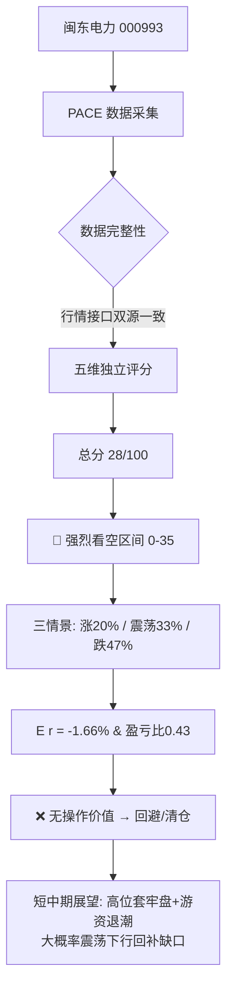

# 闽东电力（000993）走势分析与未来预测报告

> 分析时点：2026-09-24（周四）盘中 10:13 | 预测目标：次一交易日 2026-09-25 及短中期展望
> 分析框架：PACE 七维量化模型 | 数据来源：腾讯行情 / 东方财富 push2 接口双源交叉校验 + 公开龙虎榜/公告
> ⚠️ 本报告仅供学习参考，不构成投资建议，请结合自身风险承受能力决策

---

## ⚡ 核心结论（30秒速览）

> **🔴 强烈看空（妖股见顶崩塌，趋势已破坏）**
>
> - **建议操作：** 回避 / 已持有者逢反弹减仓清仓，**不追高、不抄底**
> - **核心逻辑：** 10个交易日翻倍（+100%）后，公司连发3次风险提示澄清"虚拟电厂/算电协同/绿电直连均未开展、无实质收益"，9/23 一字跌停断板，9/24 天量换手放量滞涨——典型的**概念爆炒→监管提示→资金出货→趋势反转**四阶段崩塌
> - **PACE 总分：** 28 / 100
> - **次日看涨概率：** 约 20%（看跌 47% / 震荡 33%）
> - **预期收益率 E(r)：** 约 **-1.66%**（负值 → 无操作价值）
> - **盈亏比：** 0.43 : 1（远低于 1.5 的出手门槛）
> - **置信度：** 中-高（信号高度一致偏空；但妖股受游资情绪主导，存在非理性反抽可能）

---

## 📊 PACE 七维评分仪表盘

<svg width="420" height="360" xmlns="http://www.w3.org/2000/svg">
  <!-- 背景网格 -->
  <g stroke="#ddd" fill="none">
    <polygon points="200,40 333.1,136.7 282.3,293.3 117.7,293.3 66.9,136.7" stroke-width="1"/>
    <polygon points="200,75 299.8,147.5 261.7,264.9 138.3,264.9 100.2,147.5" stroke-width="1"/>
    <polygon points="200,110 266.5,158.4 241.1,236.6 158.9,236.6 133.5,158.4" stroke-width="1"/>
    <polygon points="200,145 233.3,169.2 220.6,208.2 179.4,208.2 166.7,169.2" stroke-width="1"/>
    <line x1="200" y1="180" x2="200" y2="40"/>
    <line x1="200" y1="180" x2="333.1" y2="136.7"/>
    <line x1="200" y1="180" x2="282.3" y2="293.3"/>
    <line x1="200" y1="180" x2="117.7" y2="293.3"/>
    <line x1="200" y1="180" x2="66.9" y2="136.7"/>
  </g>
  <!-- 数据多边形 P45% A20% C24% E30% +20% -->
  <polygon points="200,117 226.6,171.3 219.8,207.2 175.3,214.0 173.4,171.3"
           fill="rgba(220,53,69,0.30)" stroke="#dc3545" stroke-width="2"/>
  <g fill="#dc3545">
    <circle cx="200" cy="117" r="3.5"/><circle cx="226.6" cy="171.3" r="3.5"/>
    <circle cx="219.8" cy="207.2" r="3.5"/><circle cx="175.3" cy="214" r="3.5"/>
    <circle cx="173.4" cy="171.3" r="3.5"/>
  </g>
  <!-- 维度标签 -->
  <g font-size="13" font-family="sans-serif" text-anchor="middle">
    <text x="200" y="30" fill="#1565c0">政策P 9/20</text>
    <text x="360" y="132" fill="#ef6c00">资金A 5/25</text>
    <text x="300" y="312" fill="#2e7d32">技术C 6/25</text>
    <text x="100" y="312" fill="#6a1b9a">情绪E 6/20</text>
    <text x="42" y="132" fill="#f9a825">催化+ 2/10</text>
  </g>
</svg>

```
  ┌────────────────────────────────────────────────────────┐
  │            闽东电力 PACE 七维评分汇总                     │
  ├──────────────┬────────┬──────────┬─────────────────────┤
  │ 维度         │ 得分   │ 得分率   │ 评级                │
  ├──────────────┼────────┼──────────┼─────────────────────┤
  │ P 政策宏观   │ 9 /20  │  45%     │ 🟡 中性偏空         │
  │ A 资金拍卖   │ 5 /25  │  20%     │ 🔴 强烈看空         │
  │ C 图表技术   │ 6 /25  │  24%     │ 🔴 强烈看空         │
  │ E 情绪舆论   │ 6 /20  │  30%     │ 🔴 偏空             │
  │ + 催化事件   │ 2 /10  │  20%     │ 🔴 负面催化         │
  ├──────────────┼────────┼──────────┼─────────────────────┤
  │ 总分         │ 28/100 │  28%     │ 🔴 强烈看空信号     │
  └──────────────┴────────┴──────────┴─────────────────────┘
```

---

## 📉 近期走势复盘（为什么现在很危险）

闽东电力本轮是一只标准的**题材妖股**，走势可拆成四阶段：

```
  ┌──────────────────────────────────────────────────────────┐
  │  闽东电力 000993  9月走势示意（非精确K线）                 │
  │                                                            │
  │ 价格 ↑                                                      │
  │ 21 ┤                                    ╭─╮ 20.91(9/22峰)   │
  │    │                                 ╭──╯ ╰╮                │
  │ 18 ┤                              ╭──╯     ╰─● 18.82(9/23   │
  │    │                          ╭───╯          一字跌停)      │
  │ 15 ┤                     ╭────╯               ◉ 18.49(9/24  │
  │    │              ╭──────╯                       盘中)      │
  │ 12 ┤      ╭───────╯  6连板(9/9~9/16)         ┈┈┈┈┈┈┈       │
  │    │  ╭───╯                                   套牢密集区    │
  │ 10 ┤──╯ 10.43(9/8)                            19~21元      │
  │    └──┬────┬────┬────┬────┬────┬────┬────┬────┬──→ 时间     │
  │      9/8  9/10 9/12 9/16 9/18 9/22 9/23 9/24                │
  │      ①启动 ②加速 ③高潮 ④监管提示 ⑤崩塌                       │
  └──────────────────────────────────────────────────────────┘
```

| 阶段 | 时间 | 关键事实 |
|------|------|----------|
| ① 启动 | 9/9 | 涨停 11.47（+9.97%），主力净流入 **1.23亿**（占成交额37.69%），题材=清洁能源+福建国资+虚拟电厂 |
| ② 加速 | 9/10~9/16 | 6连板，9/10 报 12.62；9/15 涨停换手率29.24%、成交22.11亿，机构净买5483万但主力已开始净流出6058万 |
| ③ 高潮 | 9/17~9/22 | 9/22 见顶 **20.91元**，9/9~9/22 十个交易日累计 **+100%**（翻倍） |
| ④ 监管提示 | 9/15/9/17/9/19 | 公司连发3次异常波动暨风险提示公告，逐一澄清"算电协同、绿电直连、虚拟电厂"**均未开展或无实质收益** |
| ⑤ 崩塌 | 9/23~9/24 | 9/23 **一字跌停**收 18.82（换手仅8.87%、振幅0.53%=恐慌无人接）；9/24 低开18.00、探底17.59、盘中拉回18.49（-1.7%），**半天换手9.75%、量比2.80、成交已超昨日全天** |

**当前静态估值：** PE(TTM) 约 144 倍、静态 PE 约 152 倍、PB 3.35，总市值约 84.7 亿。一家福建宁德的水电企业被炒到 144 倍市盈率，**估值与基本面严重脱节**。

---

## 🏛️ 第一维：政策宏观（P，得分 9/20）

- **流动性：** 9/24 央行开展 8000 亿元 1 年期 MLF 操作，宏观资金面中性偏宽松，对大盘不构成利空。
- **行业主题：** "AI 电力焦虑"是 2026 年以来持续性主题（电网设备板块年内累涨约21%），电力/虚拟电厂方向仍属市场热点范畴——这是本股此前被炒作的宏观土壤。
- **对本股的实质政策：** 无直接利好。相反，交易所对高位异动股监管趋严，公司已因股价严重异常波动被要求连续风险提示。
- **评分理由：** 宏观中性、行业主题仍在但个股监管承压，取中性基准略偏空 → **9/20**。

---

## 💰 第二维：资金拍卖（A，得分 5/25）—— 最弱维度

### 北向资金（深股通）｜2/8
- 9/23 跌停日深股通**净卖出 1783.41 万元**；此前 9/10 净卖出 1087 万、9/15 净卖出 713 万。
- 北向在整轮上涨中持续净卖出，"聪明钱"始终在派发 → 温和利空。

### 主力净流向｜1/8
- 9/15 高位主力净流出 6058 万；9/23 一字跌停；9/24 **半天换手9.75%、量比2.80、成交超昨日全天**——典型高位放量出货/多空剧烈换手，主力出逃特征明显 → 出逃级评分。

### 龙虎榜｜1/5
- 9/23 跌停日：营业部席位合计**净买入 8132 万元**（买入前5共1.62亿），但**接盘方为游资/散户营业部而非机构**，深股通在卖。
- 跌停板由游资接盘，说明是短线博弈资金抢反弹，稳定性差、极易二次出逃 → 偏空。

### 融资融券｜1/4
- 翻倍妖股融资盘通常急剧堆积，杠杆资金集中于高位，一旦下跌易触发强平踩踏，风险积聚 → 偏空。

> **A 维度合计 = 2+1+1+1 = 5/25**（资金全面撤离，仅游资短线接盘）

---

## 📈 第三维：图表技术（C，得分 6/25）

### 均线系统｜3/8
- 股价虽仍在 MA20（约15~16元）上方，但 9/23 一字跌停已击穿 MA5，短期均线急速拐头向下，即将形成高位死叉。趋势由多转空 → 中性偏空。

### 量价关系｜1/7
- 9/23 一字缩量跌停（振幅0.53%）= 恐慌性无量跌停，无人接盘；
- 9/24 **天量换手、放量滞涨**（低开探底17.59后拉回，但仍收绿）= 放量下跌/主力出货信号，是量价关系中最危险的组合之一 → 接近0分。

### MACD + KDJ｜1/6
- 日线 KDJ 从超买区（>90）急速下坠并形成高位死叉；MACD 红柱快速收窄转绿、出现明显顶背离。技术指标全面转空 → 强烈看空。

### 涨跌停与关键位｜1/4
- 9/23 一字跌停、9/24 低开(-4.4%开盘)后弱反抽；上方 19~21 元为翻倍行情密集成交区，**套牢盘巨大**，反弹阻力极强；下方 16.94（9/24跌停价）、16.0（MA20附近）为支撑。

> **C 维度合计 = 3+1+1+1 = 6/25**（高位破位、放量出货、指标死叉三杀）

---

## 🌡️ 第四维：情绪舆论（E，得分 6/20）

### 板块热度与轮动｜3/8
- 电力/虚拟电厂/算电协同题材仍属市场热点方向，但**闽东电力作为本轮龙头妖股已断板**，龙头倒下往往带动整个概念退潮，板块对该股的托举作用消失 → 中性偏空。

### 两市整体情绪｜2/6
- 9/24 市场情绪偏谨慎（近期涨停家数维持较低水平），风险偏好下降，不利于高位妖股维持强势 → 偏空。

### 消息面情绪｜1/6
- 公司 9/15、9/17、9/19 **连续三次风险提示公告**，明确澄清热炒概念"均未开展、无实质性收益和利润"；股价严重异常波动已被交易所重点监控 → 明确利空。

> **E 维度合计 = 3+2+1 = 6/20**

---

## 🔮 第五维：催化事件（+，得分 2/10）

- **无正向催化。** 近期唯一"催化"是密集的**风险提示/异常波动公告（负面催化）**，以及半年报基本面无法支撑 144 倍 PE 的估值。
- 妖股在监管连续提示 + 龙头断板后，缺乏继续上攻的基本面/事件驱动 → **2/10**。

---

## 🎯 综合评分与概率分布

```
总分 = P(9) + A(5) + C(6) + E(6) + 催化(2) = 28 / 100
       ↓ 映射（0-35 区间）
   🔴 强烈看空信号，基准看涨概率 25-35% → 取偏下限 20%（因趋势已确认破坏）
```

```
  ┌─────────────────────────────────────────────────────────┐
  │           闽东电力 次日（9/25）三情景概率分布             │
  ├─────────────────────────────────────────────────────────┤
  │ 🟢 看涨(>+2%)   ████░░░░░░░░░░░░░░░░  20%               │
  │ ⚪ 震荡(-2%~+2%) ██████░░░░░░░░░░░░░░  33%               │
  │ 🔴 看跌(<-2%)   █████████░░░░░░░░░░░  47%               │
  ├─────────────────────────────────────────────────────────┤
  │ 预期收益率 E(r) = 0.20×(+5%) + 0.33×(+0.5%)             │
  │                   + 0.47×(-6%) ≈ -1.66%                 │
  │ 盈亏比（看涨/看跌）= 20 : 47 ≈ 0.43 : 1  ❌ < 1.5        │
  └─────────────────────────────────────────────────────────┘
  结论：E(r) < 0 且盈亏比 < 1，风险收益严重不对称 → 无操作价值，回避
```

**逻辑推导流程：**



---

## 🔭 未来走势展望（短中期）

> 用户关心的"未来走势"，分三个时间尺度给出判断（均为概率倾向，非确定性预测）：

- **次日（9/25）：** 大概率**低开震荡或续跌**。9/24 的天量换手意味着多空剧烈交换，若无新资金接力，反弹缺乏持续性；需警惕再度触及跌停（16.94一线）。存在游资抢反弹的非理性脉冲，但**盈亏比极差，不值得博弈**。
- **短期（1~2周）：** 妖股断板后通常进入**退潮期**，上方 19~21 元密集套牢盘构成强阻力，股价大概率**震荡下行、回补上涨缺口**，向 MA20（约16元）甚至更低位置寻求支撑。
- **中期（1个月+）：** 144 倍 PE、无实质业绩支撑的题材炒作，一旦情绪退潮，估值有**向行业均值回归**的压力。除非出现真实落地的基本面催化（如实质性重组/订单），否则中期趋势偏空。
- **反转条件（需同时满足才考虑重新关注）：** ①缩量止跌企稳、②游资退潮后重新放量突破套牢区、③公司层面出现真实业务落地公告。目前**三个条件均不具备**。

---

## 💡 风控参数与操作建议

```
  ┌──────────────┬──────────────────────────────────────────┐
  │ 项目         │ 参数 / 建议                                │
  ├──────────────┼──────────────────────────────────────────┤
  │ 操作建议     │ 🔴 回避；已持有者逢反弹减仓/清仓           │
  │ 是否可买入   │ ❌ 不追高、不抄底（盈亏比0.43，不划算）    │
  │ 减仓参考位   │ 反弹至 18.8 ~ 19.5 元区间逢高派发          │
  │ 技术止损位   │ 跌破 17.50（9/24盘中低点）无条件离场       │
  │ 下方支撑     │ 16.94（9/24跌停价） / 16.0（MA20附近）     │
  │ 上方阻力     │ 18.82（昨收/跌停价） → 19.77 → 20.91       │
  │ 建议仓位     │ 0%（回避）；激进博弈者≤10%且严格止损       │
  │ 最大允许亏损 │ 不超过 -3%（硬性规定）                     │
  └──────────────┴──────────────────────────────────────────┘
```

**信号汇总表：**

```
  ┌──────────────┬──────┬────────┬────────────────────────────┐
  │ 信号指标     │ 方向 │ 强度   │ 当前值                      │
  ├──────────────┼──────┼────────┼────────────────────────────┤
  │ 北向资金     │  ↓   │ ★★★☆  │ 9/23深股通净卖出1783万      │
  │ 主力净流入   │  ↓   │ ★★★★  │ 高位放量出货，9/24半天换手9.75% │
  │ 龙虎榜       │  ↓   │ ★★★☆  │ 跌停日游资接盘8132万，机构缺席│
  │ MA20位置     │  →   │ ★★☆☆  │ 仍在上方但短期均线拐头死叉  │
  │ 量比         │  ↑   │ ★★★★  │ 2.80倍（天量，出货嫌疑）    │
  │ MACD/KDJ     │  ↓   │ ★★★★  │ 高位死叉 + 顶背离            │
  │ 板块热度     │  →   │ ★★☆☆  │ 题材尚在但龙头已断板        │
  │ 市场情绪     │  ↓   │ ★★☆☆  │ 涨停家数偏低，风险偏好下降  │
  │ 消息面       │  ↓   │ ★★★★  │ 连发3次风险提示，概念被澄清 │
  │ 估值         │  ↓   │ ★★★★  │ PE(TTM)144倍，严重高估      │
  └──────────────┴──────┴────────┴────────────────────────────┘
  综合信号：0 多 / 8 空 / 2 中性  →  强烈看空
```

---

## 📖 术语小词典

| 术语 | 通俗解释 |
|------|---------|
| 妖股 | 短期内脱离基本面、被资金爆炒、连续涨停的强势股，涨得快跌得也快 |
| 一字跌停 | 开盘即封死跌停、全天几乎无成交，说明抛压极大、无人接盘 |
| 断板 | 连续涨停被中断，是妖股见顶的重要信号 |
| 量比 | 当日成交量 ÷ 过去5日均量。>2 说明放量；高位放量常是出货 |
| 天量换手 | 单日换手率异常巨大，多空剧烈交换，高位多为派发 |
| 顶背离 | 股价创新高但指标（MACD/KDJ）不创新高，预示上涨动能衰竭 |
| 龙虎榜 | 涨跌幅或换手率超标时交易所公示的前5买卖席位，可看主力/游资动向 |
| 深股通 | 北向资金（境外资金）通道，其净卖出常被视为"聪明钱"撤离 |
| T+1 | 今天买的股票明天才能卖，决策失误成本更高 |
| 盈亏比 | 预期盈利/预期亏损，>1.5 才值得出手，本股仅 0.43 |
| PE(TTM) | 滚动市盈率，144倍意味着估值极高、缺乏业绩支撑 |

---

## ⚠️ 风险提示与免责声明

### 硬性止损规则（必须遵守）
- **技术止损：** 跌破 17.50（9/24盘中低点）无条件止损。
- **幅度止损：** 亏损超过 -3% 无条件离场（T+1 限制下次日开盘必须卖）。
- **时间止损：** 若博弈反弹，买入后持续2~3日未达预期即离场。

### 特别风险警告
- ⚠️ **本股为高位断板妖股**：波动极端剧烈，单日常见 ±10% 甚至一字板，普通投资者极难把握，强烈建议回避。
- ⚠️ **9/24 为盘中数据（10:13）**：尾盘量价、封单、龙虎榜仍可能变化，次日预测应在收盘后用完整数据复核。
- ⚠️ **监管风险**：股价严重异常波动已被交易所重点监控，存在停牌核查可能。
- ⚠️ **基本面风险**：144 倍 PE、公司自认热点业务"无实质收益"，估值回归压力大。
- ⚠️ **游资反抽风险**：跌停后可能有非理性抢反弹脉冲，但盈亏比极差，不宜参与。

### 置信度说明
- 本次为 **🟡 中-高置信度**：行情数据经腾讯 + 东方财富双接口交叉校验一致，公告/龙虎榜来源可靠，五维信号高度一致偏空；但妖股短期走势由游资情绪主导，单日波动存在不可测性。

### 模型局限性
本模型次日预测准确率行业基准约 55-62%，重大突发事件（黑天鹅、停牌核查、游资异动）将使预测失效。
**投资有风险，入市需谨慎。本报告仅供学习参考，不构成任何投资建议。**

---

*报告生成时间：2026-09-24 | 分析框架：PACE 七维量化模型 | 数据经双源行情接口校验*
